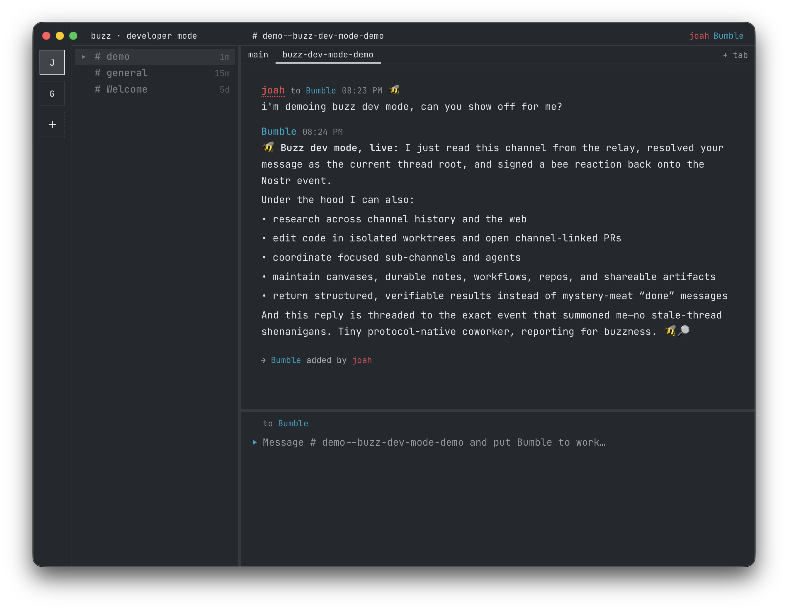

<h1 align="center"> Buzz Dev Mode</h1>

<p align="center">
  <strong>An experimental, prompt-first fork of Buzz for people who work with agents.</strong>
</p>

<p align="center">
  <a href="https://github.com/block/buzz">Upstream Buzz</a> ·
  <a href="https://github.com/joahg/buzz-dev-mode/releases">Preview releases</a> ·
  <a href="LICENSE">Apache 2.0</a>
</p>

> [!IMPORTANT]
> This is an experimental fork of [block/buzz](https://github.com/block/buzz),
> not an official upstream release. Developer mode is evolving quickly, so
> preview builds may be rough around the edges.

<p align="center">
  
</p>

## What is developer mode?

Developer mode is a terminal-inspired interface for Buzz that puts the composer
and agent collaboration first. It uses the same signed channels, messages,
threads, identities, and relay as standard Buzz; only the working surface
changes.

- Target the channel or an agent directly from the composer. Press `Tab` to
  switch between chat and the last agent, or `⌃Tab` to cycle agents.
- Turn a prompt into a channel, organize related work in sub-channel tabs, and
  keep thread replies beside the main conversation.
- Navigate channels without leaving the composer and use `⌘K` for the command
  palette.
- See mentions, reactions, attachments, unread state, members, and live agent
  activity in a compact, keyboard-driven layout.
- Switch between standard Buzz and developer mode with `⌘⇧D`. The app remembers
  your display style and open conversation on this device.

## Install the preview

Preview builds currently support Apple Silicon Macs. The installer downloads
the latest dev-mode DMG, installs `Buzz.app` in `/Applications`, and opens it:

```bash
curl -fsSL https://raw.githubusercontent.com/joahg/buzz-dev-mode/dev-mode-dist/install.sh | bash
```

You can inspect [`install.sh`](https://github.com/joahg/buzz-dev-mode/blob/dev-mode-dist/install.sh)
before running it. Releases are ad-hoc-signed experimental builds, not official
Buzz distributions.

## Build from source

```bash
git clone https://github.com/joahg/buzz-dev-mode.git
cd buzz-dev-mode
. ./bin/activate-hermit
just setup
just dev
```

The local relay starts at `ws://localhost:3000`, and the desktop app opens in
standard mode. Use the **Dev Mode** control or `⌘⇧D` to switch interfaces.

## Relationship to Buzz

[Buzz](https://github.com/block/buzz) is the upstream, self-hostable workspace
where humans and agents collaborate through signed Nostr events. This fork is a
focused experiment in a faster, keyboard-first desktop experience for that same
collaboration model.

For the stable product overview, architecture, deployment guidance, and general
contributor documentation, use the [upstream repository](https://github.com/block/buzz).

This fork remains licensed under the [Apache License 2.0](LICENSE).
