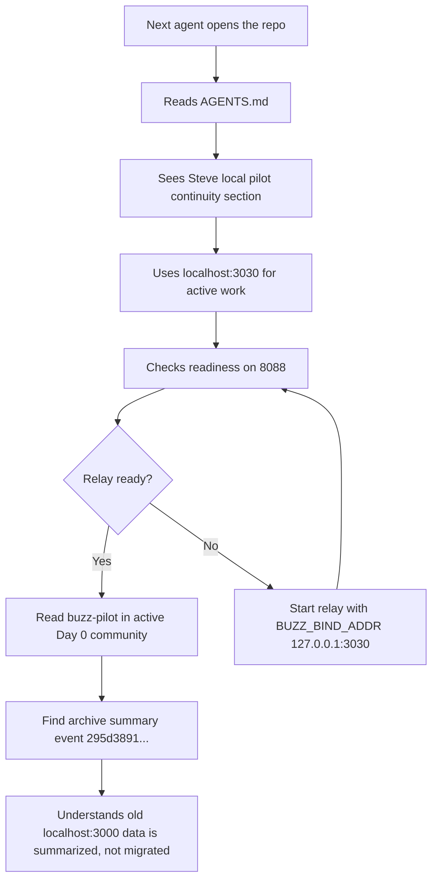
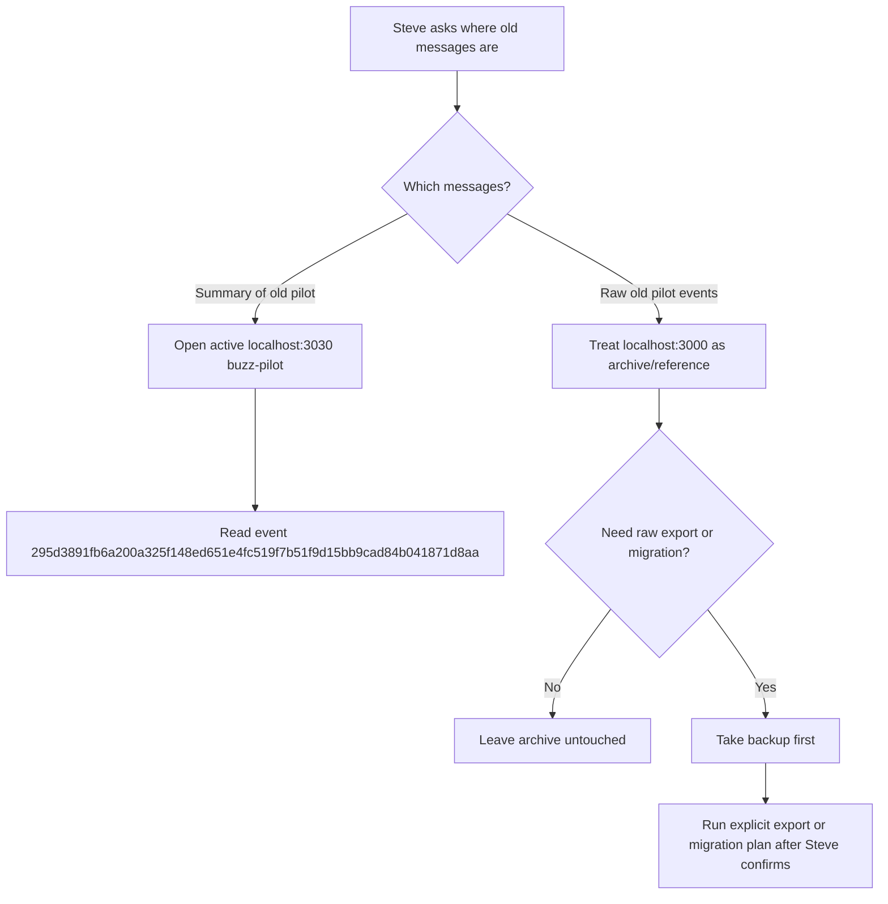

# Dogfood Report — codex/fix-dev-startup-pilot

> Diff-scoped browser QA handoff for `codex/fix-dev-startup-pilot` vs the trunk. Generated by `ce-dogfood` on 2026-07-26.
>
> Full browser dogfood was not run because `agent-browser` is not installed in this environment. This report captures the verified local Buzz continuity state and the next-person handoff Steve requested.

## Diff Summary

- Steve's active local Buzz pilot should avoid port `3000`.
- The active local Buzz community is `localhost:3030`, with relay health at `http://127.0.0.1:8088/_readiness` and metrics on `9202`.
- The older `localhost:3000` community was recovered and summarized into the active Day 0 `buzz-pilot` channel.
- The old raw messages were not migrated one by one into `localhost:3030`; only a summary message was injected.
- The local continuity docs now explain startup, backup boundaries, channel IDs, and archive-vs-active behavior.

## Personas

- **Steve, pilot owner** — wants to resume Buzz without losing context, avoid port collisions, and know what memory exists where.
- **Next Codex agent** — needs a safe, quick rehydration path before touching local Buzz data or starting services.
- **Future Buzz operator** — needs to distinguish recoverable local archive data from active pilot state without accidentally merging communities.

Persona source: inferred from the pilot setup and local continuity work.

## Flows Tested

## Test Matrix & Results

| # | Flow | Journey / Scenario | Status | Issue | Fix | Commit |
|---|------|--------------------|--------|-------|-----|--------|
| 1 | Next-agent rehydration | Agent can find active pilot port and archive warning from `AGENTS.md` | Pass | - | Added local pilot continuity section | - |
| 2 | Active Buzz readback | `localhost:3030` relay responds ready on `8088` | Pass | - | Verified with readiness check | - |
| 3 | Old-message visibility | Active `buzz-pilot` contains the old `localhost:3000` archive summary event | Pass | - | Verified compact message readback | - |
| 4 | Raw archive boundary | Docs explain raw old messages remain in `localhost:3000` unless Steve chooses backup-first export/migration | Pass | - | Documented in runbook and this report | - |
| 5 | Browser dogfood | Drive the desktop/web UI with `agent-browser` | Blocked (needs human verify) | `agent-browser` is not installed | Install `agent-browser`, then rerun dogfood | - |
| 6 | Nested guidance check | Desktop agent-config guidance does not contain startup instructions | Pass | - | Checked and left unchanged | - |

## What Was Fixed

### Next-person Buzz continuity pointer

- **Symptom:** A future agent could read the generic repo guide and still miss Steve's local pilot rule: avoid `3000`, use `3030`, and treat old `3000` messages as archive-only.
- **Root cause:** The detailed continuity state lived in pilot docs, but `AGENTS.md` did not yet point agents there.
- **Fix:** Added a Steve-specific local pilot continuity section to `AGENTS.md` with the active port, old archive boundary, injected event ID, and doc pointers.
- **Regression test:** No automated test is meaningful for this documentation-only handoff. Verification was by reading the updated docs and live CLI/DB checks.

### Read-only startup smoke check

- **Symptom:** A future agent could still perform ad hoc startup verification and accidentally drift back toward `localhost:3000`.
- **Root cause:** The runbook had manual commands, but no single read-only command that proved the active `3030` community and archive summary were visible.
- **Fix:** Added `scripts/buzz-pilot-smoke.sh` and linked it from top-level guidance and the pilot runbook.
- **Regression test:** `scripts/test-buzz-pilot-smoke.sh` exercises success and safe failure behavior with stubbed `curl` and Buzz CLI commands.

## Paper Cuts (by persona)

- **Steve, pilot owner** — The phrase "previous messages will show up" can sound like raw messages were migrated into the main instance. They were not; the active instance contains a summary event. Severity: medium. Fixed in docs.
- **Next Codex agent** — The relay may log `relay_url:"ws://localhost:3000"` even when actually bound to `127.0.0.1:3030`, which can mislead agents. Severity: medium. Already documented in the continuity runbook.
- **Future Buzz operator** — Channel archive status matters: `buzz-pilot` was unarchived for the summary post, while other Day 0 channels remained archived. Severity: low. Documented in the pilot notes and verified in Postgres.

## Console Errors

Not applicable. Browser dogfood could not run without `agent-browser`.

## Human Verifications

- Pending: install `agent-browser` and rerun full `ce-dogfood` if browser UI QA is desired.
- Pending: confirm from the Buzz Mac app that the `buzz-pilot` channel connected to `localhost:3030` displays the archive summary event.

## Decisions for a Human

### Persistent disposable pilot identity

- **What's broken:** Repeated agent writes currently use disposable generated keys unless a persistent pilot identity is created outside the repo.
- **Why escalated:** This is an operational identity decision, not a code bug. It affects attribution and continuity of agent-authored Buzz messages.
- **Options:** Keep disposable per-run keys for maximum simplicity and low secret-management burden. Create one persistent pilot identity outside the repo for clearer attribution across agent runs.
- **Recommendation:** Defer until agent-written Buzz updates become frequent enough that attribution confusion costs real time.

### Raw old-message migration

- **What's broken:** The active `localhost:3030` community only contains the summary of the old `localhost:3000` pilot messages, not the raw old events.
- **Why escalated:** Local Buzz communities are host-scoped. In-place merging or rewriting host rows risks corrupting local continuity unless designed and backed up.
- **Options:** Leave `localhost:3000` archive-only. Export selected raw messages into docs. Build a backup-first migration/export path if raw history needs to appear in `localhost:3030`.
- **Recommendation:** Leave archive-only for now. The injected summary is enough for Day 0 continuity; migrate only if Steve needs raw thread-level history in the active instance.

## Learnings

- In local Buzz dev, `localhost:3000` and `localhost:3030` are separate communities, not aliases.
- The Buzz Mac app being open does not prove relay-backed memory is available.
- For Steve's pilot, previous old-community messages show up in the main active instance only through the injected archive summary event unless a backup-first export/migration is later approved.
- Always back up local Postgres before manual channel/community metadata changes.

## Final Status

Ready as a continuity handoff, not a completed browser dogfood.

Verified state:

- Active relay: `localhost:3030`
- Health endpoint: `http://127.0.0.1:8088/_readiness`
- Read-only smoke command: `./scripts/buzz-pilot-smoke.sh`
- Active channel: `buzz-pilot` (`3cdf4550-0501-4825-b54e-87213ea08b66`)
- Old archive summary event in active channel: `295d3891fb6a200a325f148ed651e4fc519f7b51f9d15bb9cad84b041871d8aa`
- Old archive community: `localhost:3000`, 2 channels, 44 events
- Active Day 0 community: `localhost:3030`, 4 channels, 180 events

To see the previous pilot content in the main active Buzz instance, connect the app or CLI to `localhost:3030` and read `buzz-pilot`. The visible object is the summary event above. To inspect raw old messages, treat `localhost:3000` as an archive and do not run export or migration work without a fresh backup and Steve's confirmation.
