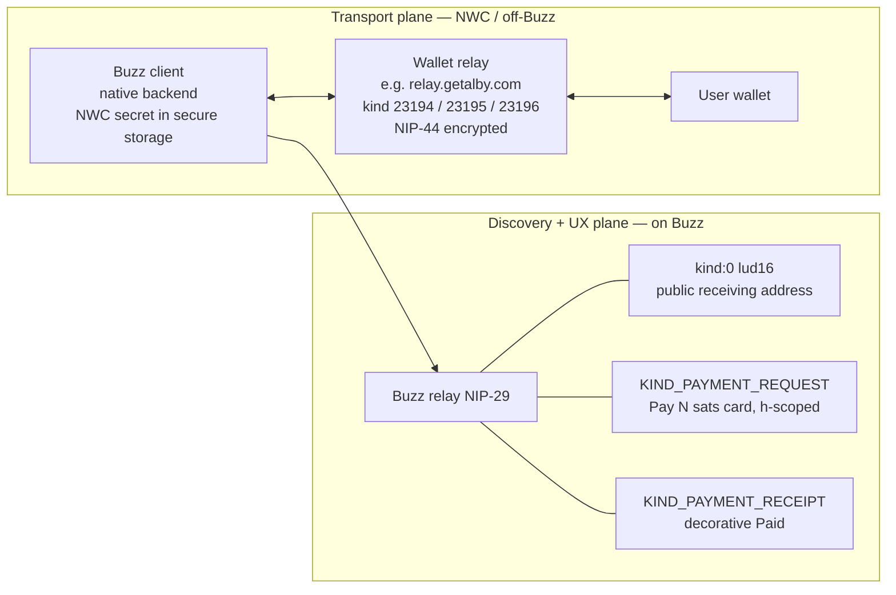
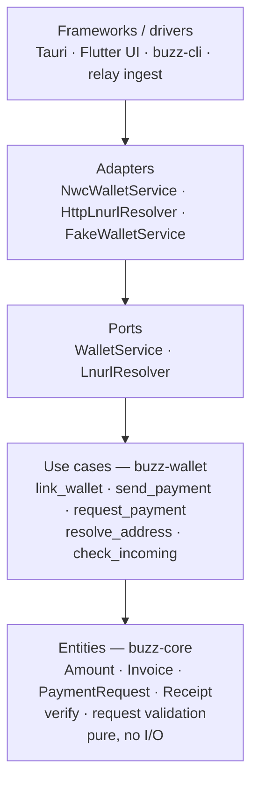

# Lightning Wallet (Nostr Wallet Connect)

`draft`

## What this is

Every user — and, in a limited receive-only form, every agent — can link an **external** Lightning wallet over [NIP-47 Nostr Wallet Connect (NWC)](https://github.com/nostr-protocol/nips/blob/master/47.md).

Users can show a receiving address, send sats, and receive sats. Buzz **never holds funds**. Money moves client-side between the user's wallet service and the wallet's relay. It never touches the Buzz relay or any Buzz server.

Two design rules shape the build:

- **No special cases.** Humans and agents use the same path. An agent is a keypair that posts events, like a human. Send always resolves to a `bolt11` invoice before pay. There is no bolt11-vs-lightning-address branch in the pay path, and no wallet-capability speculation.
- **Dependencies point inward.** Payment types and verification live in `buzz-core` with no network dependency. Exactly one real interface — `WalletService` — sits between use-cases and wallet transport. Two implementations ship with it: `NwcWalletService` and `FakeWalletService`. Any other wallet backend implements the same trait.

### Hard rules

- The NWC secret (which can spend, up to the wallet's own limits) lives **only** in native secure storage and the native backend.
- The web/Flutter UI never holds the NWC secret.
- **Every send needs explicit human confirmation.**
- The Buzz relay has **no payment logic**. It only stores and fans out events.
- **Trust is local.** Do not trust chat receipts. Each party checks its own wallet.

---

## Scope

- Link an external wallet via an NWC connection string (paste or QR).
- Show balance (when the wallet exposes it), a receive address / QR, send, and receive.
- Send to any Lightning Address ([LUD-16](https://github.com/lnurl/luds/blob/luds/16.md)) and to any other Buzz user who publishes one.
- In-chat **payment requests** and decorative **receipts**, scoped to a channel or DM.
- Agents that talk to humans can **request** payment (receive) and prove they were paid — verified against **their own wallet**, not a posted event.

---

## Two planes

Money never passes through the Buzz relay or any Buzz server.




- **Transport plane (NWC):** a second WebSocket to the relay named in the user's connection string. The native backend owns it. The Buzz relay is not involved.
- **Discovery / UX plane (Buzz relay):** what others need to pay you (`lud16`) and in-chat pay cards / receipts. Uses the existing NIP-29 pipeline: `h`-scoping, fan-out, auth. The relay stays a dumb transport for these events.

---

## Code layers

Dependencies point inward: pure types at the bottom, drivers at the top.




| Layer                        | Crate / location       | Responsibility                                                                                                                                    |
| ---------------------------- | ---------------------- | ------------------------------------------------------------------------------------------------------------------------------------------------- |
| Entities                     | `buzz-core`            | Pure payment types, `verify(preimage, payment_hash)`, request validation. **No network deps.**                                                    |
| Event encoding               | `buzz-sdk`             | Typed builders for the two new kinds.                                                                                                             |
| Use-cases + ports + adapters | `buzz-wallet` (new)    | `WalletService` / `LnurlResolver` traits; `NwcWalletService`, `HttpLnurlResolver`, `FakeWalletService`. Used by the Tauri backend and `buzz-cli`. |
| Transport (on Buzz)          | `buzz-relay`           | Thin ingest + fan-out of the two kinds, `h`-scoped. **No payment logic.**                                                                         |
| Drivers                      | desktop / mobile / CLI | Call use-cases. Hold the secret only in the native backend.                                                                                       |


### Why these boundaries


| Boundary                                       | Keep?  | Why                                                                                                        |
| ---------------------------------------------- | ------ | ---------------------------------------------------------------------------------------------------------- |
| `WalletService` port                           | Keep   | `FakeWalletService` (tests) + `NwcWalletService` (prod). New backends implement the same trait.            |
| `LnurlResolver` port                           | Keep   | `HttpLnurlResolver` + a fake in tests. LNURL resolution stays out of the pay path (pay never speaks HTTP). |
| Pure payment domain in `buzz-core`             | Keep   | Trust logic is verifiable offline.                                                                         |
| DTO layer between use-cases and event encoding | Reject | `buzz-sdk` already builds events.                                                                          |
| An interface around every type                 | Reject | Plain data and pure functions are enough.                                                                  |


Net: **one meaningful interface** (plus the resolver). Plain data and pure functions everywhere else.

Capabilities are queried, not assumed. Example: `get_balance` is optional — many NWC wallets do not expose it. New adapters and use-cases extend the system without editing existing ones.

---

## Data model

### Event kinds (`buzz-core/src/kind.rs`)

Two new kinds. Consumers dispatch on the kind number — no stringly-typed `type` tag branching.

Follow the registry process: add the `pub const`, append to `ALL_KINDS`, place into the right gating slices, add the compile-time range `assert!`, then wire ingest in `buzz-relay`.


| Kind                          | Band             | Type                | Purpose                                                                                                          |
| ----------------------------- | ---------------- | ------------------- | ---------------------------------------------------------------------------------------------------------------- |
| `lud16` on **kind:0** (reuse) | standard         | replaceable         | **Receiving address.** The primary, interoperable receive primitive.                                             |
| `KIND_PAYMENT_REQUEST`        | 40000s messaging | regular, `h`-scoped | "Pay N sats" card. Tags: `amount` (msat), `memo`, `bolt11` **or** `lud16`, `h` (channel), `p` (payee), `expiry`. |
| `KIND_PAYMENT_RECEIPT`        | 40000s messaging | regular, `h`-scoped | References the request via `e`. Carries `payment_hash`, `preimage`, `amount`. Renders "Paid ✓".                  |


Do **not** add a `KIND_WALLET_CAPABILITY` advertisement. It was optional and speculative. `lud16` in kind:0 is enough.

A `bolt11` posted in a **public channel** is payable by whoever pays first. For 1:1 payments, use `lud16` (a fresh invoice per payer) or an encrypted DM.

### Do not trust receipts

`KIND_PAYMENT_RECEIPT` is decorative only. Anyone can post a fake receipt.

The source of truth is **your own wallet**:

- The payee learns of payment from the wallet's `payment_received` notification (kind 23196) or `lookup_invoice`.
- The payer holds the `preimage` returned by their own `pay_invoice`.

The receipt event only shows "Paid ✓" to third parties in the thread. An agent confirms it was paid by querying its own wallet — never by trusting a posted preimage.

### Relay storage (`buzz-db`)

- Add a nullable `lud16` column to `users` (migration `00NN_*.sql`, mirrored in `schema/schema.sql`). Populate it during kind:0 ingest so any user's receiving address is available without refetching the profile.
- No other tables. Requests and receipts are events. Balances live in the user's wallet and are never persisted on the relay.


### NWC secret storage (client)


| Client               | Location                                                 | Notes                                                                      |
| -------------------- | -------------------------------------------------------- | -------------------------------------------------------------------------- |
| Desktop              | `desktop/src-tauri/src/secret_store.rs` (OS keyring)     | **Not** `identity.key`. **Not** on any env-read path. Keyed per community. |
| Mobile               | `flutter_secure_storage`, per community                  | Mirrors the `nsec` in `community_storage.dart`.                            |
| CLI                  | env `BUZZ_NWC_URI` or a `0600` config file               | Mirrors `BUZZ_PRIVATE_KEY`.                                                |
| Agent (receive-only) | injected as `BUZZ_NWC_URI` (receive-only) via `buzz-acp` | See [Agents](#agents).                                                     |


**Community switching.** The NWC secret and the live NWC connection are community-scoped. The connection is a module-level singleton, so wire `resetWalletState()` into `resetCommunityState()` in `desktop/src/features/communities/useCommunityInit.ts`. Also reset the balance/history cache. Otherwise the old community's wallet leaks into the new one.

---

## `buzz-wallet` API

```
link(uri)                                   -> WalletHandle   // validate, read get_info + capabilities (13194)
get_balance()                               -> Option<msat>   // capability-gated
make_invoice(amount, memo)                  -> bolt11          // "receive"
pay_invoice(bolt11)                         -> preimage        // "send"
lookup_invoice(payment_hash)                -> InvoiceStatus
list_transactions()                         -> [Tx]
```

`LnurlResolver.resolve(lud16, amount, memo) -> bolt11` lives **beside** the wallet, not inside it. A lightning address is just a way to produce a `bolt11`. The pay path has one input: `bolt11`.

Recommended adapters:

- rust-nostr `[nwc](https://docs.rs/nwc)` for `NwcWalletService`
- `[lnurl-rs](https://docs.rs/lnurl)` for `HttpLnurlResolver`

`FakeWalletService` and a fake resolver ship in the same crate for tests.

---

## Flows

### Link a wallet

1. User pastes `nostr+walletconnect://...` (or scans a QR).
2. Backend calls `buzz-wallet.link(uri)`.
3. Connect to the wallet's relay. Read `get_info` and the info event (13194) for capabilities.
4. Store the secret in secure storage (per community).
5. If the wallet exposes a lightning address, publish `lud16` in kind:0 on Buzz.
6. UI shows "Wallet linked", balance (if supported), and available capabilities.

### Show the receiving address

One primitive (`make_invoice`), plus an optional static convenience:

- **Wallet has a lightning address:** show `alice@getalby.com` (copyable) + QR. Static, **asynchronous** receive — the payer does not need you online.
- **Wallet has no lightning address:** Receive tab → `make_invoice(amount)` → bolt11 + QR. **Interactive**, one-shot.

This is Lightning's one irreducible special case (per-payment invoices): online/interactive vs offline/static receive. Isolate it behind the receive/resolver boundary so the rest of the code only ever sees "give me a bolt11".

### Receive

No action beyond showing an address or invoice. The user's wallet receives. NWC notifications (`payment_received`, kind 23196) update balance and history.

### Send to a Lightning Address (or a Buzz user with a `lud16`)

1. Pick a recipient (a `lud16`, or a Buzz user → read `lud16` from kind:0 / `users.lud16`).
2. `LnurlResolver`: GET lnurlp endpoint → callback → request invoice for N sats.
3. **Validate:** domain/TLS, `min`/`maxSendable`, returned invoice amount == requested.
4. Show **confirmation** (amount, recipient, memo).
5. Backend: `WalletService.pay_invoice(bolt11)` → `preimage`.
6. Update history. If in a thread, post `KIND_PAYMENT_RECEIPT`.

### Payment request in chat

Same flow for humans and agents:

1. B requests 500 sats → client B: `make_invoice(500)` (or reference `lud16`).
2. Publish `KIND_PAYMENT_REQUEST` in the channel/DM (`h`-scoped, `p`=B).
3. A sees the pay card "Pay 500 sats to B" → taps Pay → **confirm**.
4. `WalletService.pay_invoice` → `preimage` → publish `KIND_PAYMENT_RECEIPT` (`e`=request, `preimage`).
5. Thread shows "Paid ✓". B confirms via B's own wallet (not the posted preimage).

---

## Agents

Agents **receive and request**. They do not spend.

There is **no agent-specific code path**. An agent is a keypair that posts the same events a human posts. The only difference is the wallet behind that identity (receive-only), not a branch in the payment code.

What an agent can do:

1. **Request payment from a human.** Post `KIND_PAYMENT_REQUEST` (via `buzz wallet request`). Examples: "5,000 sats to proceed with this purchase", a tip, a service balance. The human sees the pay card, confirms, and pays from their linked wallet.
2. **Show a verifiable receiving address.** The agent's owner provisions a **receive-only** NWC connection (no spend risk), so the agent can `make_invoice` / `lookup_invoice`.
3. **Confirm the incoming payment and continue** — by querying **its own wallet** (`lookup_invoice` / `payment_received`), not by trusting a posted receipt.
4. **Ask its owner to pay on its behalf.** The agent (which cannot spend) posts a request to its owner. The owner (a human) confirms and pays. This is the key pattern for "an agent buys something with human approval".

**Receive-only provisioning.** Extend the env injection in `buzz-acp` (`build_mcp_servers`, `crates/buzz-acp/src/lib.rs`) to optionally inject a **receive-only** `BUZZ_NWC_URI` when the owner has configured one. Add `BUZZ_NWC_URI` to the reserved env keys in `desktop/src-tauri/src/managed_agents/env_vars.rs` (the user cannot override it) and to the log scrubbing in `managed_agents/backend.rs`. Provisioning happens where the agent is created (`desktop/src-tauri/src/commands/agents.rs`, beside `Keys::generate()` and the auth tag).

**Rendering.** The same pay card / receipt renders whether a human or an agent posted it — no separate UI. A badge distinguishes "requested by an agent" and shows the owner (already available via `agent_owner_pubkey`) so the human knows who is behind it before confirming.

**Hard boundary:** an agent never receives a spend-capable NWC secret.

---

## NWC is one adapter

The top-level structure names *payments*, not *NWC*. NWC is one adapter behind `WalletService`.

Any other wallet backend (`CustodialWalletService`, LDK, …) implements the same trait. Use-cases, entities, events, and UI stay the same.

---

## Security

- **Secret isolation.** The NWC secret lives only in native secure storage + native backend. Never in the web/Flutter UI or logs. Reuse `secret_store.rs` (off the env-read path) and the existing secret log-scrubbing.
- **Mandatory confirmation** for every send. No silent spend — especially when an agent is the one requesting.
- **Budget backstop:** rely on the wallet's own NWC per-connection spend limits.
- **LNURL validation:** domain/TLS, `min`/`maxSendable`, returned invoice amount == requested, timeouts; reject non-HTTPS callbacks.
- **Receipt verification** (`SHA256(preimage) == payment_hash`) is available for display, but **trust is local** — the authoritative signal is each party's own wallet.
- **Abuse:** public-channel requests are spammable → reuse the existing rate-limit tiers for `KIND_PAYMENT_REQUEST`.

---

## Testing

- **Unit (domain,** `buzz-core`**):** URI parsing, LNURL validation, `verify` — no network.
- **Use-cases (**`buzz-wallet`**):** driven entirely by `FakeWalletService` — every send/request/verify path tested deterministically, **without a real wallet or network**. This is the seam that pays for the `WalletService` boundary.
- **E2E relay:** ingest/fan-out/gating of the two kinds with `h`-scoping (`crates/buzz-test-client/tests/`).
- **Desktop E2E:** pay card, receive/send flows via the mock bridge; screenshots via `just desktop-screenshot`.
- **NWC end-to-end:** a regtest wallet or a mock NWC service; documented in `crates/buzz-cli/TESTING.md`.
- **Mobile / Dart parity:** see [Mobile (Dart)](#mobile-dart).

---

## Build order

1. `buzz-core` — payment domain types + `verify(preimage, payment_hash)` + request validation. *(pure domain, unit-tested, no network)*
2. `buzz-wallet` — `WalletService` / `LnurlResolver` ports + `FakeWalletService`. *(use-cases tested against the fake — no real wallet)*
3. **Adapters** — `NwcWalletService` (rust-nostr) + `HttpLnurlResolver`.
4. `buzz-sdk` builders + kinds in `buzz-core` + thin relay ingest (`h`-scoped, no logic).
5. **Tauri commands** (secret in `secret_store.rs`) + community reset.
6. **Desktop UI** (rem-only text, per the zoom rules) + `buzz-cli wallet`.
7. **Agents** — receive-only injection in `buzz-acp` + reserved env. **No new code path** — only a different capability.
8. **Mobile** — Dart UI + conformance vectors against the Rust domain.

---


## Mobile (Dart)

Mobile is pure Flutter (no easy FFI to a Rust crate in this repo). Reimplementing the NWC **protocol** in Dart creates two sources of truth and invites divergence bugs.

Two options:

1. **FFI the Rust domain** into Flutter — one source of truth, at a build cost.
2. **Conformance vectors generated from the Rust domain** (preimage verification, URI parsing, LNURL cases) that both implementations must pass.

Use (2). The **UI** may diverge; the **domain** must not — pin it with shared vectors.

---


## Design choices

1. **Receive without a** `lud16`**:** interactive (one-shot) `make_invoice` — simplest, zero server.
2. **Wallet scope:** per-community (consistent with `nsec` and the community-state reset).
3. **Libraries:** rust-nostr `nwc` + `lnurl-rs`.

---


## References

- [NIP-47 — Nostr Wallet Connect](https://github.com/nostr-protocol/nips/blob/master/47.md)
- [LUD-16 — Lightning Addresses](https://github.com/lnurl/luds/blob/luds/16.md)
- [LUD-06 — LNURL-pay](https://github.com/lnurl/luds/blob/luds/06.md)
- `buzz-core/src/kind.rs` — event kind registry
- `buzz-sdk/src/nip_oa.rs` — owner→agent authorization

