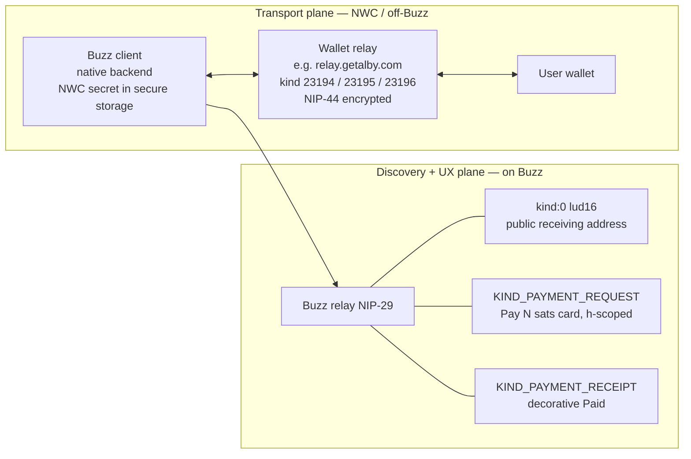
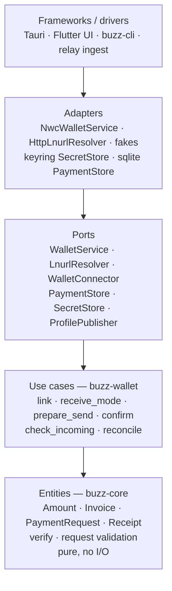
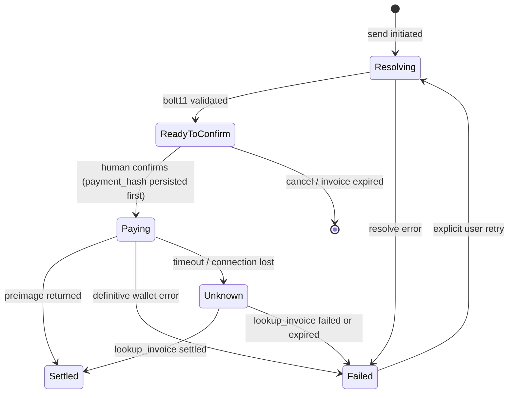

# Lightning Wallet (Nostr Wallet Connect)

`draft`

## What this is

Every user — and, in a limited receive-only form, every agent — can link an **external** Lightning wallet over [NIP-47 Nostr Wallet Connect (NWC)](https://github.com/nostr-protocol/nips/blob/master/47.md).

Users can show a receiving address, send sats, and receive sats. Buzz **never holds funds**. Money moves client-side between the user's wallet service and the wallet's relay. It never touches the Buzz relay or any Buzz server.

Two design rules shape the build:

- **No special cases.** Humans and agents use the same path. An agent is a keypair that posts events, like a human. Send always resolves to a `bolt11` invoice before pay. There is no bolt11-vs-lightning-address branch in the pay path, and no wallet-capability speculation.
- **Dependencies point inward.** Payment types and verification live in `buzz-core` with no network dependency. One real interface — `WalletService` — sits between use-cases and wallet transport (two implementations ship with it: `NwcWalletService` and `FakeWalletService`; any other wallet backend implements the same trait), flanked by a handful of thin ports (`LnurlResolver`, `WalletConnector`, `PaymentStore`, `SecretStore`, `ProfilePublisher`) that keep linking, persistence, and publishing injectable — see [Why these boundaries](#why-these-boundaries).

### Hard rules

- The NWC secret (which can spend, up to the wallet's own limits) lives **only** in native secure storage and the native backend.
- The web/Flutter UI never holds the NWC secret.
- **Every send needs explicit human confirmation.**
- The Buzz relay has **no payment logic**. It only stores and fans out events.
- **Trust is local.** Do not trust chat receipts. Each party checks its own wallet.
- **One unit.** The domain speaks millisatoshis (`Amount`, a `u64` msat newtype), everywhere — event tags included. Sats exist only at the UI boundary. No floats, ever.
- **`pay_invoice` fires at most once per `payment_hash`.** A timeout is an *unknown* outcome, not a failure. Unknown resolves only through `lookup_invoice` — never by re-firing. The in-flight guard is keyed by **payment attempt**, not by hash alone — a double-tap on a `lud16` card mints two fresh invoices with two different hashes and would slip a per-hash guard. See [Payment lifecycle](#payment-lifecycle).

---

## Scope

- Link an external wallet via an NWC connection string (paste or QR).
- Show balance (when the wallet exposes it), a receive address / QR, send, and receive.
- Send to any Lightning Address ([LUD-16](https://github.com/lnurl/luds/blob/luds/16.md)) and to any other Buzz user who publishes one.
- In-chat **payment requests** and decorative **receipts**, scoped to a channel or DM.
- Agents that talk to humans can **request** payment (receive) and prove they were paid — verified against **their own wallet**, not a posted event.

---

## Two planes

Money never passes through the Buzz relay or any Buzz server.




- **Transport plane (NWC):** a second WebSocket to the relay named in the user's connection string. The native backend owns it. The Buzz relay is not involved.
- **Discovery / UX plane (Buzz relay):** what others need to pay you (`lud16`) and in-chat pay cards / receipts. Uses the existing NIP-29 pipeline: `h`-scoping, fan-out, auth. The relay stays a dumb transport for these events.

---

## Code layers

Dependencies point inward: pure types at the bottom, drivers at the top.




| Layer                        | Crate / location       | Responsibility                                                                                                                                    |
| ---------------------------- | ---------------------- | ------------------------------------------------------------------------------------------------------------------------------------------------- |
| Entities                     | `buzz-core`            | Pure payment types, `verify(preimage, payment_hash)`, request validation. **No network deps. No bolt11 decoding** — that dependency lives in `buzz-wallet`. |
| Event encoding               | `buzz-sdk`             | Typed builders for the two new kinds.                                                                                                             |
| Use-cases + ports + adapters | `buzz-wallet` (new)    | `WalletService` / `LnurlResolver` / `WalletConnector` / `PaymentStore` / `SecretStore` / `ProfilePublisher` traits; `NwcWalletService`, `HttpLnurlResolver`, fakes for every port; bolt11 decode (`lightning-invoice`). Used by the Tauri backend and `buzz-cli`. |
| Transport (on Buzz)          | `buzz-relay`           | Thin ingest + fan-out of the two kinds, `h`-scoped. **No payment logic.**                                                                         |
| Drivers                      | desktop / mobile / CLI | Call use-cases. Hold the secret only in the native backend.                                                                                       |


### Why these boundaries


| Boundary                                       | Keep?  | Why                                                                                                        |
| ---------------------------------------------- | ------ | ---------------------------------------------------------------------------------------------------------- |
| `WalletService` port                           | Keep   | `FakeWalletService` (tests) + `NwcWalletService` (prod). New backends implement the same trait.            |
| `LnurlResolver` port                           | Keep   | `HttpLnurlResolver` + a fake in tests. LNURL resolution stays out of the pay path (pay never speaks HTTP). |
| `WalletConnector` port                         | Keep   | Linking (URI parse, connect, 13194 read) happens *before* a `WalletService` exists. The Link scenarios are untestable against `FakeWalletService` alone. |
| `PaymentStore` port                            | Keep   | "Persist `payment_hash` before `pay_invoice`" plus restart / community-switch reconciliation require a durable, injectable store with an atomic `claim_paying`. |
| `SecretStore` port                             | Keep   | Tests must assert "secure storage unchanged" without touching the OS keyring. Drivers supply the impl: keyring (desktop), `0600` file (CLI). |
| `ProfilePublisher` port                        | Keep   | `link` publishes `lud16` in kind:0 without coupling `buzz-wallet` to the Buzz relay client. Drivers own the transport. |
| Pure payment domain in `buzz-core`             | Keep   | Trust logic is verifiable offline.                                                                         |
| DTO layer between use-cases and event encoding | Reject | `buzz-sdk` already builds events.                                                                          |
| An interface around every type                 | Reject | Plain data and pure functions are enough.                                                                  |


Net: **two transport ports** (`WalletService`, `LnurlResolver`) plus four thin driver-facing ports (`WalletConnector`, `PaymentStore`, `SecretStore`, `ProfilePublisher`) that exist so the acceptance harness runs network-free. Plain data and pure functions everywhere else.

Capabilities are queried, not assumed. Example: `get_balance` is optional — many NWC wallets do not expose it. New adapters and use-cases extend the system without editing existing ones.

---

## Data model

### Event kinds (`buzz-core/src/kind.rs`)

Two new kinds: `KIND_PAYMENT_REQUEST = 40009` and `KIND_PAYMENT_RECEIPT = 40010` — the next free slots after `KIND_STREAM_MESSAGE_DIFF` (40008). Do **not** reuse 40000/40001; clients still treat them as legacy pre-migration stream kinds. Consumers dispatch on the kind number — no stringly-typed `type` tag branching.

Registry process: add the `pub const`, append to `ALL_KINDS`, add the compile-time `assert!`s. h-scoping is **not** a `kind.rs` slice — it lives in relay ingest. Wire both kinds into the ingest allowlists in `buzz-relay/src/handlers/ingest.rs`: `required_scope_for_kind` (→ `Scope::MessagesWrite`) and `requires_h_channel_scope`. A kind missing from `required_scope_for_kind` is rejected as `restricted: unknown event kind` — it is an allowlist, not a fallthrough. Rate limiting needs no wiring: every WS `EVENT` already burns the messaging quota (`LimitType::Messages`).


| Kind                          | Band             | Type                | Purpose                                                                                                          |
| ----------------------------- | ---------------- | ------------------- | ---------------------------------------------------------------------------------------------------------------- |
| `lud16` on **kind:0** (reuse) | standard         | replaceable         | **Receiving address.** The primary, interoperable receive primitive.                                             |
| `KIND_PAYMENT_REQUEST` (40009) | 40000s messaging | regular, `h`-scoped | "Pay N sats" card. Tags: `amount` (msat), `memo`, `bolt11` **or** `lud16`, `h` (channel), `p` (payee), `expiry`. A request whose outcome gates behavior carries a payee-minted `bolt11` (see [Do not trust receipts](#do-not-trust-receipts)); a `lud16`-only request is a tip — payable, not confirmable. |
| `KIND_PAYMENT_RECEIPT` (40010) | 40000s messaging | regular, `h`-scoped | References the request via a **bare** `e` tag. Carries `payment_hash`, `preimage`, `amount`. Renders "Paid ✓".   |


Tag rules:

- **`expiry`, not `expiration`.** A deliberate divergence from the NIP-40 spelling used elsewhere in Buzz (moderation, leases). The relay does not implement NIP-40 auto-delete today; if it ever does, `expiration`-tagged pay cards would be silently swept. Builders must not "normalize" the tag name.
- **Event `expiry` ≤ invoice expiry.** A bolt11 carries its own expiry (often 1 h). When embedding a `bolt11`, clamp the event's `expiry` tag to the decoded invoice expiry — otherwise the card renders active while being unpayable.
- **Bare `e` on receipts** (`["e", "<request-id>"]`, never NIP-10 `root`/`reply` markers). Once these kinds are in `requires_h_channel_scope`, marked `e` tags run the NIP-10 thread machinery and inflate `reply_count` / `descendant_count` on the request.

Do **not** add a `KIND_WALLET_CAPABILITY` advertisement. It was optional and speculative. `lud16` in kind:0 is enough.

A `bolt11` posted in a **public channel** is payable by whoever pays first. For 1:1 payments, use `lud16` (a fresh invoice per payer) or an encrypted DM.

### Do not trust receipts

`KIND_PAYMENT_RECEIPT` is decorative only. Anyone can post a fake receipt.

The source of truth is **your own wallet**:

- The payee learns of payment from the wallet's `payment_received` notification (kind 23196) or `lookup_invoice`.
- The payer holds the `preimage` returned by their own `pay_invoice`.

The receipt event only shows "Paid ✓" to third parties in the thread. An agent confirms it was paid by querying its own wallet — never by trusting a posted preimage.

**Confirmation requires a known `payment_hash`.** `lookup_invoice(H)` only works when the payee minted the invoice — i.e. the request embedded a `bolt11` from the payee's own `make_invoice`. A `lud16`-only request produces a fresh invoice per payer whose hash the payee never sees; it cannot be confirmed, only observed heuristically. Rule: **any request whose outcome gates behavior — agent requests especially — carries a `bolt11`.** `lud16`-only requests are unconfirmable tips. (LUD-21 verify was considered and rejected: extra HTTP surface, patchy wallet support.)

### Relay storage (`buzz-db`)

- Add a nullable `lud16` column to `users` (migration `00NN_*.sql`, mirrored in `schema/schema.sql`). Populate it in `handle_kind0_profile` (`buzz-relay/src/handlers/side_effects.rs`) beside `display_name` / `nip05`, following the same absolute-state rule: a kind:0 without the field clears the column.
- Teach the kind:0 **builders** about `lud16`. Desktop `update_profile` and `buzz users set-profile` rebuild kind:0 from an allowlist of fields (`build_profile` in `buzz-sdk`) — without the field, the very next profile edit silently deletes the published address.
- No other tables. Requests and receipts are events. Balances live in the user's wallet and are never persisted on the relay.


### NWC secret storage (client)


| Client               | Location                                                 | Notes                                                                      |
| -------------------- | -------------------------------------------------------- | -------------------------------------------------------------------------- |
| Desktop              | `desktop/src-tauri/src/secret_store.rs` (OS keyring)     | **Not** `identity.key`. **Not** on any env-read path. Blob key `nwc:{community_id}` — a **new** convention: the store is not community-keyed today. |
| Mobile               | `flutter_secure_storage`, per community                  | Add `nwcUri` to the `Community` blob in `mobile/lib/shared/community/community_storage.dart`, beside the `nsec`. |
| CLI                  | env `BUZZ_NWC_URI` or a `0600` config file               | Mirrors `BUZZ_PRIVATE_KEY`.                                                |
| Agent (receive-only) | injected as `BUZZ_NWC_URI` (receive-only) via the desktop spawn + `buzz-acp` | Stored in the keyring as `agent-nwc:{pubkey}` — never in `managed-agents.json`. See [Agents](#agents). |


**Mobile caveat.** Flutter has no native backend seam: Dart reads and uses the NWC secret directly, exactly as it does the `nsec` today. On mobile the isolation guarantee is "OS-backed secure storage", not "UI never sees the secret". The desktop's webview/native split does not exist there.

**Desktop caveat.** Do not copy the `get_nsec` pattern (a secret returned to the webview). `link_wallet(uri)` takes the URI in once; no Tauri command ever returns it.

**Community switching.** The NWC secret and the live NWC connection are community-scoped. The connection is a module-level singleton, so wire `resetWalletState()` into `resetCommunityState()` in `desktop/src/features/communities/useCommunityInit.ts`. Also reset the balance/history cache. Otherwise the old community's wallet leaks into the new one. Reconciliation of pending payments runs on the **next wallet connection** for that community — hook it on the native side after `apply_workspace` succeeds (where agent restore already runs), not in the TS reset list; the reset drops the connection, never the `PaymentStore` records.

---

## `buzz-wallet` API

Ports:

```
WalletConnector.connect(uri)        -> (WalletService, Capabilities, Option<lud16>)
                                       // parse URI, connect, read 13194 ∩ get_info.methods
WalletService:
  get_balance()                     -> Option<msat>   // capability-gated
  make_invoice(amount, memo)        -> bolt11          // "receive"
  pay_invoice(bolt11)               -> preimage        // "send"
  lookup_invoice(payment_hash)      -> InvoiceStatus   // Settled | Pending | Failed | Expired | NotFound
  list_transactions()               -> [Tx]
LnurlResolver.resolve(lud16, amount, memo) -> ResolvedPay  // { bolt11, payment_hash, amount, min/max }
PaymentStore                        // durable, per community; atomic claim_paying (the attempt latch)
SecretStore                         // NWC URI at rest — keyring (desktop), 0600 file (CLI)
ProfilePublisher                    // kind:0 lud16 merge-publish; drivers own the transport
```

Use-cases:

```
link(uri)                           -> WalletHandle    // connector + store secret + publish lud16
receive_mode()                      -> StaticAddress(lud16) | Interactive | Unavailable
prepare_send(target, amount, memo)  -> ConfirmHandle   // resolve + validate; state = ReadyToConfirm
confirm(handle)                     -> Settled | Failed | Unknown  // persist first, then pay_invoice once
cancel(handle)
check_incoming(request)             -> Paid | Unpaid   // lookup_invoice against own wallet
reconcile()                         // drains Paying / Unknown records via lookup_invoice
```

Send is **two-phase** — `prepare_send` / `confirm` — because "no confirmation, no spend" is untestable against a one-shot `send()`. The `ConfirmHandle` binds the exact resolved `bolt11`.

`LnurlResolver` lives **beside** the wallet, not inside it. A lightning address is just a way to produce a `bolt11`; the pay path has one input: `bolt11`. The resolver returns a `ResolvedPay` struct, not a bare string: HTTPS-callback and `min`/`maxSendable` enforcement are HTTP-level concerns that live — and are tested — inside `HttpLnurlResolver`, while amount-match / amountless / hash extraction are re-checked in the use-case against the decoded invoice.

Every call returns `Result<_, WalletError>` — one error enum for all ports (see [Failure model](#failure-model)). Adapters map transport vocabulary (NWC error codes, HTTP statuses) into it at the boundary; use-cases and UI never see NWC or HTTP terms.

Capabilities are read at link time (13194 ∩ `get_info.methods`) and **persisted beside the secret**; each reconnect re-probes and refreshes them. A restart never needs the network to know whether Receive is available.

Dependencies:

- rust-nostr [`nwc`](https://docs.rs/nwc) for `NwcWalletService` — pin 0.44, matching the workspace `nostr` pin
- [`lnurl-rs`](https://docs.rs/lnurl) for `HttpLnurlResolver` — LNURL HTTP flow only; it does **not** decode invoices
- [`lightning-invoice`](https://docs.rs/lightning-invoice) for bolt11 decoding (amount, `payment_hash`, expiry). It lives in `buzz-wallet`, **not** `buzz-core` — it drags in the `bitcoin` tree, and the domain crate stays lean.

`FakeWalletService`, a fake connector, a fake resolver, and an in-memory `PaymentStore` ship in the same crate for tests.

---

## Flows

### Link a wallet

1. User pastes `nostr+walletconnect://...` (or scans a QR — mobile has a scanner; desktop is paste-first).
2. Backend calls `buzz-wallet.link(uri)` (through `WalletConnector`).
3. Connect to the wallet's relay. Read the info event (13194) ∩ `get_info.methods` for capabilities; persist them beside the secret.
4. Store the secret in secure storage (per community).
5. If the connection string carries a `lud16` query param — the NIP-47 mechanism; `get_info` and 13194 carry **no** address — merge it into kind:0 via `ProfilePublisher`: read the latest profile, set `lud16`, write back **preserving every other field**. Skip the publish if the user already set a different `lud16`.
6. UI shows "Wallet linked", balance (if supported), and available capabilities.

### Show the receiving address

One use-case — `receive_mode()` — decides the tab; `make_invoice` is the only wallet primitive behind it:

- **`StaticAddress`** — wallet has a lightning address: show `alice@getalby.com` (copyable) + QR. Static, **asynchronous** receive — the payer does not need you online. `make_invoice` is never called.
- **`Interactive`** — no address, `make_invoice` in capabilities: Receive tab → `make_invoice(amount)` → bolt11 + QR. **Interactive**, one-shot.
- **`Unavailable`** — neither: Receive reports unavailable; the wallet stays linked.

This is Lightning's one irreducible special case (per-payment invoices): online/interactive vs offline/static receive. Isolate it behind the receive/resolver boundary so the rest of the code only ever sees "give me a bolt11".

### Receive

No action beyond showing an address or invoice. The user's wallet receives. NWC notifications (`payment_received`, kind 23196) update balance and history.

### Send to a Lightning Address (or a Buzz user with a `lud16`)

1. Pick a recipient (a `lud16`, or a Buzz user → read `lud16` from kind:0 / `users.lud16`).
2. `prepare_send` → `HttpLnurlResolver`: GET lnurlp endpoint → callback → invoice for the msat amount. The **adapter** enforces domain/TLS, HTTPS-only callbacks, and `min`/`maxSendable` before any callback request.
3. **Validate (use-case):** decode the returned bolt11 — amount == requested, not amountless; extract `payment_hash` and invoice expiry.
4. Show **confirmation** (amount, recipient, memo). Confirmation binds to the resolved `bolt11` — what you approve is exactly what is paid, even if the recipient's profile changes afterwards.
5. Backend: `confirm(handle)` — `PaymentStore.claim_paying` persists `payment_hash` + state atomically (this is also the double-tap latch), then `WalletService.pay_invoice(bolt11)` → `preimage`.
6. Update history. If in a thread, post `KIND_PAYMENT_RECEIPT`.

A retry is not a special operation: a failed send re-enters at step 2 and resolves a fresh invoice. There is no "resend the old bolt11" branch.

### Payment request in chat

Same flow for humans and agents:

1. B requests 500 sats → client B: `make_invoice(500_000)` — msat in the domain, sats only in the UI. (A `lud16`-only request is possible but **unconfirmable** — B never learns the payment_hash. Tips only.)
2. Publish `KIND_PAYMENT_REQUEST` in the channel/DM (`h`-scoped, `p`=B, `amount` in msat, `expiry`).
3. A sees the pay card "Pay 500 sats to B". Expired requests render "Expired" with no Pay action — decided from event data and the clock, no network. A taps Pay → **confirm**.
4. `WalletService.pay_invoice` → `preimage` → publish `KIND_PAYMENT_RECEIPT` (`e`=request, `preimage`).
5. Thread shows "Paid ✓". B confirms via B's own wallet (not the posted preimage).

### Payment lifecycle

One state machine drives every send — lightning address, pay card, agent request. No per-flow boolean flags.



Rules the harness enforces:

- The **only** transition into `Paying` is an explicit human confirmation.
- `ReadyToConfirm → Paying` goes through `PaymentStore.claim_paying` — an atomic per-**attempt** latch (keyed by confirm handle / request event, not by `payment_hash` alone). A double-tap on a `lud16` card resolves two fresh invoices with two different hashes; a per-hash guard would fire twice.
- `Unknown` is a first-class state, not an error. A timeout never marks a payment failed, and the only exit is `lookup_invoice(payment_hash)`. `pay_invoice` is never re-fired for a hash that has left `ReadyToConfirm`.
- `lookup_invoice` outcomes map explicitly: `settled` → `Settled`; `failed` / `expired` → `Failed`; `pending` → stay `Unknown`, re-poll; `NOT_FOUND` → stay `Unknown` until the decoded invoice expiry passes, then `Failed`. A `NOT_FOUND` right after a crash may only mean the wallet has not indexed the payment yet — failing it early invites a double pay on retry.
- Retry exists only from `Failed`, and it is not a special operation — it re-enters at `Resolving` and runs the whole send again with a fresh invoice.
- `payment_hash` and state are persisted (per community) *before* `pay_invoice` fires — `PaymentStore` backed by sqlite/JSON under the app data dir on desktop, a `0600` file for the CLI (one-shot processes must reconcile on the next invocation) — so reconciliation survives a crash, restart, or community switch.

---

## Failure model

### Error conditions

One error enum crosses both ports. Adapters translate at the boundary; nothing above the ports speaks NWC or HTTP.

```text
WalletError:
  InvalidUri            // malformed NWC string — nothing stored
  Unreachable           // wallet relay connect / info-event failure
  Unauthorized          // NWC UNAUTHORIZED or RESTRICTED — secret revoked, prompt relink
  Unsupported           // NWC NOT_IMPLEMENTED — capability absent, feature hidden
  InsufficientBalance   // NWC INSUFFICIENT_BALANCE — definitive
  QuotaExceeded         // NWC QUOTA_EXCEEDED or RATE_LIMITED — connection budget spent
  PaymentFailed         // NWC PAYMENT_FAILED — definitive, retry allowed
  ResolveRejected       // LNURL response failed validation — never pay
  ResolveFailed         // LNURL transport error (DNS / TLS / HTTP / malformed JSON)
  SecretUnavailable     // secure storage locked or missing — no plaintext fallback
  Unknown               // no response — outcome unresolved, reconcile only
```

Two error classes matter to the state machine: **definitive** errors (`PaymentFailed`, `InsufficientBalance`, `QuotaExceeded`) land in `Failed` and permit retry; **`Unknown`** permits only reconciliation.

`lookup_invoice` returns an `InvoiceStatus` (`Settled | Pending | Failed | Expired | NotFound`), not a `WalletError` — the lifecycle rules above map each variant. `Pending` and `NotFound` keep the record in `Unknown`; only `Failed` / `Expired` (or `NotFound` past the invoice expiry) terminate it.

### Edge cases

| Case                                                  | Rule                                                                                                                                     |
| ----------------------------------------------------- | ---------------------------------------------------------------------------------------------------------------------------------------- |
| Amountless `bolt11`                                   | `ResolveRejected` at validation. The pay path requires invoice amount == confirmed amount, always.                                       |
| Expired `bolt11` on a pay card                        | Pay disabled. If the request also carries `lud16`, resolve a fresh invoice — the ordinary send path, not a special one.                  |
| `expiry` tag in the past                              | Card renders "Expired". Decided from event data plus the injected clock — no network call.                                               |
| Payee's `lud16` gone at pay time                      | Resolution happens at pay time; a missing address is `ResolveFailed` before confirmation. Nothing was paid.                              |
| Wallet lacks `get_balance`                            | Hide the balance. Balance is display, never a gate on send or receive.                                                                   |
| Wallet lacks `make_invoice` **and** lightning address | Receive is unavailable; link still succeeds. Capabilities are queried, not assumed.                                                      |
| Own request                                           | The pay card on your own request has no Pay action. Not an error path — absent UI.                                                       |
| Duplicate receipts on one request                     | Render keyed by the request's event id (`e`); the receipt with the lowest `created_at` (event id as tiebreak) wins the "Paid ✓" slot — deterministic across clients regardless of arrival order. Verification stays local.             |
| Amount outside `minSendable`/`maxSendable`            | `ResolveRejected` during resolution, before confirmation.                                                                                |
| Public-channel `bolt11` paid twice                    | First settle wins; the loser's wallet returns `PaymentFailed`. Documented, not prevented — prefer `lud16` or a DM for 1:1.               |

### Race conditions

| Race | Resolution |
| --- | --- |
| Connection drops mid-`pay_invoice` | State `Unknown`. Reconcile via `lookup_invoice(payment_hash)` on reconnect. Never re-fire `pay_invoice`. |
| Double-tap Pay / double confirm | The `claim_paying` **attempt latch** is the idempotency key: one in-flight attempt per confirm handle / request; the second tap is a no-op. `payment_hash` alone is not enough — double-tapping a `lud16` card resolves two fresh invoices with two different hashes. |
| Receipt fan-out arrives before its request | Clients key receipts by `e` and render once the request arrives. Rendering is order-independent. |
| Community switch during `Paying` | The `payment_hash` record persists per community *before* `pay_invoice` fires. `resetWalletState()` drops the connection, not the record; reconciliation resumes on the next connection to that community's wallet. |
| `payment_received` notification lost | Notifications (kind 23196) are wake-ups, not truth. `lookup_invoice` is the single settlement source — agents poll it; humans reconcile on wallet open. |
| Profile `lud16` changes between render and pay | Irrelevant by construction: confirmation binds to the resolved `bolt11`. What was approved is what is paid. |
| Invoice expires between confirm shown and Pay tap | The wallet rejects with `PaymentFailed` — definitive, safe to retry with a fresh invoice. The client may also pre-check expiry at confirm time. |

---

## Agents

Agents **receive and request**. They do not spend.

There is **no agent-specific code path**. An agent is a keypair that posts the same events a human posts. The only difference is the wallet behind that identity (receive-only), not a branch in the payment code.

What an agent can do:

1. **Request payment from a human.** Post `KIND_PAYMENT_REQUEST` (via `buzz wallet request`). Examples: "5,000 sats to proceed with this purchase", a tip, a service balance. The request embeds a `bolt11` from the agent's own `make_invoice` (every receive-only wallet has it), so the agent knows the `payment_hash` it will later confirm. The human sees the pay card, confirms, and pays from their linked wallet.
2. **Show a verifiable receiving address.** The agent's owner provisions a **receive-only** NWC connection (no spend risk), so the agent can `make_invoice` / `lookup_invoice`.
3. **Confirm the incoming payment and continue** — by querying **its own wallet** (`lookup_invoice` / `payment_received`), not by trusting a posted receipt.
4. **Ask its owner to pay on its behalf.** The agent (which cannot spend) posts a request to its owner. The owner (a human) confirms and pays. This is the key pattern for "an agent buys something with human approval".

**Receive-only provisioning.** The env chain has two hops — `build_mcp_servers` alone is not enough:

1. **Provision** where the agent is created (`desktop/src-tauri/src/commands/agents.rs`, beside `Keys::generate()` and the auth tag). Store the URI in the keyring like the agent nsec (`agent-nwc:{pubkey}`) — never in `managed-agents.json`.
2. **Enforce receive-only at provisioning.** Nothing in a NIP-47 URI marks it receive-only — capabilities live in the 13194 info event. Probe the connection before storing: if the methods include `pay_invoice` (or `pay_keysend` / `multi_pay_*`), **refuse and store nothing**. Require at least `make_invoice` + `lookup_invoice`. Without this probe the hard boundary below is a label, not a mechanism.
3. **Inject** on the desktop spawn (`managed_agents/runtime.rs`, mirroring `BUZZ_AUTH_TAG`) so the ACP process sees it, and forward it in `buzz-acp` `build_mcp_servers` (`crates/buzz-acp/src/lib.rs`) so the MCP shell — and therefore the agent's `buzz` CLI invocations — inherit it.
4. **Reserve + scrub.** Add `BUZZ_NWC_URI` to `RESERVED_ENV_KEYS` in `desktop/src-tauri/src/managed_agents/env_vars.rs` (save-time rejection plus spawn-time strip). Extend log redaction in `managed_agents/backend.rs`: today it scrubs only the `nsec1` / `sprt_tok_` prefixes — add `nostr+walletconnect://` and the exact provisioned value, and scrub on the **log-read** path too (`agent_logs.rs` returns raw tails).

**Rendering.** The same pay card / receipt renders whether a human or an agent posted it — no separate UI. A badge distinguishes "requested by an agent" and shows the owner (already available via `agent_owner_pubkey`) so the human knows who is behind it before confirming.

**Hard boundary:** an agent never receives a spend-capable NWC secret.

---

## NWC is one adapter

The top-level structure names *payments*, not *NWC*. NWC is one adapter behind `WalletService`.

Any other wallet backend (`CustodialWalletService`, LDK, …) implements the same trait. Use-cases, entities, events, and UI stay the same.

---

## Security

- **Secret isolation.** The NWC secret lives only in native secure storage + native backend. Never in the web UI or logs (mobile caveat: Flutter has no native seam — see [NWC secret storage](#nwc-secret-storage-client)). `link_wallet(uri)` takes the URI in once; **no Tauri command ever returns it** — do not copy the `get_nsec` pattern. Log scrubbing must learn the `nostr+walletconnect://` prefix; today's redaction only knows `nsec1` / `sprt_tok_`.
- **Receive-only is enforced, not labeled.** Agent provisioning probes capabilities and refuses spend-capable URIs (see [Agents](#agents)).
- **Mandatory confirmation** for every send. No silent spend — especially when an agent is the one requesting.
- **Budget backstop:** rely on the wallet's own NWC per-connection spend limits.
- **LNURL validation:** domain/TLS, `min`/`maxSendable`, returned invoice amount == requested, timeouts; reject non-HTTPS callbacks.
- **Receipt verification** (`SHA256(preimage) == payment_hash`) is available for display, but **trust is local** — the authoritative signal is each party's own wallet.
- **Abuse:** public-channel requests are spammable → reuse the existing rate-limit tiers for `KIND_PAYMENT_REQUEST`.

---

## Testing

- **Unit (domain,** `buzz-core`**):** `verify`, URI parsing, request validation — no network. (LNURL validation rules live where they execute: bounds/HTTPS in the adapter, invoice checks in the use-case.)
- **Use-cases (**`buzz-wallet`**):** driven entirely by the fakes — `FakeWalletService`, fake connector/resolver, in-memory `PaymentStore` — every send/request/verify path tested deterministically, **without a real wallet or network**. This is the seam that pays for the port boundaries.
- **Adapters:** `HttpLnurlResolver` against a capturing local HTTP server (`TcpListener` pattern, as in `buzz-agent/tests/fake_llm.rs` — no mock-HTTP crate in the workspace). Non-HTTPS-callback and `min`/`maxSendable` scenarios live **here**: a fake resolver at the port boundary cannot observe them.
- **E2E relay:** ingest/fan-out/gating of the two kinds with `h`-scoping (`crates/buzz-test-client/tests/`). The scoping test needs a **private** channel — open channels fan out to every community member. The rate-limit test needs a dedicated relay instance (limits are boot-time env config shared by the suite) and asserts a NOTICE, not an OK.
- **Desktop E2E:** pay card, receive/send flows via the mock bridge; screenshots via `just desktop-screenshot`. Receipts render as **aux events** (reaction-style `e`-tag join) — that is what makes receipt-before-request order-independence free.
- **NWC end-to-end:** a regtest wallet or a mock NWC service; documented in `crates/buzz-cli/TESTING.md`.
- **Mobile / Dart parity:** see [Mobile (Dart)](#mobile-dart).

The [Acceptance criteria](#acceptance-criteria) below are the contract these layers implement.

---

## Acceptance criteria

Every scenario is deterministic and network-free. The harness rules:

- **The fake wallet is scripted per scenario:** settle with a preimage, fail with a specific error, delay past the timeout, or never respond (a pending future). It records every call, so "exactly once" and "never" assertions read its call log.
- **Link scenarios drive the fake `WalletConnector`** — linking happens before a `WalletService` exists, so `FakeWalletService` alone cannot cover them.
- **Time is injected.** Expiry scenarios advance a fake clock; nothing sleeps. Timeout scenarios pair it with `tokio::time::pause` — the production adapter wraps RPCs in `tokio::time::timeout`.
- **No scenario touches a real wallet or the network.**

| Feature | Harness |
| --- | --- |
| Link | `buzz-wallet` use-case tests with fake `WalletConnector` + in-memory `SecretStore` / `ProfilePublisher` |
| Receive · Send · Lifecycle · Trust | `buzz-wallet` use-case tests with `FakeWalletService` + fake `LnurlResolver` + in-memory `PaymentStore`, injected clock |
| Send: non-HTTPS callback · min/max bounds | `HttpLnurlResolver` adapter tests against a capturing local HTTP server |
| Payment requests in chat (event shape · pay-and-post-receipt flow) | `buzz-sdk` builder unit tests + `buzz-wallet` use-case tests |
| Relay ingest | `buzz-test-client` E2E (Postgres + Redis; private channel for scoping, dedicated relay for the rate limit) |
| Card rendering states (expired · own request · receipt-before-request · Paid ✓) | Desktop Playwright via the mock bridge (`page.clock` for expiry) |
| Agents | `buzz-acp` env-injection tests + desktop `env_vars` / redaction tests + `buzz-cli` against the fake wallet |
| Preimage vectors | Shared conformance vectors (`testdata/wallet/`) — Rust domain and Dart port pass the same table |

```gherkin
Feature: Link a wallet
  # Driven by the fake WalletConnector — linking happens before a WalletService exists

  Background:
    Given a fresh community with no linked wallet

  Scenario: Link a wallet that advertises full capabilities
    Given a valid NWC URI whose info event (13194) advertises pay_invoice, make_invoice, lookup_invoice and get_balance
    When the user links the wallet
    Then the secret is stored in secure storage, keyed to the current community
    And the reported capability set equals exactly {pay_invoice, make_invoice, lookup_invoice, get_balance}

  Scenario: A malformed URI stores nothing
    Given the URI "nostr+walletconnect://abc" with no relay or secret parameter
    When the user links the wallet
    Then linking fails with InvalidUri
    And secure storage is unchanged

  Scenario: An unreachable wallet relay stores nothing
    Given a valid NWC URI whose relay never responds
    When the user links the wallet
    Then linking fails with Unreachable when the connect timeout elapses
    And secure storage is unchanged

  Scenario: Linking publishes the lightning address
    Given the connection string carries lud16 "alice@example.com"
    When the user links the wallet
    Then a kind:0 with lud16 "alice@example.com" is published to the Buzz relay
    And every other field of the existing kind:0 is preserved
```

```gherkin
Feature: Receive

  Scenario: Static receive with a lightning address
    Given a linked wallet with lightning address "alice@example.com"
    When the user opens the Receive tab
    Then the address and its QR are shown
    And make_invoice is never called

  Scenario: Interactive receive without a lightning address
    Given a linked wallet with no lightning address
    When the user requests to receive 21000 msat with memo "coffee"
    Then make_invoice(21000, "coffee") is called exactly once
    And the returned bolt11 and its QR are shown

  Scenario: Receive unavailable without make_invoice or an address
    Given a linked wallet that advertises neither make_invoice nor a lightning address
    Then the Receive tab reports receiving as unavailable
    And the wallet remains linked
```

```gherkin
Feature: Send to a lightning address

  Background:
    Given a linked wallet the fake reports as able to spend 100000000 msat

  Scenario: Happy path
    Given "bob@example.com" resolves to a bolt11 for 25000 msat with payment_hash H
    When the user sends 25000 msat to "bob@example.com" and confirms
    Then pay_invoice is called exactly once with that bolt11
    And the payment reaches Settled with a preimage P where SHA256(P) equals H

  Scenario: No confirmation, no spend
    Given "bob@example.com" resolves to a valid bolt11
    When the user initiates the send but never confirms
    Then pay_invoice is never called

  Scenario: Resolver amount mismatch is rejected before confirmation
    Given the resolver returns a bolt11 for 24000 msat when 25000 msat was requested
    When the user initiates the send
    Then the send fails with ResolveRejected before any confirmation is shown
    And pay_invoice is never called

  Scenario: A non-HTTPS callback is rejected
    # Adapter test: HttpLnurlResolver against a capturing local HTTP server —
    # a fake resolver at the port boundary cannot observe this
    Given the lnurlp response for "bob@example.com" carries an http:// callback
    When the user initiates the send
    Then the send fails with ResolveRejected
    And no request is made to the callback

  Scenario: Amount outside the resolver bounds is rejected
    # Adapter test: bounds are enforced inside HttpLnurlResolver, before the callback request
    Given "bob@example.com" reports minSendable 1000 and maxSendable 10000 msat
    When the user initiates a send of 25000 msat
    Then the send fails with ResolveRejected before confirmation

  Scenario: An amountless invoice is rejected
    Given the resolver returns a bolt11 with no amount
    When the user initiates the send
    Then the send fails with ResolveRejected
    And pay_invoice is never called

  Scenario: Insufficient balance is definitive
    Given the fake wallet answers pay_invoice with INSUFFICIENT_BALANCE
    When the user sends 25000 msat and confirms
    Then the payment reaches Failed with InsufficientBalance
    And no reconciliation is scheduled
```

```gherkin
Feature: Payment lifecycle

  Scenario: A timeout is Unknown, not Failed
    Given the fake wallet never answers pay_invoice
    When the user confirms a send and the response timeout elapses
    Then the payment state is Unknown
    And pay_invoice was called exactly once

  Scenario: Unknown reconciles to Settled
    Given a payment in Unknown with payment_hash H
    And the fake wallet reports lookup_invoice(H) as settled with preimage P
    When reconciliation runs
    Then the payment reaches Settled
    And pay_invoice was never called a second time

  Scenario: Unknown reconciles to Failed
    Given a payment in Unknown with payment_hash H
    And the fake wallet reports lookup_invoice(H) as failed
    When reconciliation runs
    Then the payment reaches Failed

  Scenario: A double confirmation fires one payment
    Given a send at ReadyToConfirm
    When the user confirms twice in quick succession
    Then pay_invoice is called exactly once

  Scenario: A double-tap on a lud16 pay card fires one payment
    # Per-attempt latch: each tap would resolve a fresh invoice with a fresh
    # payment_hash, so a per-hash guard alone cannot serialize this
    Given a request card carrying only a lud16
    When the user taps Pay twice in quick succession and confirms
    Then at most one attempt reaches Paying
    And pay_invoice is called exactly once

  Scenario: A lookup that finds no invoice stays Unknown until the invoice expires
    Given a payment in Unknown with payment_hash H
    And the fake wallet reports lookup_invoice(H) as NOT_FOUND
    When reconciliation runs before the invoice expiry
    Then the payment remains Unknown
    When the injected clock passes the invoice expiry and reconciliation runs again
    Then the payment reaches Failed

  Scenario: Reconciliation survives a restart
    Given a payment in Paying whose payment_hash was persisted
    When the client restarts before any wallet response
    And the fake wallet reports lookup_invoice as settled
    Then reconciliation moves the payment to Settled without a second pay_invoice

  Scenario: A community switch does not orphan a pending payment
    Given community X has a payment in Unknown
    When the user switches to community Y and back to X
    Then the pending record for X is intact
    And reconciliation resolves it on the next wallet connection
```

```gherkin
Feature: Payment requests in chat

  Scenario: Request event shape
    When B requests 500 sats in channel C with memo "lunch" expiring at time T
    Then a KIND_PAYMENT_REQUEST is published with tags amount "500000", memo "lunch", h C, p B, expiry T
    And it carries a bolt11 or a lud16

  Scenario: Paying a request posts a receipt
    Given A sees B's request for 500000 msat in channel C
    When A taps Pay and confirms
    Then A's wallet settles pay_invoice with preimage P and payment_hash H
    And A publishes a KIND_PAYMENT_RECEIPT in C with e set to the request id, payment_hash H, preimage P, amount "500000"

  Scenario: An expired request cannot be paid
    Given a request whose expiry tag is before the injected clock
    Then the card renders as expired and exposes no Pay action

  Scenario: Your own request exposes no Pay action
    Given B views B's own request
    Then the card exposes no Pay action

  Scenario: A receipt arriving before its request still renders
    Given a KIND_PAYMENT_RECEIPT referencing request R is delivered before R itself
    When R arrives
    Then the thread renders R as paid
```

```gherkin
Feature: Trust is local

  Scenario: A forged receipt does not convince the payee
    Given B posted a request embedding B's own bolt11 with payment_hash H
    And a third party posts a KIND_PAYMENT_RECEIPT for it with a random preimage
    When B checks payment status
    Then B's client reports unpaid, because lookup_invoice(H) is not settled

  Scenario: The payee confirms from its own wallet
    Given B's fake wallet marks H settled
    When B checks payment status
    Then B's client reports paid, regardless of any receipt events

  Scenario: A lud16-only request is not confirmable
    Given B posted a request carrying only a lud16
    When B checks payment status
    Then the client reports the request as unconfirmable
    # There is no payment_hash to look up — the payer resolved a fresh invoice B never saw

  Scenario Outline: Preimage verification vectors
    Given preimage <preimage> and payment_hash <hash>
    Then verify(preimage, payment_hash) returns <result>
    # One table, two implementations: the Rust domain and the Dart port both pass it
```

```gherkin
Feature: Agents are receive-only

  Scenario: The provisioned env is receive-only and reserved
    Given an owner configures a receive-only NWC URI for an agent
    When the harness launches the agent
    Then BUZZ_NWC_URI is injected into the agent environment
    And a user-supplied BUZZ_NWC_URI override is rejected as reserved
    And the URI value never appears in agent logs

  Scenario: An agent cannot spend
    Given an agent wallet whose capability set lacks pay_invoice
    When the agent attempts "buzz wallet pay"
    Then the command fails with Unsupported and a non-zero exit code
    And the fake wallet records no pay_invoice call

  Scenario: An agent confirms payment only through its own wallet
    Given an agent posted a request embedding its own bolt11 with payment_hash H
    And a receipt event for H is present in the channel
    But the agent's wallet reports H unsettled
    When the agent checks whether it was paid
    Then the answer is no
```

```gherkin
Feature: Relay ingest of payment kinds

  Scenario: Requests are h-scoped
    # C must be private — open channels fan out to every community member
    Given users A and B are members of private channel C, and user E is not
    When B publishes a KIND_PAYMENT_REQUEST with h C
    Then A receives it on a C-scoped subscription
    And E's C-scoped subscription is rejected at subscribe time

  Scenario: The relay applies no payment logic
    Given a KIND_PAYMENT_RECEIPT whose preimage does not match its payment_hash
    When it is published to channel C
    Then the relay stores and fans it out unchanged
    # Verification is a client concern — trust is local

  Scenario: Requests are rate-limited like other messaging kinds
    # Needs a dedicated relay instance — limits are boot-time env config shared by the suite.
    # The rejection is a NOTICE ("rate-limited: quota exceeded"), not an OK frame.
    Given the messaging rate-limit tier allows N events per window
    When a user publishes N+1 KIND_PAYMENT_REQUEST events in the window
    Then the relay rejects the last one with the standard rate-limit response
```

---

## Build order

1. `buzz-core` — payment domain types + `verify(preimage, payment_hash)` + request validation. *(pure domain, unit-tested, no network — no bolt11 decoding here)*
2. `buzz-wallet` — all six ports (`WalletConnector` / `WalletService` / `LnurlResolver` / `PaymentStore` / `SecretStore` / `ProfilePublisher`) + fakes + bolt11 decode (`lightning-invoice`) + the payment lifecycle state machine. *(use-cases tested against the fakes — the Link / Receive / Send / Lifecycle / Trust acceptance features pass here, no real wallet)*
3. **Adapters** — `NwcWalletService` (rust-nostr `nwc` 0.44) + `HttpLnurlResolver`, with adapter tests against a capturing HTTP fake (HTTPS callback, min/max bounds).
4. `buzz-sdk` builders (bare `e` on receipts, `expiry` tag) + kinds 40009/40010 in `buzz-core` + relay ingest allowlists (`required_scope_for_kind`, `requires_h_channel_scope` — no logic) + `users.lud16` migration + `build_profile` lud16 field.
5. **Tauri commands** (secret in `secret_store.rs`, `PaymentStore` under the app data dir) + community reset + reconcile hook after `apply_workspace`.
6. **Desktop UI** (rem-only text, per the zoom rules; receipts as aux events, reaction-style `e`-join) + `buzz-cli wallet`.
7. **Agents** — provisioning probe (refuse spend-capable URIs) + env chain (`runtime.rs` spawn → `build_mcp_servers`) + reserved env + log scrubbing. **No new code path** — only a different capability.
8. **Mobile** — Dart wallet client (NWC RPC, LNURL, bolt11) + UI + conformance vectors against the Rust domain.

---


## Mobile (Dart)

Mobile is pure Flutter (no easy FFI to a Rust crate in this repo). Reimplementing the NWC **protocol** in Dart creates two sources of truth and invites divergence bugs.

Two options:

1. **FFI the Rust domain** into Flutter — one source of truth, at a build cost.
2. **Conformance vectors generated from the Rust domain** (preimage verification, URI parsing, LNURL cases) that both implementations must pass.

Use (2). The **UI** may diverge; the **domain** must not — pin it with shared vectors in `testdata/wallet/` (JSON tables read by both `cargo test` and `flutter test`). No such Rust↔Dart pipeline exists in the repo yet — it is new infrastructure, generated from the Rust side as the source of truth.

Be honest about the cost. The vectors pin only the pure core (`verify`, URI parsing, validation rules). Everything else is a **second wallet client in Dart**: NWC RPC over a second relay socket, LNURL-pay HTTP, bolt11 decode, and the lifecycle state machine with persistence. Already paid for in-tree: NIP-44 and a NIP-42 relay client exist in Dart (`lib/shared/crypto/`, `lib/shared/relay/`), and `mobile_scanner` covers QR. Not usable off the shelf: the pub.dev `nwc` package is NIP-04-based and `bolt11_decoder` is stale — plan to build both on the existing primitives and hold them to the shared vectors.

---


## Design choices

1. **Receive without a** `lud16`**:** interactive (one-shot) `make_invoice` — simplest, zero server.
2. **Wallet scope:** per-community (consistent with `nsec` and the community-state reset).
3. **Libraries:** rust-nostr `nwc` (0.44, matching the workspace `nostr` pin) + `lnurl-rs` + `lightning-invoice`.
4. **bolt11 decoding lives in `buzz-wallet`**, never `buzz-core` — the domain crate stays free of the `bitcoin` tree.
5. **Confirmable requests carry `bolt11`:** `lud16`-only requests are tips, not obligations. LUD-21 verify was considered and rejected (extra HTTP surface, patchy wallet support).
6. **Tag name `expiry`:** deliberate divergence from NIP-40 `expiration` — see [Data model](#data-model).
7. **Idempotency:** per-attempt latch (`claim_paying`), with `payment_hash` as the at-most-once pay key after the claim.

---


## References

- [NIP-47 — Nostr Wallet Connect](https://github.com/nostr-protocol/nips/blob/master/47.md)
- [LUD-16 — Lightning Addresses](https://github.com/lnurl/luds/blob/luds/16.md)
- [LUD-06 — LNURL-pay](https://github.com/lnurl/luds/blob/luds/06.md)
- [LUD-21 — verify](https://github.com/lnurl/luds/blob/luds/21.md) — considered for lud16 confirmation, rejected
- [`lightning-invoice`](https://docs.rs/lightning-invoice) — bolt11 decoding (in `buzz-wallet`)
- `buzz-core/src/kind.rs` — event kind registry
- `buzz-relay/src/handlers/ingest.rs` — `required_scope_for_kind`, `requires_h_channel_scope`
- `buzz-sdk/src/nip_oa.rs` — owner→agent authorization

