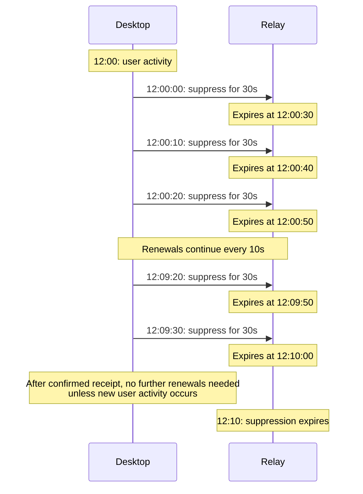

# Mobile push suppression

Status: draft, not ready for implementation.

Terminology is defined in [CONTEXT.md](../CONTEXT.md#notifications).

## Purpose

Keep [mobile push notifications](../CONTEXT.md#mobile-push-notification) quiet while the user is active on a computer where Buzz can receive the relevant community's activity. The intended behavior follows Slack's desktop-first notification model; it does not require proof that each message was visible or read. Suppression does not guarantee an alert on another device. If desktop alerts are disabled or silenced, the user may receive no alert on either device, including for DMs and mentions. The message remains unread, and its suppressed mobile push notification is not replayed later.

## Agreed requirements

### Scope and responsibilities

1. The initial version covers desktop-to-mobile suppression only. Mobile-to-mobile suppression is deferred.

2. Only the native desktop app originates [suppression activity signals](../CONTEXT.md#suppression-activity-signal) in the initial version. Browser clients do not suppress mobile push notifications.

3. Apply the same suppression rule to all otherwise eligible mobile push notifications for messages, including DMs, mentions, and thread replies, without special exceptions. Calls and other non-message alerts are outside this spec's initial scope.

4. The relay enforces suppression and is trusted to honor it for this feature. The push gateway remains entirely agnostic to suppression: it does not receive suppression activity signals, hold suppression state, or make suppression decisions.

5. Users need recourse if a relay mishandles or abuses push notifications. Designing that recourse is outside this spec; suppression does not promise enforcement against an uncooperative relay.

6. A future Do Not Disturb feature could expose the user's DND status to other members and potentially allow them to push through it. Both visible DND and any sender override are outside this spec; neither is an exception to the suppression rules defined here.

### Desktop activity and eligibility

7. Activity in another application counts while Buzz runs in the background. The notified conversation need not be open. Suppression does not check whether desktop alerts can be shown: desktop notification permissions, Buzz alert settings, and OS Focus/Do Not Disturb modes do not affect eligibility.

8. Suppression requires a working desktop connection to the relevant community. A broken connection must stop suppression for that community, even if the user remains active on the computer. Other connected communities may remain suppressed. Detection and propagation bounds remain to be specified.

9. Work within existing permissions. Buzz must not request additional permissions solely to observe cursor or keyboard activity outside the app. If computer-wide activity cannot be established within existing permissions, [in-app activity](../CONTEXT.md#in-app-activity) within the last ten minutes suffices. Buzz need not still be focused when suppression is evaluated. Available signals still need to be established for each supported platform.

10. Any eligible active desktop session connected to the relevant community suffices to suppress mobile push notifications for that community. One desktop becoming inactive or unavailable does not cancel another desktop's eligibility.

11. [Desktop activity](../CONTEXT.md#desktop-activity) applies across all communities connected in that client, regardless of which community the user is viewing. Each community still requires its own working connection under rule 8.

12. Choosing to appear offline to other members does not stop [push suppression](../CONTEXT.md#push-suppression) while the desktop otherwise qualifies. [Visible presence](../CONTEXT.md#visible-presence) controls what others see; suppression controls whether mobile devices receive alerts.

### Timing and failure behavior

13. Use a ten-minute [desktop inactivity](../CONTEXT.md#desktop-inactivity) threshold measured from the last observed user interaction. Resume mobile push notifications as soon as the user is considered inactive, with no [additional notification delay](../CONTEXT.md#additional-notification-delay), subject to the bounded timing tolerance in rule 17.

14. Locking or sleeping the computer, or quitting Buzz, immediately ends that desktop session's eligibility to suppress pushes, regardless of recent activity. Detection and propagation bounds remain to be specified.

15. A desktop session's suppression eligibility expires at most 30 seconds after the last reliable confirmation that it qualifies. This bounds stale suppression after an unannounced crash or loss of connectivity. Another qualifying desktop may still sustain suppression under rule 10. This expiry is separate from the ten-minute desktop inactivity threshold and adds no grace period after a known lock, sleep, quit, or inactivity transition.

16. Send a [suppression renewal](../CONTEXT.md#suppression-renewal) every ten seconds while a renewal is needed. This generates about six small signals per minute per active desktop/community connection.

17. A maximum delay of five seconds past the ten-minute [inactivity cutoff](../CONTEXT.md#inactivity-cutoff) is acceptable to simplify network-delay handling. Reject stale signals rather than allow them to prolong suppression beyond that limit. This tolerance does not relax the separate 30-second stale-session expiry requirement; delayed signals must not extend either limit.

18. When activity or connection status is uncertain, favor sending a potentially redundant mobile push notification over withholding an alert.

### Queued pushes and unread state

19. Resumption applies to newly arriving messages only. Do not replay mobile push notifications for previously [suppressed messages](../CONTEXT.md#suppressed-message). Suppression does not mark a message as read; unread messages remain unread.

20. A push that has already left the relay may still arrive after desktop becomes active. Suppression prevents subsequent pushes; it does not attempt to recall pushes already in transit.

21. Recheck suppression immediately before sending a push queued within the relay. If suppression applies, discard that queued push rather than defer it until desktop becomes inactive. This does not delete the message or mark it as read.

### Privacy and activity signaling

22. For each identity and community, desktop sends suppression activity signals while it otherwise qualifies and at least one mobile installation has push enabled and suppression not disabled. Disabling push on one installation does not stop signaling while another still needs suppression. Stop signaling for that identity and community when no installation needs it; stop all suppression activity signals to a relay when none of its connected communities need them. Apply this to existing controls where available and preserve it for future controls; rule 27 still defers a new suppression override UI. This does not stop unrelated connection maintenance traffic or presence events governed by visible-presence settings. Rule 28 defines the device-specific preference scope. How desktop learns whether any mobile installation still needs suppression remains to be designed.

23. Suppression activity signals are sent only to the relay and must not be broadcast to other members. They must not expose a user's activity through a second visible signal when the user chooses to appear offline.

24. Cooperating relays retain only current, short-lived suppression state, with no activity history (including an equivalent history in logs or telemetry). This is a relay behavior requirement, not a confidentiality guarantee: operators can modify relays to retain or mishandle received information. Clients must therefore enforce rule 22 locally rather than depending on a relay to stop requesting signals or to promise deletion.

25. Suppression activity signals must not contain input details. Short-lived, renewable validity calculated locally is the proposed mechanism, rather than reporting last user activity time.

26. Use separate events for suppression renewals and visible presence. Suppression timing and privacy must not depend on public-presence behavior. Sharing local activity detection remains an implementation option.

### Notification settings

27. No user-facing suppression override is required for the initial version.

28. Each mobile installation has its own push enablement setting for an identity and community, consistent with its distinct push lease. Disabling push on one installation must not disable it on another. Mobile OS notification permissions remain device-specific; whether they affect the installation's need for suppression stays explicitly TBD. Desktop notification permissions do not affect eligibility (rule 7).

29. Preference changes require relay confirmation and do not support offline queuing. Show a pending state for up to approximately ten seconds while attempting the change. If the client knows it cannot submit the change, or receives a rejection, show failure immediately; otherwise show failure when the attempt times out. Restore the previously confirmed value and clearly explain that the change was not confirmed. For a disable attempt, state: "Could not confirm that notifications were turned off. Notifications may continue." Do not silently restore the switch or claim that a local choice stopped remote delivery. Do not retain the attempt for later submission or automatic retry, including across restart. The user may explicitly retry or pursue the separate recourse described in rule 5. A timeout does not prove the relay rejected the change; its acknowledgment may have been lost. On the next successful sync, show the relay's actual setting, even if it differs from the value restored after timeout. This flow applies only to this installation's preference (rule 28) and does not submit cached state as a new choice (rule 31).

    **Relay cooperation:** saving a disabled choice locally and retrying indefinitely cannot guarantee that an unreachable or uncooperative relay stops sending notifications. This setting therefore reports confirmed relay state and makes failure or uncertainty visible. A relay's acknowledgment is not proof of future compliance. Enforcement independent of relay cooperation belongs to the recourse work in rule 5. This is the remote-operation exception described in the [mobile vision](../VISION_MOBILE.md#experience-principles).

30. No conflict state is shown in the UI. Local blocking of incoming iOS notifications is not promised; optional best-effort Android blocking remains deferred and does not determine the installation's preference outcome.

31. Reconnecting or synchronizing cached preference state is not a new user choice and must not overwrite a newer preference for that installation. Only an explicit settings change may update its enablement preference. Different installations do not compete to set a shared enablement value.

## Behavioral examples

| Situation | Agreed outcome |
| --- | --- |
| User works in an editor; Buzz runs in the background and receives community activity | Suppress otherwise eligible mobile push notifications for that community |
| User works in another app while Buzz qualifies for suppression, but desktop alerts are disabled, blocked by OS permissions, or silenced by Focus/Do Not Disturb | Suppress mobile push notifications even though neither device may alert; the message remains unread and the suppressed notification is not replayed |
| One mobile installation disables push while another still needs suppression for the same identity and community | Continue desktop suppression activity signals |
| No mobile installation needs suppression for an identity and community | Stop desktop suppression activity signals for that identity and community |
| User views one channel; a DM arrives elsewhere in the same connected community | The DM need not be visible for its mobile push notification to be suppressed |
| Desktop loses its connection to one community while the user stays active | Stop suppression for that community; do not invalidate other connected communities solely because of that failure |
| User reaches ten minutes of inactivity | Resume pushes for new eligible messages without an additional delay |
| Unread messages were suppressed before the user became inactive | Keep their unread state; do not replay their mobile push notifications |
| Observing computer-wide input would require new permission | Do not request it; use in-app activity within the last ten minutes |
| Buzz loses focus after recent in-app activity | Losing focus alone does not end suppression; the ten-minute activity window still applies |
| Activity or connection status is uncertain | Favor sending the otherwise eligible mobile push |
| The only eligible desktop locks, sleeps, or quits Buzz | End suppression immediately, regardless of recent activity |
| One desktop locks while another remains active and connected to the community | Continue suppression based on the other desktop |
| User views one community while other communities remain connected | Suppress mobile push notifications across all those connected communities |
| The only qualifying desktop crashes or loses connectivity without warning | Expire its eligibility within 30 seconds of its last reliable confirmation; resume pushes for newly arriving eligible messages |
| Future settings disable notifications or suppression across every community on a relay | Stop suppression activity signaling to that relay |
| User turns notifications off while offline, or the relay rejects the change | Immediately show that disabling was not confirmed and notifications may continue; retain the previously confirmed value and do not queue the change |
| Disable attempt times out, whether or not the relay committed the change | Show the same warning after at most approximately ten seconds, restore the previously confirmed value, and do not retry automatically |
| App restarts or reconnects after an unconfirmed preference change | Do not resubmit the failed attempt; show the relay's actual value on successful sync, without overwriting it with cached state |

## Deferred product questions and remaining design work

- **Logout:** define its effect on identity-scoped suppression state.
- **Multiple desktop sessions:** define how contradictory or stale evidence about an individual session is handled; eligibility across sessions follows rule 10.
- **Mobile notification permissions:** decide whether mobile OS notification permissions affect an installation's need for suppression. Desktop notification permissions, alert settings, and Focus modes do not affect eligibility (rule 7).
- **Timing races:** define the decision point for a newly arriving message and ordering against concurrent suppression updates. Queued pushes are rechecked and discarded when suppressed (rule 21); pushes already sent by the relay are not recalled (rule 20).
- **Failure handling:** the stale-suppression bound is 30 seconds under rule 15; define reliable confirmation, reconnect behavior, and propagation of known transitions within that bound.
- **Identity and isolation:** define scope across identities, communities, relays, and installations. Connected communities need not be selected in the UI to qualify under rule 11.
- **Privacy:** define the minimum contents of suppression activity signals. Recipients and visibility are settled by rule 23; retention is settled by rule 24. Suppression must not imply read receipts. Define how desktop learns that at least one mobile installation needs suppression, or that none do, and enforces rule 22 using the installation/identity/community scope in rule 28. The aggregation rule is settled; its synchronization mechanism remains open.

## Research context, not additional requirements

[Slack's notification documentation](https://slack.com/help/articles/201355156-Configure-your-Slack-notifications) describes default delivery after one minute of screen lock or ten minutes without cursor activity, and separately offers immediate delivery, delivery upon inactivity, or additional delay. This spec uses delivery upon inactivity with a ten-minute inactivity threshold.

The public documentation does not fully specify OS-wide versus app-focused activity detection, browser equivalence, arbitration among multiple devices, or queue behavior. Those details must not be represented as verified Slack behavior. Keyboard activity was discussed for Buzz, but Slack's cited text specifically names cursor activity.

## Architecture status

The relay is the selected suppression authority; the push gateway is outside suppression entirely. Short-lived renewals are the design direction, subject to the timing trade-offs below. Storage, authentication, and event kinds remain unresolved. This document does not describe current implementation behavior.

### Short-lived suppression renewals

Desktop computes the remaining time until ten minutes after its last observed activity. A proposed renewal's validity is the lesser of 30 seconds and that remaining time. No input details are transmitted. The relay may still infer approximate activity from the timing and contents of suppression activity signals.

The cadence is a renewal every ten seconds, beginning as soon as the session qualifies. This leaves room for delay or a missed renewal before the 30-second expiry. Once the relay's confirmed expiry reaches the inactivity cutoff, further renewals that do not extend it can be omitted unless new activity occurs. Confirmation, lost renewals, ordering, and timing mechanics remain to be designed; merely sending a signal does not prove the relay received it.

The following example assumes instant delivery and successful receipt. Last activity is at 12:00, making the inactivity cutoff 12:10. The example isolates renewal timing; the session otherwise qualifies and push settings permit signaling.

If desktop crashes, renewals stop and the last expiry stands. Starting a relative validity duration upon receipt would extend suppression by transit delay. The maximum five-second tolerance at the inactivity cutoff and separate 30-second stale-session bound still apply. Protection against delayed or stale renewals remains to be designed; this diagram is not a complete wire protocol.

Immediate invalidation on known lock, sleep, quit, or disconnection still applies. Renewal expiry handles failures that cannot be reported. No renewal is sent for an identity and community when no mobile installation needs suppression (rule 22).

### Activity authority and visible presence

The relay enforces suppression without gateway involvement. Appearing offline must not prevent suppression when push settings warrant it. Signals go only to the relay, without broadcast to other members. Cooperating relays retain no activity history; desktop stops suppression activity signaling when no mobile installation needs it for that identity and community.

These choices have separate dimensions: local activity detection, the service that enforces suppression, and the status disclosed to other members. Sharing local detection does not require sharing public status, storage, or recipients.

**Rationale for separate events:** suppression renews every ten seconds and must expire within 30 seconds of the last reliable confirmation. Existing visible presence uses a 60-second heartbeat and a 180-second expiry. Combining them would couple different timing and disclosure rules and require additional handling when public presence is manually offline. Separate events preserve suppression's timing and keep its signals private to the relay without changing public presence. Local activity detection can still be shared.

Repository observations during discovery (not desired-behavior requirements):

- [Desktop presence](../desktop/src/features/presence/hooks.ts) derives automatic activity separately from manual away/offline preferences. It uses OS idle information when available and in-app activity otherwise.
- [Presence timing](../desktop/src/features/presence/lib/presence.ts) already uses a ten-minute idle threshold, but a 60-second public-presence heartbeat.
- [Relay presence storage](../crates/buzz-pubsub/src/presence.rs) is scoped by community and user, with a 180-second expiry. That existing state alone does not satisfy the 30-second, per-desktop-session suppression requirement.
- [Push matching](../crates/buzz-relay/src/push_runtime.rs) currently happens at the relay, where event, user, community, and installation information meet.
- [Gateway delivery requests](../crates/buzz-push-gateway/src/model.rs) carry an opaque grant, request identifier, and expiry, with no event payload. Gateway [authority](../crates/buzz-push-gateway/src/authority.rs) binds installations to relay delegations rather than maintaining desktop activity state.

Relay enforcement fits existing community-scoped push matching and client connection boundaries. It assumes relay cooperation. User recourse for relay push abuse is separate work.

A suppression activity signal could convey only that desktop qualifies for suppression in a particular community until a short expiry, instead of conveying raw input events or an exact last-interaction timestamp. Such a signal still reveals activity-related information to the relay. Private handling by a cooperative relay would not guarantee confidentiality against a malicious relay operator.

Public presence and suppression answer different product questions. A user may choose to appear away/offline while still using desktop; a mobile client may make them visibly online without qualifying for desktop-to-mobile suppression. Appearing offline does not prevent suppression (rule 12). Manual away behavior remains unresolved. Reusing the same raw detector is a separate implementation option.
