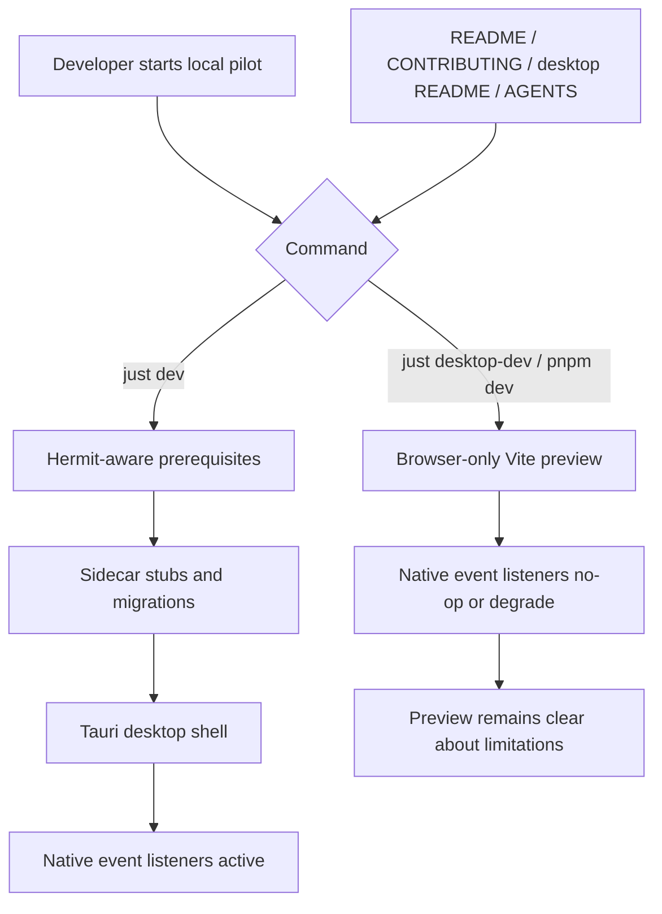

# Dev Startup Pilot Smoothness - Plan

## Goal Capsule

| Field | Value |
|---|---|
| Objective | Make local Buzz pilot startup predictable by fixing Hermit-backed Just prerequisites, clarifying desktop launch commands, and preventing browser-only Vite startup from crashing on Tauri event listeners. |
| Authority | Preserve `just dev` as the full desktop pilot path; keep `desktop-dev` as frontend/Vite-only unless a later product decision changes that contract. |
| Execution profile | Small developer-experience fix with one runtime safety layer and targeted tests. |
| Stop conditions | Stop if a proposed fix requires making the desktop app fully functional in a plain browser, changing Tauri app launch semantics, or broad refactoring of all Tauri API use. |
| Tail ownership | Implementation should update source, docs, and focused verification together so future pilots can follow the repo instructions without rediscovering the launch boundary. |

---

## Product Contract

### Summary

Local source pilots should have one reliable happy path: `just dev` launches the relay and Tauri desktop app, while `desktop-dev` is documented and hardened as a browser-only frontend preview.
The current failure modes are confusing because `desktop-dev` serves a URL that can render the bee splash but then throws Tauri IPC errors, and `just dev` can fail early when private prerequisite recipes call Rust tools before the repo `bin/` shims are on `PATH`.

### Problem Frame

The observed bee-screen hang is not a relay outage: both the Vite URL and relay can respond, but browser-loaded desktop React code calls Tauri event APIs without a Tauri runtime.
The observed `_ensure-sidecar-stubs` exit 127 is a startup-path defect: `dev` exports the Hermit `bin/` path inside its body, but Just prerequisites execute before that body, so `_ensure-sidecar-stubs` sees a shell without `rustc`.

### Requirements

**Startup Recipes**

- R1. `just dev` and its private prerequisites must find repo-pinned Hermit tools from a normal shell when the repo `bin/` shims exist.
- R2. Private prerequisite recipes that invoke Hermit-pinned tools must fail with clear setup guidance if a required shim cannot be executed.
- R3. The sidecar placeholder recipe must continue creating external binary stubs for the current Rust host target because Tauri validates sidecars at compile time.

**Desktop Browser Boundary**

- R4. Startup-mounted Tauri event subscriptions must not throw unhandled rejections when the desktop frontend is opened in browser-only Vite mode.
- R5. Tauri-native behavior must remain unchanged when the app runs through `tauri dev` or a packaged desktop build.
- R6. The fix must not promise that the desktop app is fully usable in a plain browser; it only makes browser-only startup and preview mode degrade cleanly around native event subscriptions.

**Documentation**

- R7. Developer-facing docs must name `just dev` as the source-build pilot path for the real desktop app.
- R8. Docs must describe `desktop-dev` and `pnpm dev` as Vite/browser frontend preview paths with no Tauri shell, and call out native-feature limitations.
- R9. Docs must explain when Hermit activation is still useful for ad hoc shell commands versus when Just recipes bootstrap the repo shims themselves.

### Acceptance Examples

- AE1. Given a fresh terminal in the repo with `just` available and Hermit shims present under `bin/`, when a developer runs `just dev`, then `_ensure-sidecar-stubs` does not fail because `rustc` is missing from `PATH`.
- AE2. Given the desktop frontend is opened from `just desktop-dev` in a normal browser, when app-root native event hooks mount, then they do not throw `transformCallback` errors from missing Tauri internals.
- AE3. Given a developer reads the quick start, when they want to pilot Buzz locally, then the docs direct them to `just dev` rather than the browser-only Vite URL.

### Scope Boundaries

- `just dev`, `desktop-dev`, and source-pilot docs are in scope.
- Startup-mounted Tauri event listeners are in scope when they can be guarded without changing app behavior.
- Making every desktop feature fully browser-compatible is out of scope.
- Renaming `desktop-dev` or changing it to run `tauri dev` is out of scope unless implementation proves docs-plus-guards cannot make the current contract safe.
- Packaged release installation and mobile startup are out of scope.

---

## Planning Contract

### Key Technical Decisions

- KTD1. **Keep `just dev` as the canonical pilot path.** It already owns relay startup, migrations, sidecar preparation, dynamic Tauri config, and native shell launch; changing `desktop-dev` into another native launch path would blur the repo's existing command model.
- KTD2. **Fix Hermit pathing at prerequisite boundaries.** Recipes that run before `dev`'s body cannot rely on `dev`'s internal `PATH` export, so each tool-using prerequisite needs a repo-local Hermit path convention or direct shim invocation.
- KTD3. **Guard native event subscriptions, not every native call.** The immediate bee-screen failure comes from event listener setup during startup; broader browser compatibility would require identity, community, deep-link, window, notification, and plugin decisions beyond this pilot fix.
- KTD4. **Document preview mode honestly.** Browser-only Vite can be useful for frontend preview and mock/e2e work, but docs should prevent users from mistaking it for the real desktop app.

### High-Level Technical Design

### Assumptions

- Hermit shims under `bin/` are the repo-supported source of pinned Rust, Node, pnpm, and Just tooling.
- `desktop-dev` has existing value as a Vite-only workflow, so the plan preserves it and clarifies its limitations rather than replacing it.
- Focused Node desktop tests are sufficient to prove browser-boundary listener guards; full Tauri smoke verifies the sidecar and native startup path.

### Sources & Research

- `Justfile` contains `_ensure-sidecar-stubs`, `dev`, `desktop-standalone`, `desktop-dev`, and related desktop verification recipes.
- `scripts/instance-env.sh` creates the dynamic Tauri config and Vite port used by native dev launches.
- `README.md`, `CONTRIBUTING.md`, `desktop/README.md`, and `AGENTS.md` are the user- and agent-facing command guides that need aligned wording.
- `desktop/src/features/notifications/lib/desktop.ts`, `desktop/src/shared/lib/haptics.ts`, and `desktop/src/shared/lib/titleBarActions.ts` show existing `isTauri()` native-boundary patterns.
- `desktop/src/features/mesh-compute/hooks/useMeshDownloadProgress.ts` shows an event-listener pattern that catches unavailable event systems and degrades silently.
- No `docs/solutions/`, `solutions/`, or `CONCEPTS.md` learning corpus exists in this checkout.

---

## Implementation Units

### U1. Hermit-Aware Just Prerequisites

- **Goal:** Ensure `just dev` and related desktop recipes can run private prerequisites from a normal shell without missing `rustc`, `cargo`, or other repo-pinned tools.
- **Requirements:** R1, R2, R3
- **Dependencies:** None
- **Files:** `Justfile`
- **Approach:**
  1. Introduce or apply a consistent repo-local Hermit path convention for prerequisite recipes that invoke pinned tools.
  2. Update `_ensure-sidecar-stubs` so it resolves the Rust host target through the repo shim path before creating sidecar placeholder binaries.
  3. Audit `_ensure-migrations`, `desktop-dev`, and nearby desktop recipes for the same prerequisite-time `PATH` problem and apply the convention where they invoke pinned tools.
  4. Keep existing sidecar binary names aligned with release/build comments.
- **Execution note:** This is mostly tooling/config; prefer dry-run and runtime smoke verification over adding a unit test for Just syntax.
- **Patterns to follow:** Existing `export PATH="{{justfile_directory()}}/bin:$PATH"` usage in `bootstrap`, `hooks`, `relay`, `admin`, `dev`, `desktop-standalone`, `staging`, and `production`.
- **Test scenarios:**
  - With `rustc` and `cargo` absent from the ambient shell but repo `bin/` shims present, `just dev` reaches the relay/Tauri startup phase instead of failing in `_ensure-sidecar-stubs`.
  - With a missing or non-executable required shim, the recipe reports actionable setup guidance rather than a bare exit 127.
  - Sidecar placeholders are still created for all configured external binaries with the current host target suffix.
- **Verification:** `just --dry-run dev`, `just --dry-run desktop-dev`, and `just desktop-tauri-check` confirm recipe structure and Tauri sidecar validation.

### U2. Browser-Safe Startup Event Subscriptions

- **Goal:** Prevent browser-only Vite startup from throwing unhandled Tauri event-listener errors while preserving native desktop event behavior.
- **Requirements:** R4, R5, R6, AE2
- **Dependencies:** None
- **Files:** `desktop/src/features/communities/useNestNotifications.ts`, `desktop/src/features/agents/lib/useAgentsDataRefresh.ts`, `desktop/src/shared/deep-link.ts`, `desktop/src/shared/useMessageDeepLinks.ts`, `desktop/src/shared/api/tauriEvents.ts`, `desktop/src/features/communities/useNestNotifications.test.mjs`, `desktop/src/features/agents/lib/useAgentsDataRefresh.test.mjs`, `desktop/src/shared/deep-link.test.mjs`, `desktop/src/shared/useMessageDeepLinks.test.mjs`
- **Approach:**
  1. Add a small browser-safe native event-listener helper at `desktop/src/shared/api/tauriEvents.ts`, using `isTauri()` and contained `try/catch` around listener setup.
  2. Apply it to startup-mounted event subscriptions: nest notifications, agents data refresh, community deep links, and message deep links.
  3. Preserve existing cleanup semantics so resolved unlisten functions are still called when native listeners were registered.
  4. Avoid changing command invocations or community initialization in this unit.
- **Execution note:** Start with a failing browser-boundary test for at least one startup-mounted listener before applying the shared convention broadly.
- **Patterns to follow:** `desktop/src/features/notifications/lib/desktop.ts` for `isTauri()` gates and `desktop/src/features/mesh-compute/hooks/useMeshDownloadProgress.ts` for catch-and-degrade event listener setup.
- **Test scenarios:**
  - In a browser-like test environment with no `window.__TAURI_INTERNALS__.listen`, mounting nest notifications does not throw or create an unhandled rejection.
  - In the same environment, mounting agents data refresh does not throw and does not schedule invalidation timers.
  - In the same environment, deep-link registration returns a safe cleanup path and no-ops without throwing.
  - With mocked Tauri internals available, each listener still registers, receives an event, performs its expected side effect, and unregisters on cleanup.
- **Verification:** Focused desktop unit tests plus `just desktop-test` prove the browser-boundary behavior without launching Tauri.

### U3. Launch Documentation Alignment

- **Goal:** Make the source-pilot instructions unambiguous for humans and agents.
- **Requirements:** R7, R8, R9, AE3
- **Dependencies:** U1, U2
- **Files:** `README.md`, `CONTRIBUTING.md`, `desktop/README.md`, `AGENTS.md`
- **Approach:**
  1. Update the quick start so `just dev` is the recommended local pilot command and the command description mentions that the desktop app should pop up through Tauri.
  2. Reword split-terminal guidance so `desktop-dev` is explicitly frontend/Vite-only and not the full desktop pilot path.
  3. Clarify that `pnpm dev` in `desktop/` is a browser frontend preview, while `pnpm tauri dev` or repo-level `just dev` is the desktop app.
  4. Add a brief Hermit note that Just recipes use repo shims for supported flows after U1, while ad hoc shell commands still benefit from `. ./bin/activate-hermit`.
- **Execution note:** Keep this as command semantics, not a full troubleshooting guide.
- **Patterns to follow:** `CONTRIBUTING.md` already distinguishes `just dev` from Vite-only `desktop-dev`; preserve that structure and make the limitations clearer.
- **Test scenarios:**
  - Documentation review can answer “what command should I run for a real pilot?” with `just dev`.
  - Documentation review can answer “why does the Vite URL differ from the desktop app?” without inspecting source code.
  - Agent instructions point future agents at the same command boundaries as the human docs.
- **Verification:** Markdown review plus a grep pass confirms the docs no longer recommend `desktop-dev` as the manual desktop pilot path.

### U4. Startup Smoke Verification

- **Goal:** Prove the full startup story works after the recipe, runtime-boundary, and documentation changes.
- **Requirements:** R1, R3, R4, R5, AE1, AE2
- **Dependencies:** U1, U2, U3
- **Files:** `Justfile`, `desktop/package.json`, `desktop/src/features/communities/useNestNotifications.test.mjs`, `desktop/src/features/agents/lib/useAgentsDataRefresh.test.mjs`, `desktop/src/shared/deep-link.test.mjs`, `desktop/src/shared/useMessageDeepLinks.test.mjs`
- **Approach:**
  1. Run non-mutating command expansion checks for `dev` and `desktop-dev`.
  2. Run focused desktop tests for the Tauri event boundary.
  3. Run the desktop check gate for lint, formatting, and type regressions.
  4. Run a Tauri compile smoke that exercises sidecar validation.
  5. If a full `just dev` launch is attempted, treat GUI startup as a smoke check and do not expand the plan into visual QA.
- **Execution note:** This unit should verify behavior; it should not add new product behavior.
- **Patterns to follow:** Existing `desktop-test`, `desktop-check`, and `desktop-tauri-check` recipes in `Justfile`.
- **Test scenarios:**
  - `just desktop-tauri-check` validates sidecar stubs and Tauri compile setup.
  - `just desktop-test` includes the new browser-boundary tests and passes.
  - `just desktop-check` passes after docs and TypeScript changes.
  - Local URL checks distinguish relay health from desktop runtime readiness in implementation notes or final report.
- **Verification:** The implementation is complete only when the relevant focused gates pass or any skipped gate has a concrete environmental reason recorded.

---

## Verification Contract

| Gate | Applies To | Done Signal |
|---|---|---|
| `just --dry-run dev` | U1, U4 | Command expansion shows prerequisite sequencing without syntax errors. |
| `just --dry-run desktop-dev` | U1, U3, U4 | Browser-only preview command remains available and clearly separate from native launch. |
| `just desktop-test` | U2, U4 | Browser-boundary tests pass through the desktop Node test loader. |
| `just desktop-check` | U2, U3, U4 | Desktop TypeScript, Biome, file-size, px-text, and pubkey checks pass. |
| `just desktop-tauri-check` | U1, U4 | Tauri compile validation passes with sidecar stubs available. |
| Optional local smoke: `just dev` | U1, U4 | The relay reaches readiness and the Tauri desktop app launches; if GUI launch is unavailable in the environment, record that limitation. |

---

## Definition of Done

- `just dev` no longer fails in `_ensure-sidecar-stubs` because the ambient shell lacks `rustc`.
- Browser-only `desktop-dev` no longer produces unhandled Tauri event-listener rejections during startup.
- Native Tauri event behavior for notifications, agents refresh, and deep links is preserved.
- Human and agent docs consistently recommend `just dev` for source pilots and describe `desktop-dev` as frontend-only.
- Focused tests cover the missing-Tauri startup boundary.
- Verification gates in the Verification Contract pass or have explicitly recorded environmental blockers.
- Any exploratory implementation dead ends are removed from the final diff.
