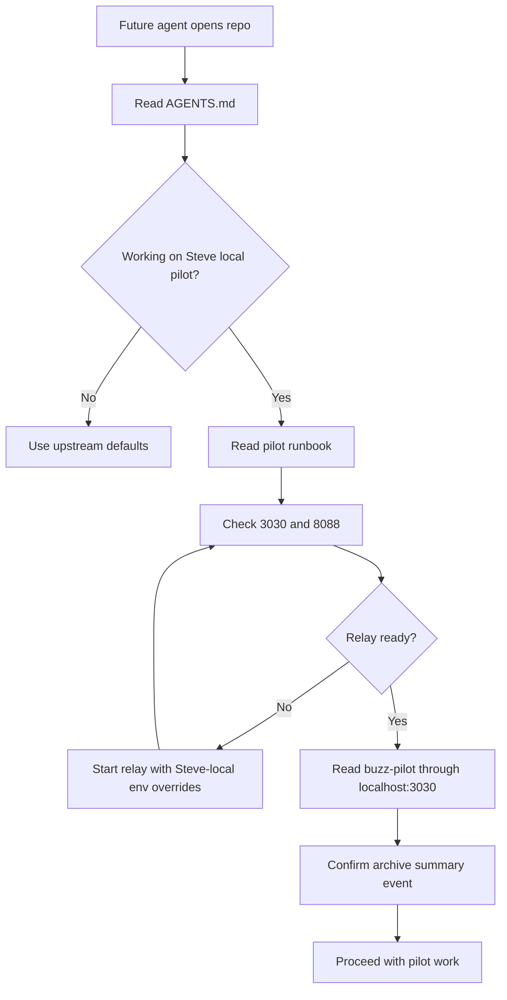

# Buzz Startup Readiness - Plan

## Goal Capsule

- **Objective:** Make Steve's local Buzz pilot startup boring and recoverable by keeping agent guidance current, preserving upstream defaults, and documenting a verified `localhost:3030` startup path.
- **Product authority:** Steve-local pilot rules override generic upstream onboarding only for this local pilot. Upstream project defaults remain documented as defaults.
- **Execution profile:** Documentation and lightweight verification work, with smoke-first proof rather than broad automated test coverage.
- **Stop conditions:** Stop before any destructive local data command, any raw migration from `localhost:3000` to `localhost:3030`, or any change that would make Steve-local behavior look like an upstream default.
- **Tail ownership:** `ce-work` or a human implementer updates docs and optionally adds a small local smoke helper, then verifies startup against the active local relay.

---

## Product Contract

### Summary

This work makes the current Buzz pilot state easy for the next agent to understand and restart. It keeps `localhost:3030` as Steve's active pilot path while treating `localhost:3000` as archive/reference only.

### Problem Frame

Buzz's upstream local development path defaults to `localhost:3000`, but Steve's pilot now deliberately avoids that port. The repo already has a Steve-local continuity runbook and an `AGENTS.md` pointer, but generic setup snippets, relay logs, seeding defaults, and desktop environment defaults can still pull a future agent back toward `3000`.

The value is reduced rehydration time: a future agent should be able to open the repo, read the right guidance, start or verify the active pilot on `3030`, and understand how old `3000` messages appear in the main active instance.

### Requirements

**Agent Guidance**

- R1. Top-level `AGENTS.md` must distinguish upstream defaults from Steve-local pilot overrides.
- R2. Top-level `AGENTS.md` must point future agents to the local continuity runbook, Day 0 notes, and handoff report before local Buzz data is touched.
- R3. Nested `AGENTS.md` files must be checked for relevance and either left unchanged with a reason or updated when they could mislead startup or agent-context work.

**Startup Continuity**

- R4. The active Steve pilot startup path must use `localhost:3030`, health port `8088`, and metrics port `9202`.
- R5. The startup docs must show how `RELAY_URL`, `BUZZ_RELAY_URL`, `BUZZ_BIND_ADDR`, `BUZZ_HEALTH_PORT`, and `BUZZ_METRICS_PORT` interact during local startup.
- R6. The docs must call out that relay logs can still show `relay_url:"ws://localhost:3000"` when bind and CLI verification are correctly pointed at `3030`.
- R7. The startup path must verify both process readiness and Buzz-level channel readback.

**Archive Boundary**

- R8. The previous `localhost:3000` pilot community must remain documented as archive/reference only.
- R9. The active `localhost:3030` community must document that old raw messages were summarized into `buzz-pilot`, not migrated one by one.
- R10. Any future raw export or migration from `3000` to `3030` must remain out of scope unless Steve explicitly approves a backup-first plan.

### Success Criteria

- SC1. A future agent can answer "which port do I use for Steve's pilot?" from `AGENTS.md` without reading the whole repo.
- SC2. A future agent can run a bounded startup verification without using port `3000`.
- SC3. A future agent can explain where old `3000` messages appear in the active `3030` instance.
- SC4. The docs do not erase or contradict upstream's default `localhost:3000` local development behavior.

### Scope Boundaries

#### In Scope

- Clarifying `AGENTS.md` and local pilot docs.
- Adding a startup smoke checklist or helper if documentation alone remains too error-prone.
- Verifying local relay readiness and active `buzz-pilot` readback.

#### Deferred to Follow-Up Work

- A reusable local CLI helper that automatically starts and verifies the Steve pilot path.
- A persistent disposable pilot identity for repeated agent-authored Buzz writes.
- Slack visibility integration beyond documenting the intended boundary.

#### Out of Scope

- Changing upstream default ports for all Buzz contributors.
- Migrating raw old `localhost:3000` events into `localhost:3030`.
- Running destructive reset, volume deletion, or in-place community merge commands.

### Acceptance Examples

- AE1. Given a future agent opens the repo cold, when they read `AGENTS.md`, then they see that Steve-local pilot work uses `localhost:3030` and that `localhost:3000` is archive/reference only.
- AE2. Given the relay is running on `3030`, when the agent performs the documented readiness and channel-readback checks, then `buzz-pilot` is readable from `localhost:3030`.
- AE3. Given Steve asks where previous pilot messages are, when the agent reads the docs, then they answer that the active instance contains summary event `295d3891fb6a200a325f148ed651e4fc519f7b51f9d15bb9cad84b041871d8aa` and raw old messages remain in the `localhost:3000` archive.
- AE4. Given an upstream contributor follows generic setup, when they read Getting Started, then upstream defaults still make sense and are not replaced by Steve-local pilot rules.

---

## Planning Contract

### Key Technical Decisions

- KTD1. **Preserve upstream defaults and layer Steve-local overrides nearby.** Upstream development still defaults to `localhost:3000`, but Steve's pilot guidance must say when and how to override to `3030`. This prevents personal pilot state from drifting into project-wide truth while still protecting Steve's workflow.
- KTD2. **Prefer a smoke checklist before a helper script.** The first pass should make manual verification clear and repeatable; add a helper only if the checklist stays error-prone after one more manual run.
- KTD3. **Verify through readiness plus channel readback.** A process listening on `3030` is not enough because host-scoped communities can differ; the proof must include `buzz-pilot` readback from `localhost:3030`.
- KTD4. **Keep archive recovery read-only by default.** The old `localhost:3000` community is only queried or summarized unless Steve approves backup-first export or migration.

### High-Level Technical Design

### Assumptions

- A1. The current priority is reliable local pilot startup, not full upstream setup redesign.
- A2. `localhost:3030`, `8088`, and `9202` remain acceptable Steve-local ports unless a later conflict appears.
- A3. Documentation updates are sufficient for the next iteration unless manual verification shows repeated operator mistakes.

### Relevant Existing Patterns

- `AGENTS.md` already includes a Steve Local Pilot Continuity section and generic upstream Getting Started defaults.
- `docs/pilots/buzz-local-continuity-runbook.md` owns the current continuity model, backup boundaries, and active/archive community split.
- `docs/pilots/2026-07-25-buzz-day0-slack-visibility.md` owns Day 0 evidence, channel IDs, and archive summary event provenance.
- `docs/dogfood-reports/2026-07-26-codex-fix-dev-startup-pilot-buzz-continuity-handoff.md` explains the next-person handoff and the summary-versus-raw-message distinction.
- `scripts/seed-local-community.sh` derives host rows from `RELAY_URL`, so startup docs must mention `RELAY_URL` as well as `BUZZ_RELAY_URL`.
- `scripts/instance-env.sh` defaults desktop clients to `ws://localhost:3000` unless `BUZZ_RELAY_URL` is provided by the caller.
- `Justfile` recipes default relay bind, health, and metrics ports to `3000`, `8080`, and `9102`, while Steve's pilot commands override them.

---

## Implementation Units

### U1. Audit Agent Guidance

- **Goal:** Ensure future agents see the Steve-local pilot override before they follow generic startup instructions.
- **Requirements:** R1, R2, R3, AE1, AE4
- **Dependencies:** None
- **Files:**
  - `AGENTS.md`
  - `desktop/src/features/agents/AGENTS.md`
  - `docs/dogfood-reports/2026-07-26-codex-fix-dev-startup-pilot-buzz-continuity-handoff.md`
- **Approach:**
  1. Review all repo `AGENTS.md` files for startup, relay, desktop, and agent-context claims.
  2. Keep nested desktop agent-config guidance unchanged unless it creates startup confusion.
  3. Tighten the top-level Steve-local section so it explicitly says generic Getting Started defaults still describe upstream behavior.
  4. Ensure the handoff report stays linked from top-level guidance.
- **Execution note:** Treat this as documentation hygiene; no code behavior should change in this unit.
- **Patterns to follow:** Existing top-level `AGENTS.md` structure with scoped subsections and concise pointers.
- **Test scenarios:**
  - Given a cold future agent starts from `AGENTS.md`, when they scan Getting Started and Steve Local Pilot Continuity, then they can distinguish upstream `3000` defaults from Steve-local `3030` pilot rules.
  - Given a future agent works under `desktop/src/features/agents/`, when they read the nested `AGENTS.md`, then they do not receive conflicting startup instructions.
  - Given the dogfood handoff report exists, when top-level guidance links it, then the old-message visibility explanation is discoverable without transcript history.
- **Verification:** Markdown renders cleanly, links point to existing repo-relative files, and no Steve-local rule is presented as a universal upstream default.

### U2. Tighten Startup Runbook

- **Goal:** Make the startup and verification path clear enough to follow without conversation context.
- **Requirements:** R4, R5, R6, R7, AE2
- **Dependencies:** U1
- **Files:**
  - `docs/pilots/buzz-local-continuity-runbook.md`
  - `docs/pilots/2026-07-25-buzz-day0-slack-visibility.md`
- **Approach:**
  1. Add an explicit environment-variable table for Steve-local startup.
  2. Explain the difference between relay bind address, relay URL, CLI URL, health port, metrics port, and seeded host rows.
  3. Document why `RELAY_URL=ws://localhost:3030` matters for host seeding when starting fresh.
  4. Keep the warning that logs may still show `ws://localhost:3000`, but define the decisive verification as readiness plus `buzz-pilot` readback on `3030`.
- **Execution note:** Start with docs-only changes, then run the startup smoke manually to validate the wording.
- **Patterns to follow:** Existing runbook sections for Safe Preflight, Start And Stop Safely, and Verify Active Community Through The CLI.
- **Test scenarios:**
  - Given Docker services are healthy, when the documented Steve-local startup env is used, then the relay binds on `127.0.0.1:3030` and health responds on `8088`.
  - Given `.env` or defaults still mention `3000`, when the agent reads the runbook, then they know which verification signal wins.
  - Given a fresh host-row mismatch appears, when the agent reads the runbook, then they know to inspect or seed `localhost:3030` rather than switching to `3000`.
- **Verification:** The runbook contains no active-pilot checklist step that points at `3000` or `8080`, except in archive-only sections.

### U3. Add Startup Smoke Checklist

- **Goal:** Provide a small, repeatable proof that startup is smooth on `3030`.
- **Requirements:** R4, R7, R8, R9, AE2, AE3
- **Dependencies:** U2
- **Files:**
  - `docs/pilots/buzz-local-continuity-runbook.md`
  - Optional: `scripts/buzz-pilot-smoke.sh`
  - Optional: `scripts/test-buzz-pilot-smoke.sh`
- **Approach:**
  1. First implement the smoke as a documented checklist.
  2. Include port-listener checks, Docker service health, readiness, channel listing, and bounded `buzz-pilot` message readback.
  3. If the checklist remains cumbersome after one manual pass, add a small local helper script that performs read-only checks and prints next actions.
  4. Ensure any helper refuses destructive actions and never starts by touching `localhost:3000`.
- **Execution note:** This is mostly operational verification; prefer runtime smoke proof over unit tests.
- **Patterns to follow:** `scripts/start-relay-for-tests.sh` for health polling style, but keep Steve-pilot checks local and non-destructive.
- **Test scenarios:**
  - Given the relay is already running on `3030`, when the checklist is followed, then it confirms readiness and shows `buzz-pilot`.
  - Given the relay is not running, when the checklist is followed, then it tells the operator to start the Steve-local relay rather than falling back to `3000`.
  - Given only the old archive community is reachable, when the checklist is followed, then it reports archive-only state and does not treat that as active pilot success.
  - If a helper script is added, given no relay is running, when its script-level test runs, then it proves the helper exits nonzero with a safe next-action message and no data mutation.
- **Verification:** Manual smoke output proves `localhost:3030` readiness and active-channel readback, or the docs capture the exact blocker.

### U4. Reconcile Archive Visibility Language

- **Goal:** Make the previous-message story precise everywhere a future agent might look.
- **Requirements:** R8, R9, R10, AE3
- **Dependencies:** U1, U2
- **Files:**
  - `AGENTS.md`
  - `docs/pilots/buzz-local-continuity-runbook.md`
  - `docs/pilots/2026-07-25-buzz-day0-slack-visibility.md`
  - `docs/dogfood-reports/2026-07-26-codex-fix-dev-startup-pilot-buzz-continuity-handoff.md`
- **Approach:**
  1. Standardize the wording: old messages appear in the active instance as a summary event, not raw migrated events.
  2. Preserve the summary event ID and source channel IDs in exactly one or two authoritative places, then link rather than restating everywhere.
  3. Keep backup-first migration as an explicit follow-up option, not an implied next step.
- **Execution note:** Avoid touching local database state in this unit.
- **Patterns to follow:** Existing Day 0 CLI Evidence and Recovered Old Community sections.
- **Test scenarios:**
  - Given Steve asks where older pilot messages are, when a future agent reads any of the linked docs, then they answer with the summary event and archive boundary.
  - Given a future agent considers raw migration, when they read the docs, then they see backup-first approval is required before proceeding.
  - Given a doc mentions `localhost:3000`, when it is not in an archive-only context, then the wording is corrected or justified.
- **Verification:** `rg` for `localhost:3000`, `localhost:3030`, and the summary event shows consistent active/archive framing.

---

## Verification Contract

| Gate | Applies To | Done Signal |
|---|---|---|
| Markdown guidance scan | U1, U2, U4 | `AGENTS.md` and pilot docs distinguish upstream defaults from Steve-local overrides. |
| Port/reference scan | U2, U4 | `localhost:3000` references are either upstream-default context or archive-only context. |
| Local readiness smoke | U2, U3 | `http://127.0.0.1:8088/_readiness` returns ready for the active relay. |
| Active channel readback | U3, U4 | `buzz-pilot` is readable through `BUZZ_RELAY_URL=http://localhost:3030`. |
| Optional helper check | U3 | If a helper script is added, it is executable, read-only, and fails safely when the relay is absent. |

---

## Definition of Done

- The top-level agent guide tells future agents where to start for Steve-local Buzz pilot work.
- The startup runbook contains a clear `3030` startup and verification path.
- Generic upstream `3000` defaults remain intact and are not rewritten as if Steve's pilot applies to every contributor.
- The old-message visibility story is consistent: active `3030` has the summary event, raw old events remain in `3000` archive.
- Startup verification is proven once after the docs are updated, or the blocker is recorded in the runbook.
- No destructive database, Docker volume, or migration command is run.
- Any abandoned helper-script attempt is removed before declaring the work done.

---

## Appendix

### Source Breadcrumbs

- `AGENTS.md` — top-level agent guidance and current Steve Local Pilot Continuity section.
- `desktop/src/features/agents/AGENTS.md` — nested agent-config contributor rules.
- `docs/pilots/buzz-local-continuity-runbook.md` — current local startup and continuity runbook.
- `docs/pilots/2026-07-25-buzz-day0-slack-visibility.md` — Day 0 state, CLI evidence, Slack visibility boundary.
- `docs/dogfood-reports/2026-07-26-codex-fix-dev-startup-pilot-buzz-continuity-handoff.md` — next-person handoff explaining previous-message visibility.
- `Justfile` — `relay`, `dev`, and `desktop-dev` startup recipes.
- `scripts/seed-local-community.sh` — host-row seeding behavior derived from `RELAY_URL`.
- `scripts/instance-env.sh` — desktop development relay URL defaults.
