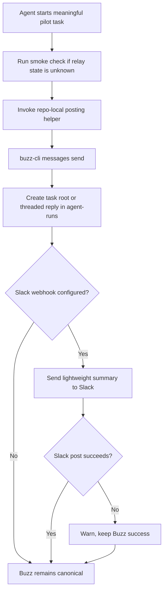

# Buzz Pilot Visibility And Memory - Plan

## Goal Capsule

- **Objective:** Make the active Buzz pilot on `localhost:3030` useful day to day by giving each meaningful agent task a visible Buzz activity trail, with optional Slack summaries that never replace Buzz.
- **Product authority:** This plan narrows the broader visibility-and-memory brainstorm to the first implementation slice Steve confirmed: Buzz stays canonical, Slack is outbound-only visibility, and raw old-message migration remains out of scope.
- **Execution profile:** Upstream shell helper, focused script tests, doc updates, and one live pilot proof against the active local relay.
- **Stop conditions:** Stop before any raw archive migration, any bidirectional Slack command/control path, any secret committed to the repo, or any change that makes `localhost:3000` look active for Steve's pilot.
- **Tail ownership:** `ce-work` or a human implementer ships the helper, docs, and verification together so the next agent can use the flow without transcript history.

---

## Product Contract

### Summary

This plan adds a simple operating loop for agent visibility in the active Buzz pilot.
Agents should be able to post a task root, add threaded status updates, and optionally mirror lightweight summaries to Slack while keeping Buzz as the system of record.

### Problem Frame

The pilot now starts reliably enough to use, but agent activity is still too easy to lose in terminal scrollback or local memory.
Steve needs a quick way to see what an agent is doing, what changed, and whether a decision or review is waiting on him.

The repo already has the pieces for a low-risk first pass: the active pilot community on `localhost:3030`, the `agent-runs` channel, the Day 0 continuity notes, and a `buzz-cli` message command that can create thread roots and replies.
What is missing is a repo-local, discoverable workflow that turns those building blocks into a repeatable habit for future agents.

### Requirements

**Buzz activity records**

- R1. Agent visibility for Steve's pilot must write to the active `localhost:3030` Buzz community, not the archive-only `localhost:3000` community.
- R2. Each meaningful agent task must open exactly one Buzz task root when work starts, then use threaded replies only for blocker, decision-needed, material artifact change, handoff, and closeout updates.
- R3. Each Buzz update must use a fixed, scannable presentation contract: a status token, task title, short summary, next owner, and an explicit `Needs Steve` marker when the task is waiting on Steve; changed artifacts must appear when relevant.

**Slack visibility**

- R4. Slack visibility must remain optional and outbound-only for this first slice.
- R5. Slack summaries must stay lightweight and link-oriented, and may include only a sanitized task label plus a non-secret Buzz reference; they must never include `localhost` URLs, raw logs, secrets, or long transcripts.
- R6. Buzz write credentials and Slack webhook secrets must come from local environment or another untracked local secret source; they must never be passed on the CLI or committed in docs, examples, or fixtures.
- R7. Slack failure or missing configuration must never block the canonical Buzz post, and Slack failure logs must redact webhook URLs and credentials.

**Continuity and discoverability**

- R8. Repo-local docs must explain that Buzz is canonical, Slack is advisory, and the Day 0 summary remains the bridge to the old archive.
- R9. The older `localhost:3000` archive must remain read-only and outside this implementation slice.
- R10. The posting workflow must live in the upstream checkout so future agents can find it beside the smoke script and continuity docs.

### Key Decisions

- **Keep `3030` active.** Governs R1, R8, R9. (session-settled: user-directed - chosen over returning active pilot work to `3000`: Steve asked to avoid port `3000` while Buzz is piloted.)
- **Use Buzz as canonical, Slack as visibility.** Governs R2, R3, R4, R5, R7, R8. (session-settled: user-directed - chosen over a Slack-first or dual-canonical workflow: Steve confirmed the Buzz-first visibility slice.)
- **Keep pilot helpers in the upstream repo.** Governs R8, R10. (session-settled: user-directed - chosen over leaving helper context only in the sibling bundle: Steve asked to move install scripts into the project so context stays close.)
- **Use env-backed destination and secret contracts.** Governs R1, R5, R6, R7, R10. The helper should read its canonical Buzz destination and any credentials from local config or environment, keep non-default destinations behind explicit test-only overrides, and never put secrets on the CLI or in tracked docs.
- **Preserve summary-before-migration.** Governs R8, R9. The active pilot keeps the Day 0 continuity summary visible and leaves raw archive export or migration to a later, backup-first decision.

<!-- ce-section: work-relationships -->
### How This Work Fits Together

This plan turns the already-running pilot into a visible operating loop without reopening startup or migration work.

- Depends on: `docs/plans/2026-07-26-001-docs-buzz-startup-readiness-plan.md` for the current `3030` smoke-first startup path.
- Extends: `docs/pilots/2026-07-25-buzz-day0-slack-visibility.md`, which already recommends incoming-webhook-first Slack visibility and records the `agent-runs` channel.
- Preserves: `docs/pilots/buzz-local-continuity-runbook.md` and `docs/solutions/developer-experience/local-pilot-community-authority.md` as the continuity boundary for old pilot data.
- Enables: a later Slack API or plugin plan only if outbound summaries prove useful.

### Actors

- A1. **Steve:** Reviews agent activity, notices blockers or decisions, and chooses whether Slack is worth keeping in the loop.
- A2. **Codex or another agent:** Performs work, posts Buzz updates, and optionally mirrors lightweight Slack summaries.
- A3. **Buzz Mac app:** The canonical place Steve reads pilot activity and continuity notes.
- A4. **Slack:** An optional visibility surface for alerts or summaries, not the source of truth.

### Key Flows

- F1. Agent task opens
  - **Trigger:** An agent begins a meaningful Buzz pilot task.
  - **Actors:** A2, A3
  - **Steps:** Run the pilot smoke if needed; post one task root in `agent-runs`; capture the returned event ID for follow-up replies.
  - **Covered by:** R1, R2, R3, R9

- F2. Agent task updates
  - **Trigger:** The task reaches a checkpoint, blocker, or closeout.
  - **Actors:** A2, A3, A4
  - **Steps:** Post a threaded reply in Buzz with status and summary details; if Slack is configured, mirror a short advisory summary; continue even if Slack fails.
  - **Covered by:** R2, R3, R4, R5, R6

- F3. Continuity lookup
  - **Trigger:** Steve or a future agent asks how current work relates to old pilot conversation.
  - **Actors:** A1, A2
  - **Steps:** Read the Day 0 summary and continuity docs from the active pilot; stop before any raw archive migration or merge.
  - **Covered by:** R7, R8

### Acceptance Examples

- AE1. Given the active pilot relay is healthy on `localhost:3030`, when an agent starts a meaningful task, then a new root appears in `agent-runs` rather than in the old `3000` archive community.
- AE2. Given an agent hits a blocker or needs Steve's input after opening a task root, when the agent posts an update, then Steve can tell from Buzz whether the task is active, blocked, done, or waiting on him.
- AE3. Given Slack visibility is configured, when an agent posts a Buzz update, then Slack receives a short summary with a sanitized Buzz reference and does not include sensitive or verbose output.
- AE4. Given Slack is not configured or the webhook post fails, when the helper runs, then the Buzz post still succeeds and the failure is treated as advisory.
- AE5. Given a future agent asks where older conversation lives, when they read the local docs, then they find the Day 0 summary boundary and do not assume raw old messages were merged into the active instance.

### Success Criteria

- Steve can scan Buzz and understand current agent activity, including which threads need his input, without reading terminal scrollback.
- Each meaningful task has a stable Buzz thread that captures start, checkpoints, blockers, and closeout.
- Slack, when enabled, reduces missed updates without becoming a second source of truth.
- Future agents can find the posting workflow and continuity boundary from the upstream repo alone.

### Scope Boundaries

#### In Scope

- A repo-local helper in `scripts/` for posting Buzz task roots and threaded updates.
- Optional incoming-webhook Slack mirroring for lightweight summaries only.
- Doc updates that teach future agents where to post and how the archive boundary works.
- Focused tests and one live pilot proof against the active `3030` community.

#### Deferred to Follow-Up Work

- Slack Web API posting, threaded Slack updates, or plugin-driven channel selection.
- Bidirectional Slack commands, mention handling, or Slack-initiated Buzz task creation.
- Exporting or migrating raw old `localhost:3000` events.
- Daily digest or dashboard views layered on top of the task-root workflow.

#### Out of Scope

- Changing upstream default local development away from `localhost:3000`.
- Modifying Buzz relay, database, or workflow engine behavior just to support this pilot helper.
- Treating Slack history as canonical memory for agent work.

### Dependencies / Assumptions

- The active pilot relay continues to use `localhost:3030`, readiness `8088`, and metrics `9202`.
- `agent-runs` remains the pilot channel for task-level agent activity.
- A built or otherwise invokable `buzz-cli` binary is available locally for pilot scripting.
- Slack may remain unconfigured during implementation; the helper still needs to be useful without it.

### Sources / Research

- `AGENTS.md`
- `README.md`
- `CONCEPTS.md`
- `docs/plans/2026-07-26-001-docs-buzz-startup-readiness-plan.md`
- `docs/pilots/buzz-local-continuity-runbook.md`
- `docs/pilots/2026-07-25-buzz-day0-slack-visibility.md`
- `docs/dogfood-reports/2026-07-26-codex-fix-dev-startup-pilot-buzz-continuity-handoff.md`
- `docs/solutions/developer-experience/local-pilot-community-authority.md`
- `scripts/buzz-pilot-smoke.sh`
- `crates/buzz-cli/src/commands/messages.rs`
- `crates/buzz-cli/src/lib.rs`
- `crates/buzz-workflow/src/action_sink.rs`

---

## Planning Contract

### Key Technical Decisions

- KTD1. **Freeze a v1 event policy.** One root opens at task start, and replies are limited to `blocked`, `needs-steve`, `changed`, `handoff`, and `done`. This keeps the Buzz thread list scannable and prevents the first slice from devolving into status spam.
- KTD2. **Resolve the canonical Buzz destination through env-backed configuration.** The helper reads `BUZZ_PILOT_AGENT_RUNS_CHANNEL_ID` for the normal `agent-runs` target. A non-default `BUZZ_PILOT_CHANNEL_ID_OVERRIDE` is allowed only for explicit local testing and should warn loudly when used.
- KTD3. **Use env-only write credentials and ephemeral proof credentials.** The helper requires `BUZZ_RELAY_URL` and `BUZZ_PRIVATE_KEY` for writes, never accepts secrets as CLI args, and treats the U3 proof identity as disposable: supplied or generated for the run, never written into tracked docs, examples, or fixtures.
- KTD4. **Ship and prove the Buzz loop before Slack mirroring.** The docs and Buzz-only proof should stand on their own; Slack mirroring is a secondary extension that rides the same message contract after the canonical loop is already useful.
- KTD5. **Freeze a Slack-safe payload contract.** Slack v1 may send only status, task label, sanitized Buzz reference, optional GitHub reference, and `Needs Steve`; it must never send `localhost` URLs, auth-bearing links, or raw logs.
- KTD6. **Keep one authoritative helper contract across the docs.** `AGENTS.md`, `README.md`, and the pilot runbook should all point to the same helper usage, status vocabulary, and archive boundary so future agents do not invent alternate workflows.

### High-Level Technical Design

### Assumptions

- A1. The first implementation should optimize for reliable habit formation, not for perfect workflow automation.
- A2. A shell helper is easier for future agents to inspect and adapt than a new workflow-engine configuration surface.
- A3. The current `agent-runs` channel UUID is stable enough to seed `BUZZ_PILOT_AGENT_RUNS_CHANNEL_ID` for Steve's pilot, even if a later plan chooses a richer destination-discovery flow.

### Relevant Existing Patterns

- `scripts/buzz-pilot-smoke.sh` already carries Steve-local relay URLs, pilot channel defaults, and Buzz CLI invocation patterns.
- `docs/pilots/2026-07-25-buzz-day0-slack-visibility.md` already defines the recommended Slack status shape and the `agent-runs` channel role.
- `crates/buzz-cli/src/commands/messages.rs` already supports `messages send` with `--channel`, `--content`, and `--reply-to`, which is enough for task roots and threaded updates.
- `buzz-workflow` already has webhook capabilities, but the pilot does not need workflow configuration or new server-side actions for this first loop.

### Sequencing

1. Freeze the helper contract first: status vocabulary, channel resolution, auth/secret rules, and the root/reply message template.
2. Implement and document the Buzz-only helper path.
3. Prove the Buzz-only path with an action-needed update in the active pilot.
4. Layer optional Slack mirroring on top of the same contract, with sanitized references and redaction tests.

---

## Implementation Units

### U1. Add The Buzz-First Activity Helper

- **Goal:** Create a discoverable upstream helper that opens task roots and posts threaded status updates into the canonical `agent-runs` pilot channel.
- **Requirements:** R1, R2, R3, R6, R10, AE1, AE2
- **Dependencies:** None
- **Files:**
  - `scripts/post-pilot-agent-update.sh`
  - `scripts/test-post-pilot-agent-update.sh`
- **Approach:**
  1. Add a shell helper in `scripts/` that resolves the Buzz CLI from the upstream checkout first, with an explicit binary override env var when Steve wants to point at another build.
  2. Resolve the canonical destination from `BUZZ_PILOT_AGENT_RUNS_CHANNEL_ID`. Allow `BUZZ_PILOT_CHANNEL_ID_OVERRIDE` only for explicit local testing and warn when it is used so the normal path stays anchored on `agent-runs`.
  3. Require `BUZZ_RELAY_URL` and `BUZZ_PRIVATE_KEY` for writes. Never accept secrets as CLI arguments, and fail clearly on missing or unauthorized credentials.
  4. Freeze one message contract: the root opens with `[started] <task title>`, replies use one of `blocked`, `needs-steve`, `changed`, `handoff`, or `done`, and every post includes `Summary`, `Next owner`, and `Needs Steve: yes` when applicable, with `Changed` added when relevant.
  5. Print the resulting event ID and a sanitized Buzz reference for follow-up tooling.
  6. Leave `scripts/buzz-pilot-smoke.sh` unchanged unless the helper cannot be delivered otherwise; do not refactor it for shared logic in this slice.
- **Execution note:** Keep the helper readably small; this is a pilot workflow script, not a new abstraction layer.
- **Patterns to follow:** `buzz messages send` for root/reply creation and `scripts/buzz-pilot-smoke.sh` for Steve-local relay defaults.
- **Test scenarios:**
  - Given no `reply-to` value, when the helper runs successfully, then it creates a new task root in the canonical `agent-runs` destination.
  - Given an existing root event ID, when the helper runs with `blocked`, `needs-steve`, `changed`, `handoff`, or `done`, then it creates a threaded reply rather than a second root.
  - Given required write credentials are missing or unauthorized, when the helper runs, then it exits with actionable guidance and no partial post.
  - Given the channel override env var is used, when the helper runs, then it warns that the path is test-only and still posts only to the explicitly supplied override.
- **Verification:** `bash scripts/test-post-pilot-agent-update.sh` and a live disposable-key post against the canonical `agent-runs` channel.

### U2. Document The Buzz-First Visibility Loop

- **Goal:** Make the Buzz-only posting workflow easy for future agents and Steve to discover from the upstream repo alone.
- **Requirements:** R3, R8, R9, R10, AE5
- **Dependencies:** U1
- **Files:**
  - `AGENTS.md`
  - `README.md`
  - `docs/pilots/buzz-local-continuity-runbook.md`
  - `docs/pilots/2026-07-25-buzz-day0-slack-visibility.md`
  - `CONCEPTS.md`
- **Approach:**
  1. Add one short usage example for the posting helper in the Steve-local pilot guidance.
  2. Document the fixed status vocabulary, the one-root-plus-replies rule, the required channel env var, and the env-only write-auth contract.
  3. Re-state the canonical/advisory split clearly: Buzz owns task memory, Slack is optional visibility only, and old archive data remains read-only.
  4. Keep references to the Day 0 summary and archive boundary aligned across `AGENTS.md`, the runbook, and the Day 0 notes instead of inventing new continuity wording.
- **Execution note:** Favor a few aligned pointers over a large new runbook section.
- **Patterns to follow:** The existing Steve Local Pilot Continuity section in `AGENTS.md` and the Day 0 note structure already in `docs/pilots/2026-07-25-buzz-day0-slack-visibility.md`.
- **Test scenarios:**
  - Given a future agent opens `AGENTS.md`, when they look for the active pilot flow, then they can find the smoke script, posting helper, channel env var, and continuity docs in one pass.
  - Given Steve asks whether Slack is required, when he reads the updated docs, then it is clear that Slack is optional and Buzz remains canonical.
  - Given a future agent asks where old pilot messages live, when they read the docs, then they are pointed at the Day 0 summary rather than a supposed raw migration.
- **Verification:** A targeted doc scan shows consistent `3030`, `agent-runs`, env-backed channel config, optional Slack wording, and archive-boundary language across the updated docs.

### U3. Prove The Buzz-Only Loop Against The Active Pilot

- **Goal:** Verify that the helper and docs work together against the real local pilot without mutating archive data or tracked continuity docs.
- **Requirements:** R1, R2, R3, R8, R9, AE1, AE2, AE5
- **Dependencies:** U1, U2
- **Files:**
  - `scripts/post-pilot-agent-update.sh`
  - `scripts/test-post-pilot-agent-update.sh`
  - `scripts/buzz-pilot-smoke.sh`
  - `scripts/test-buzz-pilot-smoke.sh`
- **Approach:**
  1. Run the existing pilot smoke check first so live verification only happens against the active `3030` relay.
  2. Use a disposable pilot identity that is supplied or generated for the run and never written into tracked docs, examples, or fixtures.
  3. Post one `[started]` root, one `needs-steve` or `blocked` reply, and one `done` or `handoff` reply so Buzz-only quick-scan and action-needed visibility are both proven.
  4. Keep the proof ephemeral; do not write event IDs or transcripts into the Day 0 notes as part of this unit.
- **Execution note:** This is a bounded live proof, not a larger dogfood session.
- **Patterns to follow:** The existing smoke script contract and the current `agent-runs` pilot workflow.
- **Test scenarios:**
  - Given the relay is healthy, when the live proof runs, then the new sample root and action-needed reply are visible in `agent-runs`.
  - Given the relay is unhealthy or missing, when the proof starts, then the smoke script stops the run before any write attempt.
  - Given the proof completes, when the repo is reviewed, then no tracked continuity doc was mutated just to record disposable proof evidence.
- **Verification:** `bash scripts/test-buzz-pilot-smoke.sh`, `bash scripts/buzz-pilot-smoke.sh`, and one live disposable-key root-plus-replies proof against the active pilot.

### U4. Add Optional Slack Summary Mirroring

- **Goal:** Let the same helper send a lightweight Slack summary after the Buzz loop is already proven and only when a webhook is configured.
- **Requirements:** R4, R5, R6, R7, R8, AE3, AE4
- **Dependencies:** U1, U2, U3
- **Files:**
  - `scripts/post-pilot-agent-update.sh`
  - `scripts/test-post-pilot-agent-update.sh`
  - `docs/pilots/2026-07-25-buzz-day0-slack-visibility.md`
- **Approach:**
  1. Read `BUZZ_PILOT_SLACK_WEBHOOK_URL` from env only. Docs and tests must use placeholders, never real webhook values.
  2. Mirror only `blocked`, `needs-steve`, and `done` updates by default, using status, task label, sanitized Buzz reference, optional GitHub reference, and `Needs Steve`.
  3. Send the Slack mirror only after the Buzz post succeeds.
  4. Redact webhook URLs, auth material, and Buzz private keys from all success logs, failure logs, and test fixtures.
  5. If a webhook is configured during live verification, treat Slack as a secondary check; otherwise keep Slack unconfigured and non-blocking.
- **Execution note:** Keep the mirror one-way and link-oriented; do not add Slack thread management, message updates, or inbound commands in this slice.
- **Patterns to follow:** The Phase 1 incoming-webhook guidance in `docs/pilots/2026-07-25-buzz-day0-slack-visibility.md`, narrowed to single-message webhook posting only.
- **Test scenarios:**
  - Given no Slack webhook env var, when the helper posts to Buzz, then it skips Slack cleanly and still returns success.
  - Given a stub webhook endpoint, when the helper mirrors an update, then the payload contains only the allowed fields and excludes `localhost` URLs, raw logs, and secrets.
  - Given the Slack webhook returns an error, when the helper runs after a successful Buzz post, then the process reports an advisory Slack failure and keeps logs redacted.
- **Verification:** `bash scripts/test-post-pilot-agent-update.sh` covers webhook-present, webhook-absent, webhook-failure, and redaction paths; optional live Slack verification runs only when a webhook is configured locally.

---

## Verification Contract

| Gate | Applies To | Done Signal |
|---|---|---|
| `bash scripts/test-post-pilot-agent-update.sh` | U1, U4 | Helper coverage proves root posting, reply posting, missing-credential failures, unauthorized-write failures, webhook-absent behavior, webhook-failure behavior, and log redaction. |
| `bash scripts/test-buzz-pilot-smoke.sh` | U3 | Existing pilot smoke-script coverage still passes before and after the helper proof flow. |
| `bash scripts/buzz-pilot-smoke.sh` | U3, U4 | The active `localhost:3030` relay is ready and the Day 0 continuity summary remains visible before any live post. |
| Doc consistency scan (`rg -n "agent-runs|BUZZ_PILOT_AGENT_RUNS_CHANNEL_ID|Slack is optional|Slack is only for visibility|Day 0|read-only|archive" AGENTS.md README.md docs/pilots CONCEPTS.md`) | U2, U4 | Updated docs consistently point future agents to the Buzz-first visibility loop, env-backed channel config, optional Slack wording, and archive boundary. |
| Live Buzz proof with a disposable key | U1, U3 | A sample `[started]` root plus an action-needed reply and a final `done` or `handoff` reply are visible in `agent-runs` without mutating tracked continuity docs. |
| Optional live Slack proof | U4 | When a webhook is configured locally, the sanitized mirror lands and any failure output remains redacted. |

---

## Definition of Done

- The upstream repo contains a small helper for posting pilot agent updates into Buzz.
- The helper resolves its canonical destination through `BUZZ_PILOT_AGENT_RUNS_CHANNEL_ID`, with any non-default destination treated as an explicit local test override.
- The helper supports both new task roots and threaded updates with a fixed status vocabulary and a stable, readable message format.
- Buzz write credentials and Slack webhook secrets are env-backed only, never passed as CLI args, and never written into tracked docs, examples, or fixtures.
- Future agents can discover the Buzz-first workflow from `AGENTS.md`, `README.md`, and the pilot docs without needing this session transcript or Slack configuration.
- The Buzz-only proof demonstrates action-needed visibility and does not mutate tracked continuity docs just to preserve disposable proof evidence.
- Optional Slack mirroring works through an incoming webhook, uses sanitized Buzz references, and never blocks or overrides the Buzz result.
- Focused verification gates pass, or any environment-limited live proof records the concrete blocker.
- No archive migration, destructive database change, or secret-in-repo workaround is introduced.
- Any exploratory script or formatting dead end is removed from the final diff.

---

## Appendix

### Source Breadcrumbs

- `AGENTS.md` — top-level Steve-local pilot continuity guidance and upstream/default boundary.
- `README.md` — human-facing source setup and Steve-local pilot notes.
- `CONCEPTS.md` — shared pilot vocabulary that future agents can reuse in docs and posts.
- `docs/plans/2026-07-26-001-docs-buzz-startup-readiness-plan.md` — the current startup authority for `3030`.
- `docs/pilots/buzz-local-continuity-runbook.md` — the active/archive continuity model and safe verification path.
- `docs/pilots/2026-07-25-buzz-day0-slack-visibility.md` — Day 0 evidence, `agent-runs` channel ID, and Slack phase guidance.
- `docs/dogfood-reports/2026-07-26-codex-fix-dev-startup-pilot-buzz-continuity-handoff.md` — the next-person explanation of where old messages appear.
- `docs/solutions/developer-experience/local-pilot-community-authority.md` — host-authority explanation for why `3000` and `3030` can show different communities.
- `scripts/buzz-pilot-smoke.sh` — current read-only pilot verification entry point.
- `crates/buzz-cli/src/commands/messages.rs` — existing root/reply posting surface for the helper to standardize.
- `crates/buzz-cli/src/lib.rs` — CLI command registration and message subcommand wiring.
- `crates/buzz-workflow/src/action_sink.rs` — confirms webhook support exists upstream even though this slice does not require it.
