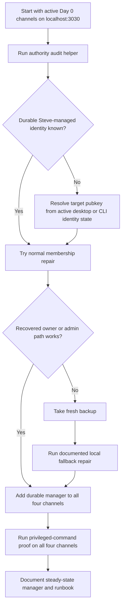

# Buzz Day 0 Channel Authority Recovery - Plan

## Goal Capsule

- **Objective:** Restore a normal Buzz-authorized way to manage the four Day 0 pilot channels on `localhost:3030` so future TTL and membership changes can be done without direct database edits.
- **Product authority:** Keep this slice local-pilot operational only. Prefer owner recovery and membership normalization over new relay product surfaces or broad authority redesign.
- **Execution profile:** Repo-local authority audit and repair helpers, focused shell-script tests, and runbook updates that make the steady-state path discoverable for future agents.
- **Stop conditions:** Stop before changing the `localhost:3000` archive story, before recreating Day 0 channels with new IDs, before adding a general channel-transfer product feature, and before normalizing authority through raw SQL except as an explicitly documented last-resort local fallback.
- **Tail ownership:** `ce-work` or a human implementer should ship the helpers, live normalization proof, and docs together so the next operator can use the repaired path without session transcript context.

---

## Product Contract

### Summary

Steve's active Buzz pilot on `localhost:3030` already has the right Day 0 channels and the right continuity docs, but each of the four channels is currently owned by a different sole pubkey.
That fragmentation makes future durability changes fragile because the normal Buzz path for clearing TTL or changing privileged metadata requires channel owner or admin authority.

This plan restores a stable authority model for those four existing channels without redesigning Buzz channel ownership as a product.
The preferred outcome is that one durable Steve-controlled identity becomes a known owner or admin on all four Day 0 channels, after which future changes use normal Buzz commands such as `buzz channels update --no-ttl` and `buzz channels add-member`.

### Problem Frame

The local pilot currently depends on historical state that is hard to reason about from the desktop app alone.
The four Day 0 channels are all now durable, but the durability change was achieved with direct local database intervention rather than through a reusable authorized path.

Research in the relay and CLI code shows that privileged channel metadata changes such as `ttl`, `archived`, `name`, `about`, and `visibility` are intentionally limited to a channel owner, channel admin, or the owning human of an active owner-role agent in the channel.
The same research also shows that `buzz channels update --no-ttl` is the intended permanent-channel path, while archive and unarchive are separate admin operations.

Local inspection of the active pilot found that:

- `agent-runs` (`d0bf00d9-e76d-44a8-bf4c-61725f79f3d4`) has sole owner `e11aff75320a7ec7c2766ef107d2fb091eb81d9503caa30d92ccc2f586499129`
- `buzz-pilot` (`3cdf4550-0501-4825-b54e-87213ea08b66`) has sole owner `165de5b4aedc81307c864eb4862c175c45379433b079b96a6cd925d86ee2a445`
- `install-support` (`7cf15a6f-a601-4c40-92a3-5fee69594992`) has sole owner `4f580907f64f44887f1369cc423745488faf482390167fa9e268e0f3e25b9d99`
- `repo-review` (`577ef732-7ee7-44dd-bd3d-f2ef0473a286`) has sole owner `b60e151878b5e2fb2347df8e203e2ff11165c646066a08d62474eb1d01821adb`

All four currently have `ttl_seconds = NULL`, are unarchived, and have no obvious matching `users` profile rows.
That means future operators cannot safely assume a visible human owner exists in the current community state.

### Requirements

**Authority recovery**

- R1. The solution must preserve the four existing Day 0 pilot channels on `localhost:3030` rather than recreating them with new IDs or dropping their history.
- R2. The preferred steady-state must use normal Buzz authorization paths for future privileged channel changes, not direct SQL edits.
- R3. At least one durable Steve-controlled identity must become a known authorized manager for all four Day 0 channels, either as `owner` or `admin`.
- R4. The authority repair flow must distinguish the preferred owner-recovery path from the one-time fallback path, so future operators know which path is normal and which path is exceptional.

**Local-pilot operational safety**

- R5. The repair workflow must require a fresh local database backup before any fallback that bypasses ordinary channel-owner commands.
- R6. The normal path must not depend on `localhost:3000`, archived-community migration, or any cross-community merge.
- R7. The solution must not widen into a generic product redesign for channel transfer, relay-operator authority, or ownership semantics beyond the Day 0 local pilot.

**Discoverability and repeatability**

- R8. Future agents must be able to audit the current Day 0 authority state from the upstream checkout without re-reading old transcripts.
- R9. Future operators must have a short documented recipe for verifying that the repaired identity can perform privileged channel actions through ordinary Buzz commands.
- R10. The repaired workflow must live beside the existing pilot scripts and docs in the upstream repo so the context stays close to the project.

### Key Decisions

- **Keep scope local to the active `3030` pilot.** Governs R1, R5, R6, R7, R10. (session-settled: user-directed - chosen over widening into a broader Buzz ownership redesign or revisiting the `3000` archive.)
- **Prefer membership normalization over channel recreation.** Governs R1, R2, R3, R4. Existing Day 0 channel IDs and history are more valuable than starting clean, so the plan repairs authority in place.
- **Use one durable Steve-controlled identity as the normal management anchor.** Governs R2, R3, R8, R9. The fix should leave one obvious identity that can run `buzz channels update --no-ttl`, `channels add-member`, and related maintenance later.
- **Treat `buzz channels update --no-ttl` as the proof target.** Governs R2, R9. The plan should verify the actual privileged command path that matters for future durability changes instead of settling for a looser proxy.
- **Document an explicit fallback instead of inventing a hidden one.** Governs R4, R5, R7, R8. If owner recovery is impossible, the operator fallback should be visible, backup-first, and clearly marked as exceptional.

<!-- ce-section: work-relationships -->
### How This Work Fits Together

This plan repairs a missing authority path in the active pilot that earlier continuity and visibility work assumed but did not establish.

- Preserves: `docs/pilots/buzz-local-continuity-runbook.md` and `docs/solutions/developer-experience/local-pilot-community-authority.md`, which define `localhost:3030` as active and `localhost:3000` as archive.
- Extends: `docs/plans/2026-07-26-002-feat-buzz-pilot-visibility-and-memory-plan.md`, which assumes `agent-runs` and the Day 0 channels are usable long term.
- Depends on: the existing local backup discipline already used for prior Day 0 database snapshots.
- Enables: future TTL, membership, and visibility work to use authorized Buzz commands instead of local DB edits.

### Actors

- A1. **Steve:** Owns the local pilot and needs a durable, understandable authority path for future maintenance.
- A2. **Future agent or operator:** Audits the Day 0 channel state, repairs or verifies authority, and then uses normal Buzz commands for ongoing upkeep.
- A3. **Buzz relay and local database:** Hold the authoritative channel rows and membership state for the active pilot community.
- A4. **Buzz desktop app / CLI identity:** The durable identity that should become the recognizable management anchor for the Day 0 channels.

### Key Flows

- F1. Audit current Day 0 authority
  - **Trigger:** An operator needs to understand who currently controls the four Day 0 channels.
  - **Actors:** A2, A3
  - **Steps:** Run the repo-local audit helper; inspect each channel's channel ID, owner membership, TTL state, and archived state; compare against the expected Day 0 set.
  - **Covered by:** R1, R8, R10

- F2. Normalize one durable management identity
  - **Trigger:** The audit shows fragmented or unclear ownership.
  - **Actors:** A1, A2, A4
  - **Steps:** Identify the target durable Steve-controlled pubkey; attempt owner-authorized or admin-authorized membership repair first; verify that the target identity can run the intended privileged Buzz command path on all four channels.
  - **Covered by:** R2, R3, R4, R9

- F3. Fallback repair with backup-first guardrails
  - **Trigger:** The current owners cannot be recovered through ordinary Buzz-authorized paths.
  - **Actors:** A1, A2, A3
  - **Steps:** Take a fresh backup; follow the documented local-only repair path; re-run the audit and privileged-command proof immediately after repair.
  - **Covered by:** R4, R5, R7, R8

### Acceptance Examples

- AE1. Given the four Day 0 channels already exist on `localhost:3030`, when the repair work completes, then those same channels remain in place and no replacement Day 0 channels are created.
- AE2. Given Steve's durable management identity is known, when that identity runs `buzz channels update --no-ttl` against any Day 0 channel, then the relay accepts the command without direct DB intervention.
- AE3. Given a future operator opens the upstream checkout without transcript history, when they read the docs and run the audit helper, then they can see who manages each Day 0 channel and which path is normal versus fallback.
- AE4. Given the preferred owner-recovery path is unavailable, when the fallback path is used, then a fresh backup is taken first and the operator re-verifies the normal Buzz command path immediately after repair.

### Success Criteria

- One durable Steve-controlled identity is documented and verifiably authorized across all four Day 0 channels.
- Future privileged channel maintenance uses ordinary Buzz commands instead of ad hoc SQL.
- The repo contains a short, repeatable audit-and-repair path that a future agent can follow without reconstructing prior debugging sessions.

### Scope Boundaries

#### In Scope

- Repo-local authority audit tooling for the four existing Day 0 pilot channels.
- Repo-local repair tooling or runbook support that normalizes one durable management identity across those channels.
- Documentation that explains the normal path, the proof step, and the backup-first fallback.

#### Deferred to Follow-Up Work

- A general product feature for channel ownership transfer or operator-managed channel repair.
- Broader cleanup of other pilot channels outside the Day 0 set.
- Slack visibility changes or archive-message migration tied to this authority fix.

#### Out of Scope

- Changing the active/archive community split between `3030` and `3000`.
- Rebuilding the local Buzz desktop identity model.
- Inventing a new generic relay authority model for all Buzz instances.

### Dependencies / Assumptions

- The active pilot community remains `localhost:3030`.
- Steve can nominate or confirm one durable identity pubkey to serve as the steady-state Day 0 manager, or the implementation can derive it from the active desktop/CLI identity state.
- `buzz-cli` and `buzz-admin` remain locally runnable from the upstream checkout or local container setup.
- Fresh local Postgres backups remain practical before any fallback repair step.

### Sources / Research

- `CONCEPTS.md`
- `AGENTS.md`
- `README.md`
- `docs/pilots/buzz-local-continuity-runbook.md`
- `docs/pilots/2026-07-25-buzz-day0-slack-visibility.md`
- `docs/solutions/developer-experience/local-pilot-community-authority.md`
- `docs/plans/2026-07-26-002-feat-buzz-pilot-visibility-and-memory-plan.md`
- `crates/buzz-cli/src/lib.rs`
- `crates/buzz-cli/src/commands/channels.rs`
- `crates/buzz-cli/TESTING.md`
- `crates/buzz-sdk/src/builders.rs`
- `crates/buzz-relay/src/handlers/side_effects.rs`
- `crates/buzz-relay/src/api/operator.rs`
- `NOSTR.md`
- Local `buzz-postgres` inspection on 2026-07-27 confirming four distinct sole owners across the Day 0 channels and `ttl_seconds = NULL` for each

---

## Planning Contract

### Key Technical Decisions

- KTD1. **Add a dedicated Day 0 authority audit helper.** Future operators should not need to remember SQL or reconstruct channel IDs from chat history. The helper should print the Day 0 channel set, current owner/admin memberships, and the current TTL/archive posture in a compact operator view.
- KTD2. **Normalize authority by adding a durable Steve-controlled manager to each existing channel, not by moving or recreating channels.** The preferred repair is to add the durable identity as `owner` where recoverable and at minimum `admin` everywhere, because `admin` is already sufficient for the privileged maintenance path in scope.
- KTD3. **Use existing Buzz command surfaces for the steady state.** After normalization, the documented path for future changes should be `buzz channels members`, `buzz channels add-member`, and `buzz channels update --no-ttl`; `buzz-admin` stays an operator or relay-membership tool, not the normal Day 0 channel manager.
- KTD4. **Make the proof step exercise the real privileged command.** The repair is not complete until the durable manager identity can successfully perform a privileged channel action on each Day 0 channel through ordinary Buzz authorization.
- KTD5. **Keep the fallback local and explicit.** Because the repo does not expose an obvious channel-level operator API for authority repair today, any bypass repair should remain a documented, backup-first local operator step instead of becoming a silently normalized workflow.

### High-Level Technical Design

### Assumptions

- A1. Steve prefers a practical local-pilot fix over a larger upstream ownership feature.
- A2. Adding one durable manager identity to the four Day 0 channels is enough to restore safe day-to-day maintenance.
- A3. Preserving channel IDs and history is more important than preserving the currently fragmented sole-owner layout.

### Relevant Existing Patterns

- `buzz channels update --no-ttl` is already the intended normal path for making a channel permanent.
- `buzz channels add-member --role owner|admin` already exists in `buzz-cli` and is the closest existing surface to authority normalization.
- `buzz-admin` is already documented as the relay operator CLI for membership and key generation, which makes it the right local operator companion when the normal path cannot be recovered directly.
- The repo already stores local pilot operational knowledge in `scripts/`, `AGENTS.md`, `README.md`, and `docs/pilots/`, so this authority flow should follow the same pattern instead of inventing a separate operations home.

### Sequencing

1. Capture the current authority state in a repeatable repo-local audit helper.
2. Normalize one durable Steve-controlled manager identity across the four Day 0 channels using ordinary authorized surfaces where possible.
3. Prove that the normalized identity can perform the real privileged command path.
4. Document the normal path and the exceptional fallback in the same upstream context future agents already use.

---

## Implementation Units

### U1. Add A Day 0 Authority Audit Helper

- **Goal:** Make the current Day 0 authority state visible from the upstream checkout without transcript archaeology.
- **Requirements:** R1, R8, R10, AE3
- **Dependencies:** None
- **Files:**
  - `scripts/audit-day0-channel-authority.sh`
  - `scripts/test-audit-day0-channel-authority.sh`
- **Approach:**
  1. Add a small shell helper that knows the four canonical Day 0 channel names and IDs for the active `3030` pilot.
  2. Prefer read-only inspection that works in Steve's local bundle today, including channel ID, owner/admin members, TTL state, and archived state.
  3. Print output in an operator-friendly table or aligned text block so a future agent can immediately see whether ownership is fragmented, missing, or normalized.
  4. Make the helper fail clearly if the active local services are unavailable or the expected Day 0 channels are missing.
  5. Keep the helper specific to the Day 0 pilot slice instead of turning it into a generic Buzz admin tool.
- **Execution note:** This is a visibility helper, not the repair itself. Keep it read-only.
- **Patterns to follow:** `scripts/buzz-pilot-smoke.sh` for repo-local pilot scripting shape and `CONCEPTS.md` for the canonical Day 0 channel set.
- **Test scenarios:**
  - Given all four Day 0 channels exist, when the helper runs, then it reports each channel's ID, owner/admin state, TTL posture, and archive posture.
  - Given a Day 0 channel is missing or renamed, when the helper runs, then it exits nonzero with actionable guidance.
  - Given local dependencies are unavailable, when the helper runs, then it reports the missing prerequisite instead of printing partial or misleading state.
- **Verification:** `bash scripts/test-audit-day0-channel-authority.sh`

### U2. Add A Day 0 Authority Repair And Proof Helper

- **Goal:** Normalize one durable Steve-controlled manager identity across the four existing Day 0 channels and prove the normal privileged path works afterward.
- **Requirements:** R1, R2, R3, R4, R5, R6, R9, AE1, AE2, AE4
- **Dependencies:** U1
- **Files:**
  - `scripts/repair-day0-channel-authority.sh`
  - `scripts/test-repair-day0-channel-authority.sh`
- **Approach:**
  1. Accept or resolve the target durable manager pubkey explicitly, so the repair does not depend on hidden session state.
  2. Attempt the preferred path first: use recovered owner or admin authority to add the durable manager as `owner` where possible and at minimum `admin` on each Day 0 channel.
  3. Refuse any fallback bypass unless a fresh backup marker or explicit backup step has completed for the current run.
  4. Keep any fallback local-only and narrowly scoped to these four channels. Do not generalize it into a broad relay maintenance abstraction in this slice.
  5. After normalization, run the proof step with the durable manager identity on every Day 0 channel, exercising the real privileged maintenance path that future operators will need.
  6. Re-run the audit helper at the end so the resulting steady state is visible immediately.
- **Execution note:** If a channel can only be repaired through a fallback path, log that fact explicitly so future operators know the steady state is repaired but the original owner identity was not recovered.
- **Patterns to follow:** `buzz channels add-member`, `buzz channels members`, `buzz channels update --no-ttl`, and `buzz-admin` operator usage already documented in `NOSTR.md` and `crates/buzz-cli/TESTING.md`.
- **Test scenarios:**
  - Given the target durable manager is already authorized on a Day 0 channel, when the repair helper runs, then it treats that channel as already normalized and does not duplicate membership.
  - Given the preferred owner/admin repair path is available, when the helper runs, then it adds the durable manager through ordinary Buzz-authorized commands and reports success per channel.
  - Given the preferred path is unavailable, when the helper runs without a fresh backup precondition, then it refuses the fallback path.
  - Given the fallback path is used, when repair completes, then the helper immediately re-runs audit and privileged-command proof so the resulting normal path is verified rather than assumed.
  - Given proof runs against all four channels, when the durable manager identity is used, then each privileged command succeeds without direct SQL edits.
- **Verification:** `bash scripts/test-repair-day0-channel-authority.sh` plus one live local-pilot run that normalizes the target pubkey and proves privileged access across the four channels.

### U3. Document The Normal And Fallback Day 0 Authority Paths

- **Goal:** Make the repaired authority model and the backup-first fallback discoverable for future agents working from the upstream checkout.
- **Requirements:** R4, R5, R8, R9, R10, AE3
- **Dependencies:** U1, U2
- **Files:**
  - `AGENTS.md`
  - `README.md`
  - `CONCEPTS.md`
  - `docs/pilots/buzz-local-continuity-runbook.md`
- **Approach:**
  1. Add a short section that names the Day 0 authority problem, the durable management identity concept, and the audit/repair helper entry points.
  2. Document the normal future maintenance path with ordinary Buzz commands after normalization.
  3. Document the local-only fallback boundary: backup first, repair narrowly, verify immediately, do not treat it as the routine path.
  4. Keep the continuity boundary intact by restating that this work stays inside the active `3030` pilot and does not touch raw `3000` archive migration.
- **Execution note:** Keep the docs short and operational. Future agents should be able to act from the runbook, not reread the entire planning history.
- **Patterns to follow:** The existing Steve-local pilot guidance already in `AGENTS.md`, `README.md`, and the continuity runbook.
- **Test scenarios:**
  - Given a future agent opens the repo cold, when they read the updated docs, then they can find the audit helper, the repair helper, the proof step, and the fallback warning in one pass.
  - Given a future operator only needs routine maintenance, when they follow the doc, then they are directed to normal Buzz commands rather than direct database edits.
  - Given a fallback repair was required once, when the docs are read later, then it is still clear that fallback is exceptional and the post-repair steady state is normal Buzz authority.
- **Verification:** Manual doc walkthrough from `README.md` and `AGENTS.md` into the pilot runbook, confirming the path is coherent without transcript context.

---

## Verification Contract

| Scope | Command / Proof | Purpose |
|---|---|---|
| U1 | `bash scripts/test-audit-day0-channel-authority.sh` | Verifies the audit helper's parsing, expected-channel checks, and failure modes |
| U2 | `bash scripts/test-repair-day0-channel-authority.sh` | Verifies repair-helper guardrails, per-channel normalization logic, and fallback gating |
| U2 live proof | Live Day 0 normalization run against `localhost:3030` with a fresh backup taken first | Proves the chosen durable manager can perform the real privileged maintenance path on all four channels |
| U3 | Manual walkthrough from `README.md` / `AGENTS.md` to the continuity runbook | Confirms future operators can discover the authority workflow without transcript context |
| Whole plan | Re-run `scripts/audit-day0-channel-authority.sh` after live proof | Confirms the final Day 0 authority state matches the intended steady-state model |

### Quality Gates

- The plan is not complete until the live proof demonstrates ordinary Buzz-authorized privileged channel access on all four Day 0 channels.
- No routine maintenance step in the final docs may require direct SQL.
- Any fallback bypass must be visibly backup-first and clearly marked exceptional in both helper output and docs.

---

## Definition of Done

### Global

- A repo-local audit helper exists and reports the Day 0 authority state accurately.
- A repo-local repair helper or equally discoverable repair entry point exists and normalizes one durable Steve-controlled manager identity across the four Day 0 channels.
- The durable manager identity has been proven able to run the real privileged maintenance path on every Day 0 channel through ordinary Buzz authorization.
- The upstream docs explain the normal path, the proof step, and the backup-first fallback without requiring old transcript context.
- Any abandoned experimental repair code or one-off debugging scaffolding used during implementation has been removed.

### Per Unit

- **U1 done when:** the audit helper reliably shows channel IDs, owner/admin posture, and TTL/archive state for the Day 0 set.
- **U2 done when:** the target durable manager is normalized across all four channels and the privileged-command proof succeeds on each.
- **U3 done when:** a future agent can start from the repo docs, find the audit/repair flow, and understand which path is normal versus exceptional.
