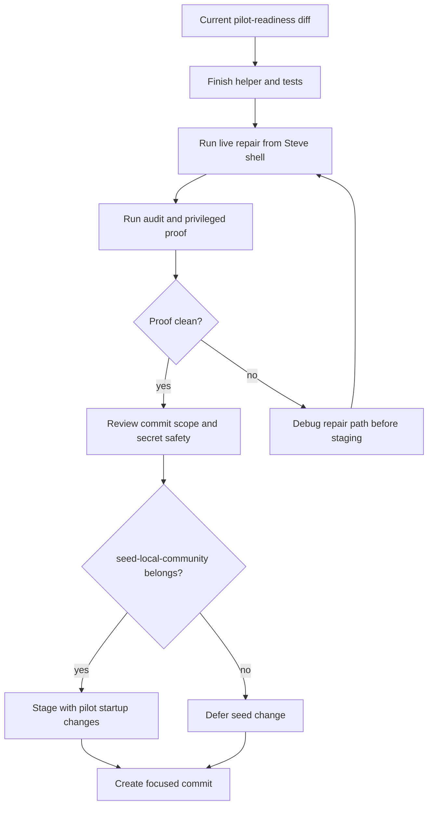

# Buzz Pilot Commit Readiness - Plan

## Goal Capsule

- **Objective:** Finish the Buzz pilot authority-repair work to a safe commit state by proving the helper works live, preserving the stale-binary guard, reviewing commit scope, and keeping secrets out of tracked files.
- **Product authority:** This plan is local-pilot operational work for Steve's active `localhost:3030` Buzz Community. It does not change upstream channel ownership semantics or the `localhost:3000` archive decision.
- **Execution profile:** Small code/docs/script finalization with one live operator proof from Steve's shell after secrets are exported there.
- **Stop conditions:** Stop before committing private keys, `.env` contents, local database dumps, raw Buzz message exports, or unrelated upstream source changes.
- **Tail ownership:** `ce-work` or a human implementer should finish verification, stage only the approved scope, and create a focused commit.

---

## Product Contract

### Summary

The Day 0 repair helper now has the right shape: it can derive a public key from a private key, avoid stale local `buzz-admin` binaries, create a backup before fallback repair, and prove normal Buzz-authorized access after repair.
The remaining work is to package that safely: run the live repair with Steve's exported identity, confirm the audit/proof result, inspect the one extra seed-script diff, scan for secrets, and commit only the pilot-readiness surface.

### Problem Frame

Steve hit `error: unrecognized subcommand 'public-key'` after exporting the right variables because the helper found an old compiled `target/debug/buzz-admin` before it tried the freshly built source.
That failure does not mean the `public-key` command is wrong; it means local development artifacts can drift from the source tree.
The fix should keep the source-level resolver guard and ignore stale binaries that do not support the needed command.

The current working tree also includes broader Buzz pilot docs, smoke checks, agent visibility helpers, and one `scripts/seed-local-community.sh` environment-precedence change.
Those may belong in the same pilot-readiness commit, but they should be reviewed as intentional scope rather than swept in by accident.

### Requirements

**Must Dos**

- R1. The repair helper must work when `--target-pubkey` is omitted by deriving the target public key from `BUZZ_PILOT_PROOF_PRIVATE_KEY` or `BUZZ_PRIVATE_KEY`.
- R2. The helper must not fail just because an old local `target/debug/buzz-admin` exists without the `public-key` subcommand.
- R3. The live repair must prove that Steve's chosen identity can manage all four Day 0 channels through the normal Buzz path after any fallback repair.
- R4. Any fallback that writes local database state must create a fresh local backup first.
- R5. The commit must not include private keys, webhook URLs, `.env` contents, local database dumps, or raw archive-message exports.
- R6. The final staged diff must preserve the active/archive split: `localhost:3030` is active pilot continuity and `localhost:3000` is archive/reference only.

**Should Dos**

- R7. The `buzz-admin public-key` command should remain as a small operator utility because it gives scripts a non-leaky way to derive a public key from an identity secret.
- R8. The resolver should fail loudly for an explicit operator-provided admin binary that lacks the required subcommand, but should skip auto-discovered stale `target/` binaries and fall back to repo-pinned source execution.
- R9. The commit should include script-level tests for the stale-binary/derived-pubkey path and the relay-membership fallback path.
- R10. The commit should include runbook and agent-instruction updates that explain how to retry the repair without transcript context.
- R11. The `scripts/seed-local-community.sh` change should be included only if it is intentionally part of startup smoothing; otherwise defer it to a separate commit.
- R12. The final commit message should describe the operator value: smoother Day 0 recovery and safer local pilot startup.

### Acceptance Examples

- AE1. Given `BUZZ_PRIVATE_KEY` is set and `--target-pubkey` is omitted, when the repair helper runs, then it derives the target public key without printing the private key.
- AE2. Given a stale `target/debug/buzz-admin` exists without `public-key`, when the repair helper resolves admin tooling, then it ignores that stale binary and falls back to the repo source path.
- AE3. Given the target pubkey is missing as a relay member, when the fallback runs with `--allow-local-fallback`, then one backup is created and relay membership plus Day 0 channel authority are repaired.
- AE4. Given the repair completes, when the audit helper runs, then all four Day 0 channels show Steve's durable pubkey as `owner` or `admin`.
- AE5. Given the commit is staged, when the staged diff is reviewed, then no secret-bearing or local dump files are included.

### Scope Boundaries

#### In Scope

- `buzz-admin public-key` support.
- Day 0 authority repair helper hardening.
- Script-level repair/audit tests.
- Runbook, README, AGENTS, CONCEPTS, and pilot-doc updates that support smoother local startup and Day 0 recovery.
- Commit-scope review for current Buzz pilot files.

#### Deferred to Follow-Up Work

- General upstream product support for channel ownership transfer.
- Raw-message migration from the archive community into the active community.
- Persistent secret-file setup for Steve's identity.
- Slack webhook activation beyond sanitized optional mirroring.

#### Out of Scope

- Keeping or committing any stale binary under `target/`.
- Changing the upstream default `localhost:3000` development path.
- Rewriting the Buzz desktop app identity model.

---

## Planning Contract

### Key Technical Decisions

- KTD1. **Keep the resolver guard, not the stale binary.** The stale thing is a disposable compiled artifact under `target/`; the valuable fix is the helper logic that checks whether a candidate `buzz-admin` supports `public-key` before using it. This protects future retries from the same local-drift failure. Governs R2, R8.
- KTD2. **Use source-built fallback for auto-discovered stale binaries.** When auto-discovered target binaries do not support `public-key`, the helper should use the repo-pinned cargo path so the command surface matches the current source checkout. An explicit operator-provided admin binary should fail loudly if it is incompatible because that override is a deliberate instruction. Governs R1, R2, R8.
- KTD3. **Keep secret handling ephemeral by default.** Steve's exported identity should live in the current shell for the repair session only, while `.env` stays ignored and uncommitted. Governs R5.
- KTD4. **Treat live audit plus privileged proof as the real completion signal.** Unit tests prove helper behavior, but the pilot is not wrapped until the active `localhost:3030` community shows repaired authority and normal privileged updates succeed. Governs R3, R4.
- KTD5. **Review `seed-local-community` as an intentional startup-smoothing change.** The environment-precedence diff can make local install smoother by respecting caller-provided database and relay variables after `.env` loading, but it should not ride along unless the final diff review confirms it belongs with pilot readiness. Governs R11.

### High-Level Technical Design

### Relevant Existing Patterns

- `scripts/audit-day0-channel-authority.sh` is the read-only authority check for the active Day 0 channel set.
- `scripts/repair-day0-channel-authority.sh` owns the repair and proof path.
- `scripts/test-repair-day0-channel-authority.sh` provides shell-level characterization for fallback repair behavior.
- `crates/buzz-admin/src/main.rs` already exposes small operator commands such as key generation and migration, so `public-key` belongs there rather than in a one-off shell parser.
- `AGENTS.md`, `README.md`, `CONCEPTS.md`, and `docs/pilots/buzz-local-continuity-runbook.md` are the durable navigation layer for future agents.

---

## Implementation Units

### U1. Preserve Public-Key Derivation Support

- **Goal:** Keep the `buzz-admin public-key` command and clap environment support so repair scripts can derive a public key without echoing private key material.
- **Requirements:** R1, R7.
- **Dependencies:** None.
- **Files:** `crates/buzz-admin/Cargo.toml`, `crates/buzz-admin/src/main.rs`.
- **Approach:** Keep the command small, parse `nsec` or hex through the existing Nostr key parser, and print only the public key hex.
- **Test scenarios:**
  - Given a known 64-character private key in `BUZZ_PRIVATE_KEY`, invoking `buzz-admin public-key` prints the expected public key.
  - Given an invalid private key, invoking `buzz-admin public-key` fails without printing a secret value.
- **Verification:** `buzz-admin` builds, the direct known-key proof passes, and the command help shows the expected operator surface.

### U2. Harden Repair Helper Resolution

- **Goal:** Keep the repair helper resilient when stale target binaries exist locally.
- **Requirements:** R1, R2, R4, R8, R9.
- **Dependencies:** U1.
- **Files:** `scripts/repair-day0-channel-authority.sh`, `scripts/test-repair-day0-channel-authority.sh`.
- **Approach:** Validate any `buzz-admin` candidate with `public-key --help` before use; fail loudly for an incompatible explicit override, and fall back to repo-pinned source execution when an auto-discovered target binary is missing or stale.
- **Test scenarios:**
  - Covers AE1. With `BUZZ_PRIVATE_KEY` set and no `--target-pubkey`, the helper derives the target pubkey through a valid admin helper.
  - Covers AE2. With an auto-discovered stale admin candidate that lacks `public-key`, the helper does not use it and continues through the fallback source path.
  - With an explicit incompatible admin override, the helper fails loudly and names the incompatible path without exposing secret material.
  - Covers AE3. With relay membership missing and fallback allowed, the helper creates one backup and adds relay membership plus Day 0 channel authority.
  - With fallback not allowed, the helper fails closed and tells the operator to rerun with the explicit fallback flag.
- **Verification:** Repair script syntax checks pass and the shell test suite covers normal-path failure, fallback repair, relay-membership fallback, and already-authorized no-op behavior.

### U3. Prove the Live Day 0 Repair

- **Goal:** Run the active `localhost:3030` repair from Steve's Mac shell and capture a non-secret proof that authority is normalized.
- **Requirements:** R3, R4, R5, R6.
- **Dependencies:** U1, U2.
- **Files:** `scripts/audit-day0-channel-authority.sh`, `scripts/repair-day0-channel-authority.sh`, `docs/pilots/buzz-local-continuity-runbook.md`.
- **Approach:** Use Steve's already-exported identity variables in the shell that can reach Docker and the active relay; run repair with fallback only if ordinary Buzz repair cannot recover authority; rerun audit afterward.
- **Execution note:** This is an operator proof, not a unit-test-only change. Keep output sanitized and do not paste private key values into docs, commits, or shell history.
- **Test scenarios:**
  - Covers AE4. After repair, the audit shows the target pubkey as `owner` or `admin` for `buzz-pilot`, `install-support`, `repo-review`, and `agent-runs`.
  - After repair, the privileged `--no-ttl` proof succeeds on each Day 0 channel through the Buzz command path.
  - If fallback repair is needed, a new backup exists before the database-changing step runs.
- **Verification:** Live audit and proof are clean, and any recorded evidence contains channel names, roles, and success status only.

### U4. Review Pilot Startup Scope

- **Goal:** Decide whether the `scripts/seed-local-community.sh` environment-precedence change belongs in this pilot-readiness commit.
- **Requirements:** R10, R11, R12.
- **Dependencies:** U3.
- **Files:** `scripts/seed-local-community.sh`, `README.md`, `AGENTS.md`, `docs/pilots/buzz-local-continuity-runbook.md`.
- **Approach:** Include the seed-script change only if it directly supports smoother local startup by respecting caller-provided database and relay variables after `.env` loading. Defer it if it is an independent behavior change.
- **Test scenarios:**
  - With caller-provided Postgres or relay variables, the seed helper preserves those values instead of silently replacing them from `.env`.
  - With no caller-provided variables, the seed helper keeps the existing `.env` and default behavior.
- **Verification:** The final staged diff tells one coherent pilot-readiness story rather than mixing unrelated startup behavior with authority repair.

### U5. Package a Safe Commit

- **Goal:** Stage and commit only the approved Buzz pilot readiness surface.
- **Requirements:** R5, R6, R9, R10, R12.
- **Dependencies:** U1, U2, U3, U4.
- **Files:** `AGENTS.md`, `README.md`, `CONCEPTS.md`, `docs/dogfood-reports/`, `docs/ideation/`, `docs/pilots/`, `docs/plans/`, `docs/solutions/`, `scripts/audit-day0-channel-authority.sh`, `scripts/buzz-pilot-smoke.sh`, `scripts/post-pilot-agent-update.sh`, `scripts/repair-day0-channel-authority.sh`, `scripts/test-audit-day0-channel-authority.sh`, `scripts/test-buzz-pilot-smoke.sh`, `scripts/test-post-pilot-agent-update.sh`, `scripts/test-repair-day0-channel-authority.sh`, `crates/buzz-admin/Cargo.toml`, `crates/buzz-admin/src/main.rs`.
- **Approach:** Review unstaged and untracked files as a set, stage only the files that support startup smoothing, Day 0 continuity, authority repair, and agent visibility, then create a focused commit.
- **Test scenarios:**
  - Covers AE5. A secret scan over staged files finds no private keys, webhook URLs, `.env` contents, local dumps, or raw archive exports.
  - Staged files do not include `target/`, `.env`, backup dumps, or generated dependency artifacts.
  - The commit diff includes the tests that prove new repair helper behavior.
- **Verification:** The final staged diff is scoped, tests pass, secret scan is clean, and the commit message communicates the local-pilot operator value.

---

## Verification Contract

| Gate | Applies To | Done Signal |
|---|---|---|
| Script syntax | U2, U3, U5 | Repair and audit helpers parse cleanly before live use. |
| Repair helper tests | U2, U5 | `scripts/test-repair-day0-channel-authority.sh` passes, including derived-pubkey and relay-membership fallback coverage. |
| Audit helper tests | U3, U5 | `scripts/test-audit-day0-channel-authority.sh` passes. |
| Admin command build | U1, U5 | `buzz-admin` builds and the known-key public-key proof prints the expected public key. |
| Live pilot proof | U3, U5 | Active `localhost:3030` audit shows Steve's manager pubkey as `owner` or `admin` across all four Day 0 channels, and privileged proof succeeds. |
| Secret safety | U5 | Staged files exclude `.env`, private keys, webhook URLs, backup dumps, raw exports, and `target/` artifacts. |
| Scope review | U4, U5 | `scripts/seed-local-community.sh` is either intentionally staged with startup-readiness rationale or left unstaged for separate handling. |

---

## Risks & Dependencies

- **Private-key exposure:** The live repair needs Steve's identity in shell, but the commit must not persist it. Mitigate with ephemeral exports, redacted script errors, and staged-file secret scanning.
- **Database fallback risk:** The fallback path writes local pilot database state. Mitigate with backup-first behavior and by using fallback only when the normal Buzz path cannot repair authority.
- **Stale local artifacts:** Old compiled binaries under `target/` can shadow current source. Mitigate by keeping KTD1's resolver guard and never staging `target/`.
- **Commit scope creep:** The branch contains multiple pilot docs and helpers. Mitigate by reviewing staged files against U5 before committing.

---

## Definition of Done

- The `buzz-admin public-key` source change is present and verified.
- The repair helper ignores stale admin binaries and falls back to current source when needed.
- The live Day 0 authority repair and audit proof have succeeded on `localhost:3030`.
- Any fallback repair created a backup before database mutation.
- The `scripts/seed-local-community.sh` change has an explicit include-or-defer decision.
- Staged files contain no secrets, `.env`, database dumps, raw archive exports, or generated binaries.
- The final commit is focused on Buzz pilot startup/readiness, Day 0 authority recovery, and agent visibility continuity.
