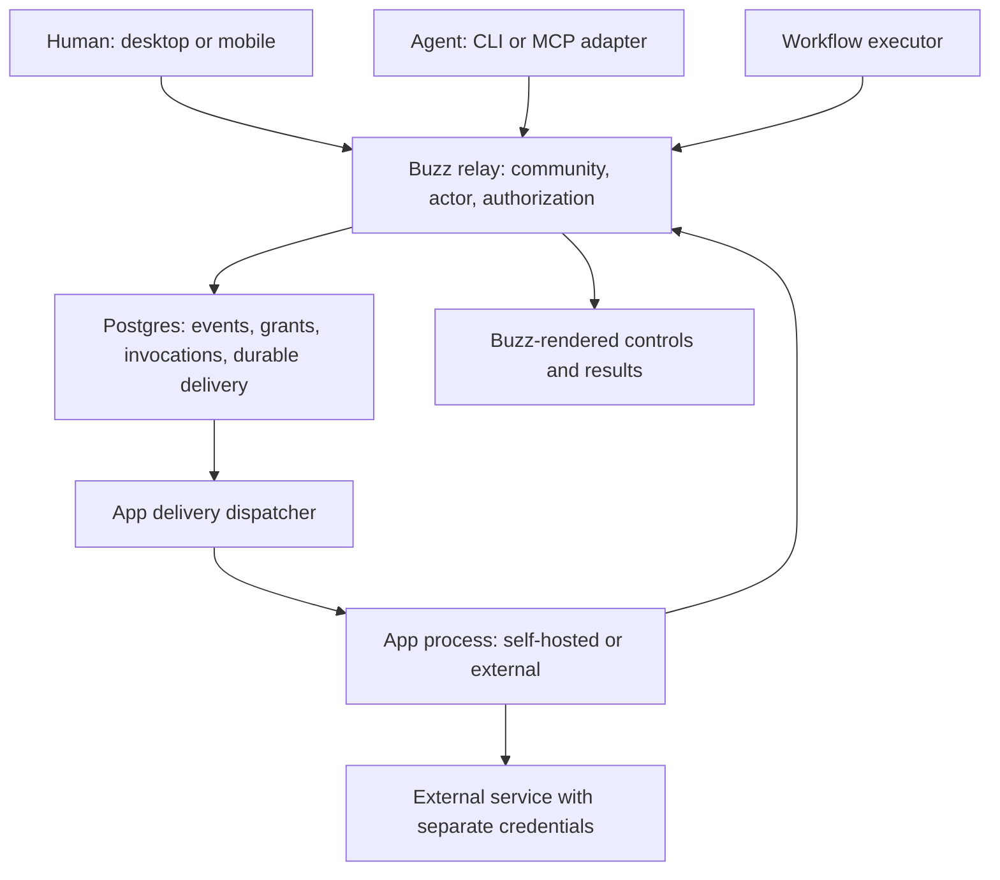
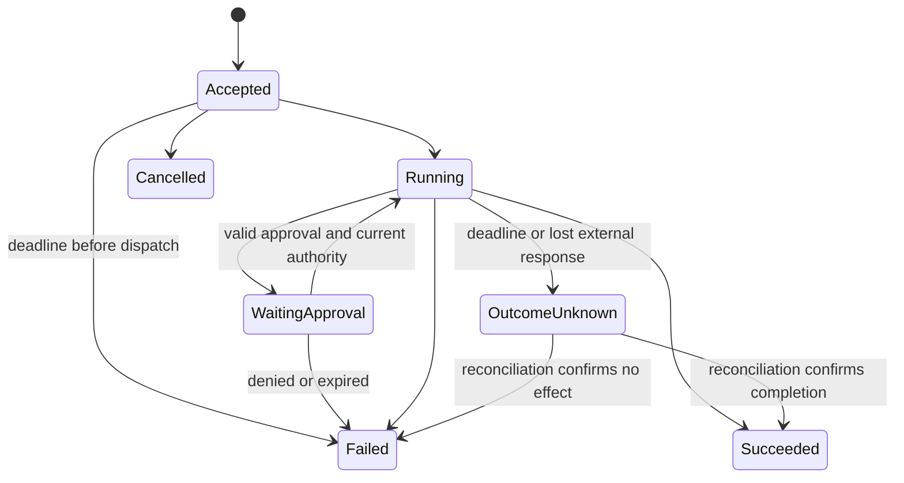

# Buzz plugin architecture: research and proposed design

**Date:** September 4, 2026; Cordis research and design additions September 8, 2026.\
**Status:** Proposed architecture; implementation and product priorities require review.\
**Audience:** Buzz maintainers, including engineers building their first plugin system.\
**Code baseline:** block/buzz, commit 88687876f7808a2fd742b7eb2e4b9f87d999ad8d; Buzz implementation findings were not refreshed to a later revision. Cordis/Harness source is separately pinned in section 3A.

## Recommendation

Build **community-installed apps with declared capabilities, named actions, and a versioned protocol**. Run app logic outside the relay. Let Buzz render standard interactive content on desktop and mobile. Expose the same actions to people, agents, and workflows through the CLI and protocol.

Start with independently hosted apps, including apps operated alongside a self-hosted relay. Add managed execution of untrusted code only after there is a concrete need and a tested isolation design. Keep persona packs, MCP tools, and compute-provider binaries as distinct extension mechanisms. Their installation, identity, and trust requirements differ.

Adopt Cordis's explicit dependency and registration-ownership concepts: required host interfaces govern activation, and every action, subscription, and view has an owner and a removal contract. Implement these in Buzz's host and protocol. Cordis's TypeScript context is not a substitute for relay authorization or execution isolation. Section 3A traces the implementation and the resulting design changes.

The first release should prove two workflows: creating an external issue from a selected message, and posting build results into an authorized channel. These are illustrative priorities, pending product input. They exercise commands, limited context access, external credentials, signed results, and disconnected delivery without requiring arbitrary client code.

“Best-in-class” here means explicit permissions, predictable compatibility, useful developer tools, cross-client functionality, recoverable failures, and operator control. The research does not establish an objective ranking of ecosystems.

### Decisions proposed now

| Decision | Reason |
|---|---|
| One action definition for UI, CLI, agents, and workflows | Prevent divergent behavior and authorization between callers. |
| Community-specific installation and execution identity | Match Buzz's tenant boundary; avoid sharing credentials across installations. |
| Relay-enforced grants on every access path | An SDK or runtime convention can be bypassed. |
| Standard controls rendered by Buzz | Support React desktop, Flutter mobile, accessibility, and older clients. |
| External app execution first | Reuse Buzz's protocol without building a language runtime or container service. |
| Durable delivery and explicit invocation state | A signed event or live subscription alone does not guarantee processing. |
| Versioned public contracts; internal modules stay private | Allow Buzz implementation changes without requiring every app to change. |
| Private installation and self-hosted catalogs | Preserve operation without a mandatory vendor service. |
| Interface requirements separate from permission grants | An available service does not authorize resource access. |
| Host-owned registrations tied to activation generations | Failed setup, replacement, and disable must remove the exact contributions they own. |

These are design recommendations, not descriptions of existing Buzz functionality. The remainder distinguishes research facts, current implementation, and proposed behavior.

A separate Desktop-only proposal exists at commit 5acd181bc. It addresses trusted local extensions and has different first-release requirements. Section 2 compares the proposals; neither document establishes an approved product decision. Do not implement both systems as one initial release.

## 1. What a plugin system must define

A plugin is independently developed functionality connected through an interface the host promises to support. Loading code is only one possible implementation.

Six contracts matter:

1. **Discovery and packaging:** how Buzz identifies an app, reads its capabilities, and verifies the artifact.
2. **Integration:** which commands, events, content, and views an app can contribute.
3. **Authority:** who installed it, what data it can receive, and which actions it may perform.
4. **Execution:** where its code runs and what happens when it hangs, crashes, or behaves maliciously.
5. **Lifecycle:** installation, configuration, update, disable, revocation, removal, and data retention.
6. **Compatibility:** which changes Buzz can make without breaking installed apps.

A **manifest** is static metadata Buzz can inspect before executing anything. A **contribution point** is a supported place for an app feature, such as a message action. A **capability** is a permission Buzz actually checks. An **installation** is an approved instance of an app in one community. A **protocol version** describes a wire contract; a package version identifies a particular release. They should not be conflated.

An event subscription expresses interest. It grants no access. A signature establishes who signed bytes. It does not establish that the signer may perform the operation. A process boundary contains some failures. It does not automatically prevent filesystem or network access.

## 2. Buzz's requirements and existing architecture

### Product intent

Buzz is an OSS workspace where people and agents collaborate using the same identities, channels, and signed-event protocol. The product includes communication, code hosting, workflows, shared documents, and agent coordination. A plugin architecture limited to chat bots would omit substantial intended use. [Buzz vision](https://github.com/block/buzz/blob/88687876f7808a2fd742b7eb2e4b9f87d999ad8d/VISION.md), [sovereign workspace vision](https://github.com/block/buzz/blob/88687876f7808a2fd742b7eb2e4b9f87d999ad8d/VISION_SOVEREIGN.md).

| Product requirement | Consequence for extensions |
|---|---|
| One community selected by its URL | Installation, grants, queues, caches, credentials, and diagnostics must be community-scoped. |
| Portable identity; community-local state | Reusing a public key elsewhere must not import an app's grants or history. |
| Humans and agents participate through shared primitives | A GUI-only extension API is insufficient. |
| The relay enforces access | App UI visibility and prompts cannot be authorization controls. |
| Self-hosting and operator ownership | Runtime, installation, and recovery must work without a mandatory public marketplace. |
| Code, review, and workflow activity share a record | App results should produce signed, attributable Buzz records and searchable summaries. |
| Low notification volume by default | Installing an app must not automatically authorize mass mentions or DMs. |
| Private moderation reports; human moderation decisions | Community app installation must not grant moderator-report access or autonomous moderation authority. |

These requirements come from the vision documents, including [projects](https://github.com/block/buzz/blob/88687876f7808a2fd742b7eb2e4b9f87d999ad8d/VISION_PROJECTS.md), [moderation](https://github.com/block/buzz/blob/88687876f7808a2fd742b7eb2e4b9f87d999ad8d/VISION_MODERATION.md), and [activity presentation](https://github.com/block/buzz/blob/88687876f7808a2fd742b7eb2e4b9f87d999ad8d/VISION_ACTIVITY.md). They describe intended behavior; they are not blanket evidence of implementation.

Remote agents are intended to operate after the desktop closes, using the relay for subsequent coordination. Mesh compute is community-scoped and opt-in. Therefore an app's lifetime should not depend on an open desktop window, and app installation should not grant compute access. [Remote-agent vision](https://github.com/block/buzz/blob/88687876f7808a2fd742b7eb2e4b9f87d999ad8d/VISION_REMOTE_AGENTS.md), [mesh vision](https://github.com/block/buzz/blob/88687876f7808a2fd742b7eb2e4b9f87d999ad8d/VISION_MESH.md).

### Current implementation relevant to this design

Buzz uses Rust 2021 with minimum Rust 1.88.0, a Tauri 2 desktop client with React 19, and a Flutter mobile client. The relay coordinates persistence, authorization, pub/sub, search, audit, and workflows. Browser UI currently includes the repository browser; this design does not assume a full browser workspace already exists. [Workspace dependencies](https://github.com/block/buzz/blob/88687876f7808a2fd742b7eb2e4b9f87d999ad8d/Cargo.toml#L39), [desktop dependencies](https://github.com/block/buzz/blob/88687876f7808a2fd742b7eb2e4b9f87d999ad8d/desktop/package.json), [mobile dependencies](https://github.com/block/buzz/blob/88687876f7808a2fd742b7eb2e4b9f87d999ad8d/mobile/pubspec.yaml), [contributor architecture](https://github.com/block/buzz/blob/88687876f7808a2fd742b7eb2e4b9f87d999ad8d/AGENTS.md).

| Area | Source-backed finding | Design implication |
|---|---|---|
| Community binding | Host resolution rejects empty and unmapped hosts. [tenant.rs:71](https://github.com/block/buzz/blob/88687876f7808a2fd742b7eb2e4b9f87d999ad8d/crates/buzz-relay/src/tenant.rs#L71) | Resolve community before app lookup. Never derive it from an app-supplied tag. |
| Event submission | WebSocket handling delegates persistent submission to shared ingest; specialized observer and ephemeral paths also exist. [event.rs:608](https://github.com/block/buzz/blob/88687876f7808a2fd742b7eb2e4b9f87d999ad8d/crates/buzz-relay/src/handlers/event.rs#L608) | App restrictions must cover generic and specialized paths, not one new endpoint. |
| Restricted channel access | Token channel restrictions are enforced in ingest and REQ handling. [ingest.rs:777](https://github.com/block/buzz/blob/88687876f7808a2fd742b7eb2e4b9f87d999ad8d/crates/buzz-relay/src/handlers/ingest.rs#L777), [req.rs:149](https://github.com/block/buzz/blob/88687876f7808a2fd742b7eb2e4b9f87d999ad8d/crates/buzz-relay/src/handlers/req.rs#L149) | Extend existing restrictions; do not assume all per-channel attenuation is new. |
| Admission limits | RedisRateLimiter implements production limits and is called by relay admission. [rate_limiter.rs:81](https://github.com/block/buzz/blob/88687876f7808a2fd742b7eb2e4b9f87d999ad8d/crates/buzz-pubsub/src/rate_limiter.rs#L81), [rejection.rs:70](https://github.com/block/buzz/blob/88687876f7808a2fd742b7eb2e4b9f87d999ad8d/crates/buzz-relay/src/rejection.rs#L70) | Reuse admission infrastructure; add app invocation and backlog quotas where needed. |
| Search | Generated Postgres full-text data is part of the stored event row; the separate search worker was removed. [event.rs:502](https://github.com/block/buzz/blob/88687876f7808a2fd742b7eb2e4b9f87d999ad8d/crates/buzz-relay/src/handlers/event.rs#L502) | Reuse authorized event search; do not build a second app-content index initially. |
| Event-triggered workflows | Dispatch uses a spawned task with explicit community context. [event.rs:528](https://github.com/block/buzz/blob/88687876f7808a2fd742b7eb2e4b9f87d999ad8d/crates/buzz-relay/src/handlers/event.rs#L528) | This path is not a durable app-delivery queue. |
| Event-created audit | Bounded in-memory channel; backpressure is awaited. Worker DB failures are documented as not retried, and a closed channel records an error. [event.rs:563](https://github.com/block/buzz/blob/88687876f7808a2fd742b7eb2e4b9f87d999ad8d/crates/buzz-relay/src/handlers/event.rs#L563) | App grants and critical invocation transitions need durable audit intent. |
| Workflow approval | Finalization deliberately marks a run with an approval token Failed. [workflow lib.rs:229](https://github.com/block/buzz/blob/88687876f7808a2fd742b7eb2e4b9f87d999ad8d/crates/buzz-workflow/src/lib.rs#L229) | Approval-dependent app actions require completion of the approval lifecycle. |
| Workflow action availability | SendDm and SetChannelTopic return NotImplemented. [executor.rs:655](https://github.com/block/buzz/blob/88687876f7808a2fd742b7eb2e4b9f87d999ad8d/crates/buzz-workflow/src/executor.rs#L655) | A parsed action type is not an executable capability. |
| Membership revocation | Channel subscriptions are evicted; departing owners' workflows are disabled, with per-fire checks described in source. [side_effects.rs:39](https://github.com/block/buzz/blob/88687876f7808a2fd742b7eb2e4b9f87d999ad8d/crates/buzz-relay/src/handlers/side_effects.rs#L39) | Extend existing revocation patterns to app invocations and deliveries. |

**Documentation corrections:** ARCHITECTURE.md still describes a separate search queue, independently spawned audit work, and an absent production rate limiter. An AuthContext comment labels channel restrictions as reserved for future use. The source above supersedes those claims. No security proof or feature-completeness claim in a vision/specification substitutes for checking the implementation and its stated assumptions.

### Existing extension mechanisms to preserve

**Persona packs already exist.** The loader reads `.plugin/plugin.json` and resolves persona content, instructions, and MCP configuration. The package specification intends Open Plugin Spec compatibility. This is a packaging contract for agent configuration, not a community app authorization system. [Pack loader](https://github.com/block/buzz/blob/88687876f7808a2fd742b7eb2e4b9f87d999ad8d/crates/buzz-persona/src/pack.rs#L125), [pack specification](https://github.com/block/buzz/blob/88687876f7808a2fd742b7eb2e4b9f87d999ad8d/crates/buzz-persona/PERSONA_PACK_SPEC.md).

Pack parsing and configuration resolution do not establish automatic installation or execution. The resolver preserves author-supplied MCP command/argument/environment data; the inspected ACP and desktop source did not show a consumer that launches those resolved pack commands. Treat end-to-end pack activation as unestablished, not as an existing secure app loader. [MCP configuration resolution](https://github.com/block/buzz/blob/88687876f7808a2fd742b7eb2e4b9f87d999ad8d/crates/buzz-persona/src/resolve.rs#L310).

**MCP lifecycle hooks already execute.** The agent invokes named hooks such as `_Stop` from configured servers, applies timeouts, and limits objections. These are advisory hooks. Pack-level hook paths are separately parsed and explicitly described as not executed in their resolver. Do not combine these into a claim that all packaged hooks work. [Hook dispatch](https://github.com/block/buzz/blob/88687876f7808a2fd742b7eb2e4b9f87d999ad8d/crates/buzz-agent/src/mcp.rs#L360), [stop handling](https://github.com/block/buzz/blob/88687876f7808a2fd742b7eb2e4b9f87d999ad8d/crates/buzz-agent/src/agent.rs#L737), [pack hook resolution](https://github.com/block/buzz/blob/88687876f7808a2fd742b7eb2e4b9f87d999ad8d/crates/buzz-persona/src/resolve.rs#L340).

**Compute-provider binaries already implement a narrow executable contract.** Deployment stages a binary, checks protocol version through `info`, and sends the secret-bearing deploy request to the same staged bytes. Configuration validation and output bounds are present. This is a useful compatibility and artifact-verification precedent. It does not sandbox a provider entrusted with an agent key. [Provider negotiation](https://github.com/block/buzz/blob/88687876f7808a2fd742b7eb2e4b9f87d999ad8d/desktop/src-tauri/src/managed_agents/backend.rs#L507), [provider contract](https://github.com/block/buzz/blob/88687876f7808a2fd742b7eb2e4b9f87d999ad8d/docs/remote-agents.md).

**ACP and MCP should keep their roles.** ACP connects agent runtimes to clients; MCP supplies tools and context. Buzz's contributor instructions make the CLI the starting point for new agent-facing operations. A community app should be callable through that interface; it should not require every agent to implement a new runtime protocol. [Agent architecture](https://github.com/block/buzz/blob/88687876f7808a2fd742b7eb2e4b9f87d999ad8d/VISION_AGENT.md), [CLI contribution rule](https://github.com/block/buzz/blob/88687876f7808a2fd742b7eb2e4b9f87d999ad8d/AGENTS.md#L272).

A bounded source search found no general third-party UI loader for Buzz desktop or mobile. Existing editor-library extensions and agent-harness configuration should not be described as such a loader.

### Separate Desktop proposal found during review

The worktree's `docs/plugin-system.md`, added at 5acd181bc after the code baseline above, explicitly describes a **proposed** Desktop plugin system. It has unresolved rollout requirements and does not establish that a runtime ships or that its scope was approved. [Desktop proposal status](https://github.com/block/buzz/blob/5acd181bc73b2a9ba36d67851aef3f9ca6e6e879/docs/plugin-system.md#L3), [rollout requirements](https://github.com/block/buzz/blob/5acd181bc73b2a9ba36d67851aef3f9ca6e6e879/docs/plugin-system.md#L374).

| Decision | Desktop proposal | Community-app recommendation here |
|---|---|---|
| Execution and lifetime | Trusted native child process under Tauri; no complete delivery while Desktop is closed | Independent app process; relay retains delivery obligations |
| Installation authority | User/device trust or managed distribution policy | Community installation within operator policy |
| Client support | Desktop contributions; mobile/web UI and plugin CLI additions deferred | Shared actions/results across desktop, mobile, CLI, and agents |
| Protocol | Buzz hosts an MCP stdio server; existing Buzz event kinds | Versioned Buzz action/event contract; MCP exposes actions to agents when needed |
| Initial use cases | Code review, system stewardship, loop management | Illustrative external integrations and collaborative automation |

The Desktop proposal explicitly accepts same-user native-code trust and keeps signing in the host. It does not claim that process isolation prevents that code from reading credentials independently. It also avoids new relay kinds in v1. Those are concrete tradeoffs, not evidence that community-installed third-party apps can use the same trust model. [Desktop execution](https://github.com/block/buzz/blob/5acd181bc73b2a9ba36d67851aef3f9ca6e6e879/docs/plugin-system.md#L38), [trust](https://github.com/block/buzz/blob/5acd181bc73b2a9ba36d67851aef3f9ca6e6e879/docs/plugin-system.md#L75), [v1 exclusions](https://github.com/block/buzz/blob/5acd181bc73b2a9ba36d67851aef3f9ca6e6e879/docs/plugin-system.md#L25).

Both proposals retain attributable effects, explicit uncertainty after lost external responses, and host-owned revocation. Both need verification of the selected MCP revision against Buzz's actual client implementation. They can share action/schema conventions, but runtime, installation, and delivery contracts are not interchangeable.

**Product choice:** if the immediate goal is trusted local review/stewardship/loop tools, evaluate the existing Desktop proposal first; this research's community delivery and mobile requirements do not automatically belong in that release. If the goal is community integrations and automation that operates while clients are closed, use the community-app proposal. Keep these as separately named extension categories if both are eventually needed. This report recommends the latter for the broader human-and-agent workspace vision, pending concrete first-use-case selection.

## 3. What established systems teach

### Slack: apps, permissions, events, and native interaction

Slack distinguishes app-owned bot credentials from user credentials. Bot identity can survive the departure of the installing user. Its workflow credentials illustrate a further distinction: temporary execution authority can differ from the app's standing authority. Buzz should preserve app identity and record the initiating actor separately; it should not copy Slack's many token categories wholesale. [Slack token model](https://docs.slack.dev/authentication/tokens/).

App manifests declare features and permissions. Block Kit supplies messages, modals, and App Home UI from structured components. The transferable pattern is declarative integration: the host knows an app's contributions before executing it. [Slack manifest reference](https://docs.slack.dev/reference/app-manifest), [Block Kit](https://docs.slack.dev/block-kit/).

Slack requires an Events API acknowledgement within three seconds and documents retries after failure. It recommends queued processing. Scope and visibility checks constrain event delivery; subscribing to an event does not independently authorize its content. [Events API](https://docs.slack.dev/apis/events-api/).

Block Kit also documents a concrete accessibility requirement: message screen-reader content depends on top-level text or a supported generated fallback. Buzz should require a useful textual representation and verify native control semantics. “The host renders it” does not remove the need for accessibility tests. [Block Kit accessibility](https://docs.slack.dev/block-kit/#accessibility-considerations).

Socket Mode avoids a public inbound endpoint. Slack currently excludes Socket Mode apps from its public Marketplace. That is a Slack distribution policy, not a technical constraint Buzz must reproduce. An OSS catalog can list an app that connects outward to a relay. [Socket Mode](https://docs.slack.dev/apis/events-api/using-socket-mode/).

**Adopt:** declared features, app identity, native controls, bounded acknowledgements.\
**Avoid:** assuming webhook receipt means completed work; requiring broad message access for a selected-message action.

### VS Code: contribution points, activation, and compatibility

VS Code declares commands, views, languages, and other contributions in a manifest. It supports different extension-host locations and lazy activation. This lets UI and workspace code execute where their dependencies exist, without making every installed extension active at startup. [Contribution points](https://code.visualstudio.com/api/references/contribution-points), [extension hosts](https://code.visualstudio.com/api/advanced-topics/extension-host).

Its stable extension API is treated as a compatibility commitment; proposed APIs provide a separate experimental process. Extension manifests declare compatible editor versions. Buzz should similarly distinguish stable protocol support, experimental capabilities, and package release versions. [Proposed API policy](https://code.visualstudio.com/api/advanced-topics/using-proposed-api), [extension manifest](https://code.visualstudio.com/api/references/extension-manifest).

The critical limitation: a native extension host has the same permissions as VS Code. Extensions can access files, networks, and processes. Marketplace signing, publisher trust, and scanning do not convert that runtime into a restricted sandbox. These facts apply to the native host model; browser extensions have different constraints. [Extension runtime security](https://code.visualstudio.com/docs/configure/extensions/extension-runtime-security).

**Adopt:** discover contributions without execution, activate only when needed, publish stable contracts.\
**Avoid:** equating a separate extension process with permission isolation.

### JetBrains: explicit interfaces and executable compatibility checks

JetBrains defines extension points and registrations in plugin configuration. Its Plugin Verifier checks binary compatibility against IDE builds. Dynamic unloading requires specific lifecycle discipline, including use of dynamic extension points and restrictions on retained objects. An unloading failure can require restarting the IDE. [Extension points](https://plugins.jetbrains.com/docs/intellij/plugin-extension-points.html), [Plugin Verifier](https://plugins.jetbrains.com/docs/intellij/verifying-plugin-compatibility.html), [dynamic plugins](https://plugins.jetbrains.com/docs/intellij/dynamic-plugins.html).

JetBrains explicitly documents that plugins have the IDE's access rights and are not sandboxed with granular permissions. It also warns that uninstalling a plugin does not undo every effect it caused. [Plugin security](https://plugins.jetbrains.com/docs/marketplace/understanding-plugin-security.html).

**Adopt:** compatibility tests and explicit cleanup ownership.\
**Avoid:** exposing internal application classes as Buzz's public contract, or promising complete rollback of external effects.

### Mattermost: self-hosted management and a trust model Buzz should narrow

Mattermost supports server processes and webapp contributions, private marketplaces, and configurable signing trust. It explicitly treats plugins as part of the trusted server: they can access configuration, the database, and messages across channels. That is unsuitable for plugins installed by one community administrator on a shared Buzz deployment. [Using and managing plugins](https://developers.mattermost.com/integrate/plugins/using-and-managing-plugins/).

Its mobile documentation distinguishes webapp customization from cross-platform interactive messages and dialogs. This directly supports building shared interaction primitives before arbitrary desktop UI extensions. [Mobile plugins](https://developers.mattermost.com/integrate/plugins/components/mobile/).

**Adopt:** self-hosted distribution and operator-managed signing trust.\
**Avoid:** giving a community app the privileges of the relay operator.

### Figma: separate document access from browser UI

Figma's plugin sandbox accesses the document; a separate iframe accesses browser APIs. The two communicate by messages. Its documented network restrictions have limits: embedded websites can load their own external resources. Therefore neither “iframe” nor “domain allowlist” is a complete description of data-egress guarantees. [How plugins run](https://developers.figma.com/docs/plugins/how-plugins-run/).

**Adopt:** narrow, explicit communication between untrusted UI and host APIs.\
**Avoid:** giving extension JavaScript direct access to Buzz's React state, signing bridge, or Tauri commands.

### Atlassian Forge: host-rendered UI and enforced external access

Forge provides host components through UI Kit and custom UI through a separate web interface. Its FaaS egress model requires declared external domains; changes can require renewed permission approval. The useful distinction is between author-declared intent and host-enforced access. A manifest field alone is not enforcement. [UI Kit](https://developer.atlassian.com/platform/forge/ui-kit/), [runtime egress permissions](https://developer.atlassian.com/platform/forge/runtime-egress-permissions/).

**Adopt:** controlled host components, explicit egress policy, permission-aware updates.\
**Avoid:** making a vendor-operated runtime mandatory for Buzz's self-hosted app ecosystem.

### Discord and Matrix: structured invocation and precise retry contracts

Discord provides slash commands, message commands, and interactive components that produce structured interactions. HTTP interaction endpoints must validate signed request headers. Buzz can similarly offer selected-context actions without asking apps to parse every channel message. [Discord interactions](https://docs.discord.com/developers/interactions/overview).

Matrix application services receive queued transactions with stable transaction identifiers. Retries must preserve the event set for that identifier; duplicate processing can then be detected. Its specification is unusually explicit about acknowledgement loss and replay. Its trusted application-service identities should not be copied as unrestricted app authority. [Matrix application-service protocol](https://spec.matrix.org/latest/application-service-api/).

Matrix widgets provide a separate client integration model; they are not equivalent to trusted application services. This research relies on the stable application-service specification for delivery guarantees, not on widget proposals.

**Adopt:** structured actions, authenticated requests, immutable retry payloads.\
**Avoid:** treating an event timestamp as a reliable processing cursor.

### GitHub Apps: installation authority versus actor authority

GitHub distinguishes installation access from user-delegated access. A user-delegated request is constrained by both the app and the user. It also supports narrowing installation tokens and explicitly handles permission changes per installation. This is the most useful reference for avoiding an app that lets a low-privilege caller perform a high-privilege operation. [GitHub App practices](https://docs.github.com/en/apps/creating-github-apps/about-creating-github-apps/best-practices-for-creating-a-github-app).

GitHub does not automatically retry failed webhook deliveries. Mature ecosystems make different delivery promises; Buzz must specify its own rather than calling webhooks “reliable” without qualification. [Failed webhook deliveries](https://docs.github.com/en/webhooks/using-webhooks/handling-failed-webhook-deliveries).

### MCP, HashiCorp, and WebAssembly: reuse protocols without overstating guarantees

The published MCP 2026-07-28 revision defines stateless self-contained requests and per-request negotiation. MCP Apps is an optional interactive-UI extension. Buzz's current MCP dependency must be checked for actual revision support; this research does not imply it already implements the newest protocol. [Current MCP specification](https://modelcontextprotocol.io/specification/2026-07-28), [Buzz MCP dependency](https://github.com/block/buzz/blob/88687876f7808a2fd742b7eb2e4b9f87d999ad8d/crates/buzz-agent/Cargo.toml#L51).

MCP Apps uses host-controlled sandboxed UI and a message protocol. Reuse it when rich tool UI becomes necessary, through an adapter enforcing Buzz's grants. MCP tool descriptions and safety annotations are not authoritative permissions. [MCP Apps](https://modelcontextprotocol.io/extensions/apps/overview), [MCP trust requirements](https://modelcontextprotocol.io/specification/2026-07-28).

HashiCorp go-plugin uses subprocess RPC and protocol-version negotiation. Its documentation explicitly limits it to local reliable networking. It provides useful precedent for Buzz's compute-provider binaries, not a reason to adopt that library for internet-connected apps. [go-plugin](https://github.com/hashicorp/go-plugin).

WebAssembly restricts execution to imported interfaces; Wasmtime's WASI filesystem access follows capabilities. Host functions, runtime bugs, CPU, memory, and other resource limits still require engineering. WASM is a plausible later managed runtime, not a complete app platform or a prerequisite for the first release. [Wasmtime security](https://docs.wasmtime.dev/security.html).

## 3A. Cordis and DeepSeek Harness: dependencies, ownership, and live composition

Added September 8, 2026. This section uses the linked primer, implementation, tests, and research papers. It changes the proposed Buzz lifecycle and developer contracts; it does not recommend replacing Buzz's Rust services with a TypeScript runtime.

### Provenance matters: upstream framework versus Harness distribution

Cordis is a general TypeScript composition framework used by DeepSeek Harness. The Harness vendors nine packages: Cordis, Loader, Include, Group, HMR, timer, console logging, cosmokit, and schemastery. Its upstream snapshot table identifies Cordis `4.0.0-rc.7` at 56b3d4f725681cf4556c1a8695a709cc3b6eed74, while the inspected Harness package is named `@deepseek-ai/cordis` and declares version `4.0.2`. The README says the rescoping operation leaves versions unchanged but does not explain this difference. Use the table for upstream provenance and the manifest for the local package version. The Harness root declares `0.1.5-alpha.1`. All Harness source below is pinned to 5dda764ed3aa172535a7967b06ff95d9cbfe536a. [Vendor provenance](https://github.com/deepseek-ai/deepseek-harness/blob/5dda764ed3aa172535a7967b06ff95d9cbfe536a/vendor/README.md#L9), [distributed Cordis version](https://github.com/deepseek-ai/deepseek-harness/blob/5dda764ed3aa172535a7967b06ff95d9cbfe536a/vendor/cordis/package.json#L4), [Harness version](https://github.com/deepseek-ai/deepseek-harness/blob/5dda764ed3aa172535a7967b06ff95d9cbfe536a/package.json#L3).

Do not substitute documentation for the older `@cordisjs/core` API or assume every Harness behavior comes from upstream. The Harness records local modifications, including disposal races, configuration reconciliation, and loader compatibility. Source-vendoring gives its maintainers direct control and creates an ongoing responsibility to maintain those changes. Package versions alone do not describe that responsibility.

### The useful model: declarations plus runtime ownership

| Concept | What it means in Cordis | Buzz implication |
|---|---|---|
| Context | A service resolver with inherited metadata and per-service namespace mappings | Pass a narrow, explicitly scoped host interface |
| Service | A named interface available through the context | Separate an interface from its selected implementation |
| Plugin | Code mounted with configuration and declared dependencies | Keep installation metadata distinct from active execution |
| Fiber | One plugin runtime instance, its state, dependencies, and owned effects | Give every activation a distinct identity and lifecycle |
| Injection | A service dependency required before that plugin body runs | Compatibility and dependency availability belong in activation checks |
| Effect | Registration/acquisition paired with cleanup owned by the fiber | Host registries must retain exact ownership and removal handles |

The primer describes a system where dependency declarations determine activation and registrations can be removed with their owner. This is more specific than a list of startup and shutdown callbacks. [Cordis primer](https://deepseek-harness.github.io/deepseek-harness/en/reference/cordis-primer).

Cordis contexts are JavaScript proxies. `extend()` creates a child without changing its parent; `isolate()` changes how a selected service key resolves. Isolating one key does not isolate every service, memory, filesystem access, or network access. These mechanisms support composition within a process; they do not establish Buzz community isolation. [Context construction](https://github.com/deepseek-ai/deepseek-harness/blob/5dda764ed3aa172535a7967b06ff95d9cbfe536a/vendor/cordis/src/context.ts#L74), [extension and isolation](https://github.com/deepseek-ai/deepseek-harness/blob/5dda764ed3aa172535a7967b06ff95d9cbfe536a/vendor/cordis/src/context.ts#L99).

### Dependencies participate in the whole lifecycle

Core `inject` entries are required dependencies. Cordis normalizes their declarations, waits for availability, and runs the plugin only when the requirements are satisfied. A provider change can invalidate dependent activations. Optional functionality can be mounted in a child `ctx.inject(...)` registration that waits independently; it need not prevent the containing plugin from starting. This does not require an app marketplace dependency solver. [Injection normalization](https://github.com/deepseek-ai/deepseek-harness/blob/5dda764ed3aa172535a7967b06ff95d9cbfe536a/vendor/cordis/src/registry.ts#L71), [child registration](https://github.com/deepseek-ai/deepseek-harness/blob/5dda764ed3aa172535a7967b06ff95d9cbfe536a/vendor/cordis/src/registry.ts#L300).

`Service` publishes its named binding and may supply an availability predicate. `provide()` rejects a duplicate binding in the same namespace. During withdrawal, the public binding is removed, affected dependents are notified and awaited, and the provider's local binding reference is removed afterward. This ordering supports dependent cleanup; it does not establish arbitrary application resource-order guarantees. [Service publication](https://github.com/deepseek-ai/deepseek-harness/blob/5dda764ed3aa172535a7967b06ff95d9cbfe536a/vendor/cordis/src/service.ts#L37), [binding withdrawal](https://github.com/deepseek-ai/deepseek-harness/blob/5dda764ed3aa172535a7967b06ff95d9cbfe536a/vendor/cordis/src/reflect.ts#L277).

The runtime distinguishes `PENDING`, `LOADING`, `ACTIVE`, `FAILED`, `UNLOADING`, and `DISPOSED`. Mounting an entry therefore does not prove that it is usable. Separate mounts have distinct fiber identities even when they share the same plugin implementation. Configuration updates can restart an activation. [Fiber states](https://github.com/deepseek-ai/deepseek-harness/blob/5dda764ed3aa172535a7967b06ff95d9cbfe536a/vendor/cordis/src/fiber.ts#L140), [runtime-instance allocation](https://github.com/deepseek-ai/deepseek-harness/blob/5dda764ed3aa172535a7967b06ff95d9cbfe536a/vendor/cordis/src/registry.ts#L316).

For Buzz, “installed,” “enabled,” “compatible,” “dependencies ready,” and “running” must be separate facts. An unavailable optional renderer should remove that contribution, not disable unrelated CLI actions. Missing required host interfaces should produce a named blocked reason. Provider replacement must invalidate old handles and callbacks; cached objects cannot silently retain authority from the previous activation.

### Dependency declarations are not security permissions

Ordinary plugin-context `ctx.serviceName` access searches the fiber's resolved bindings and its ancestors, including injected services and services they provide themselves. It does not simply expose every sibling provider. A root context reads the service store non-strictly and can resolve a provider that is not yet `ACTIVE`. Explicit `ctx.get(name)` bypasses the injection requirement but defaults to strict lookup: an inactive provider yields `undefined`. Service resolution also permits `internal/get` middleware to replace the default lookup. These are composition mechanisms, not hostile-code access controls. [Reflected access checks](https://github.com/deepseek-ai/deepseek-harness/blob/5dda764ed3aa172535a7967b06ff95d9cbfe536a/vendor/cordis/src/reflect.ts#L136), [explicit lookup](https://github.com/deepseek-ai/deepseek-harness/blob/5dda764ed3aa172535a7967b06ff95d9cbfe536a/vendor/cordis/src/reflect.ts#L233), [provider self-access](https://github.com/deepseek-ai/deepseek-harness/blob/5dda764ed3aa172535a7967b06ff95d9cbfe536a/vendor/cordis/src/reflect.ts#L293).

Buzz should expose separate **interface requirements** and **permission requests**. Finding a messages interface does not authorize reading a channel. Dependency disappearance is a lifecycle event; revocation is an authorization decision. They can both deactivate an app, but neither should be implemented by pretending they are the same check.

### Registration ownership is the main implementation lesson

An effect may return a disposer directly, return a promise of one, or yield disposers from an iterator. Cordis tracks these registrations and unwinds owned disposers in reverse registration order; asynchronous cleanup can be awaited. Disposed fibers reject new effects. The Harness additionally rejects them during `UNLOADING`; `PENDING` and `LOADING` remain legal. That additional check is a local change beyond the pinned upstream snapshot. Event listeners use effect ownership too. [Effect execution](https://github.com/deepseek-ai/deepseek-harness/blob/5dda764ed3aa172535a7967b06ff95d9cbfe536a/vendor/cordis/src/fiber.ts#L356), [effect-state check](https://github.com/deepseek-ai/deepseek-harness/blob/5dda764ed3aa172535a7967b06ff95d9cbfe536a/vendor/cordis/src/fiber.ts#L418), [listener ownership](https://github.com/deepseek-ai/deepseek-harness/blob/5dda764ed3aa172535a7967b06ff95d9cbfe536a/vendor/cordis/src/events.ts#L254).

This applies to registered tools, prompts, adapters, UI contributions, timers created through managed helpers, and subscriptions. It does not automatically recover arbitrary global mutations, unregistered timers, a process crash, data sent to another service, or an irreversible business action. Cleanup that never settles also needs an application-level policy.

Buzz should make an activation generation own every contribution through a host registry. Registration returns an opaque handle; removal targets that handle, not a mutable name that a replacement may already own. Prefer owner-keyed entries and deterministic recomputation over “save old global value, then restore it later.” Require explicit asynchronous shutdown for resources that need draining; a Rust destructor alone cannot await that work. Keep durable cleanup obligations in persistent state where crash recovery requires them.

### Events have different contracts, not one generic callback API

| Dispatch | Actual behavior in the inspected implementation | Appropriate interpretation |
|---|---|---|
| `emit` | Calls listeners synchronously; ignores returned promises | Immediate notification, without joined asynchronous completion |
| `parallel` | Runs all listeners, waits for settlement, aggregates errors | Independent work whose completion must be joined |
| `serial` | Awaits listeners in order until a bail value | Ordered decision chain |
| `bail` | Synchronous decision chain | Immediate first-result decision |
| `waterfall` | Passes a shared `next()` continuation; a listener can omit it | Around-middleware that can replace or suppress default behavior |

For `serial` and `bail`, “bail” is not ordinary truthiness: `null`, `undefined`, and `false` continue; other values can stop dispatch. `waterfall` returns the chain's value, which can itself be a promise; the method being non-`async` does not prohibit asynchronous middleware. A synchronous exception from `emit` can interrupt dispatch; the bus is not a blanket listener-failure isolator. [Dispatch implementation](https://github.com/deepseek-ai/deepseek-harness/blob/5dda764ed3aa172535a7967b06ff95d9cbfe536a/vendor/cordis/src/events.ts#L183), [bail predicate](https://github.com/deepseek-ai/deepseek-harness/blob/5dda764ed3aa172535a7967b06ff95d9cbfe536a/vendor/cordis/src/events.ts#L13).

Buzz must document ordering, completion, error handling, and whether a handler may deny or replace behavior for each extension point. Remote app notifications remain asynchronous, bounded deliveries. Do not make relay authorization, event persistence, or mandatory audit depend on a third-party `next()` call. Internal reviewed policy code may compose decisions; an external app cannot suppress the host's final authorization check.

### Harness services show how to avoid implementation coupling

Harness distinguishes a service definition, provider, and consumer. Filesystem, model access, and persistence can use that pattern, while composition bundles select implementations. These are three responsibilities, not a requirement for three packages for every feature. Some shared services instead contain provider registries: `ctx.llm` remains present while adapters register into it. [Harness architecture and capability roles](https://github.com/deepseek-ai/deepseek-harness/blob/5dda764ed3aa172535a7967b06ff95d9cbfe536a/docs/architecture.md#L125), [LLM adapter registry](https://github.com/deepseek-ai/deepseek-harness/blob/5dda764ed3aa172535a7967b06ff95d9cbfe536a/packages/llm/llm/src/index.ts#L387).

One useful trace is filesystem tooling: the tool plugin registers against the shared tool service and delegates filesystem operations to the selected filesystem provider; additional image functionality activates only when its dependency is present. A tool need not import a local-disk implementation to do its work. A second trace is model access: the DeepSeek adapter registers through `ctx.llm`, so consumers call the model interface without importing that adapter. [Filesystem tool composition](https://github.com/deepseek-ai/deepseek-harness/blob/5dda764ed3aa172535a7967b06ff95d9cbfe536a/packages/fs/tool-fs/src/index.ts#L18), [DeepSeek adapter registration](https://github.com/deepseek-ai/deepseek-harness/blob/5dda764ed3aa172535a7967b06ff95d9cbfe536a/packages/llm/llm-deepseek/src/index.ts#L483).

Tool registration validates output structure and timeouts, rejects the reserved `run_code` name, and returns an exact removal handle. Scoped restrictions and execution guards are separate: `guardReason()` returns the first denial from the global and ancestor scope layers. That distinction is useful for Buzz: hiding an action from a catalog is not enough; invocation must still check authority. [Tool registration](https://github.com/deepseek-ai/deepseek-harness/blob/5dda764ed3aa172535a7967b06ff95d9cbfe536a/packages/core/tools/src/index.ts#L1027), [guard composition](https://github.com/deepseek-ai/deepseek-harness/blob/5dda764ed3aa172535a7967b06ff95d9cbfe536a/packages/core/tools/src/index.ts#L1108).

Harness agent creation also separates setup from publication: a candidate agent and scope are prepared before creation is announced, with cleanup on setup failure. Buzz should likewise publish an activation's contribution set only after validating its descriptor, grants, required interfaces, and registrations. This is a proposed Buzz transaction; the Harness's in-process setup does not provide a distributed transaction for Buzz. [Agent setup contract](https://github.com/deepseek-ai/deepseek-harness/blob/5dda764ed3aa172535a7967b06ff95d9cbfe536a/packages/core/agent/src/index.ts#L98).

### Configuration and hot reload have operational costs

Harness profiles select bundles and ordered patch layers. The web profile permits live patch reload; shipped headless, SDK, minimal SDK, and ACP profiles apply composition at startup because replacing dependencies while those applications own work would invalidate their lifecycle. Hot reload is a deployment choice even in an architecture built around plugins. [Profile composition](https://github.com/deepseek-ai/deepseek-harness/blob/5dda764ed3aa172535a7967b06ff95d9cbfe536a/docs/architecture.md#L15).

Loader configuration is executable: Include preserves `!!js` expression nodes, and the loader evaluates them using `new Function` and `eval` against a context. Configuration evaluation waits for declared dependencies; `disabled` is evaluated at mount decisions. This requires trust in the configuration author. Buzz's public app descriptor should remain data: no JavaScript expressions, install scripts, or host-secret lookups. Trusted operator composition can use a separately governed mechanism if needed. [Loader expression semantics](https://github.com/deepseek-ai/deepseek-harness/blob/5dda764ed3aa172535a7967b06ff95d9cbfe536a/docs/cordis-primer.md#L35), [expression evaluator](https://github.com/deepseek-ai/deepseek-harness/blob/5dda764ed3aa172535a7967b06ff95d9cbfe536a/vendor/loader/src/config/utils.ts#L5).

The Harness adds reload recovery beyond its pinned upstream snapshot. Its tests check restoration of a previous plugin after replacement fails, restoration of previous configuration after a failed restart, unchanged stored configuration after a rejected direct fiber update, and reversal of earlier tree changes when a later entry fails. Failed replacement restores the old implementation in a new fiber; the failed in-place configuration restart keeps the same fiber. Neither establishes uninterrupted service or rollback of network requests and database writes performed by plugin code. [Replacement recovery test](https://github.com/deepseek-ai/deepseek-harness/blob/5dda764ed3aa172535a7967b06ff95d9cbfe536a/packages/boot/app-boot/tests/config-reload.spec.ts#L128), [configuration recovery tests](https://github.com/deepseek-ai/deepseek-harness/blob/5dda764ed3aa172535a7967b06ff95d9cbfe536a/packages/boot/app-boot/tests/config-reload.spec.ts#L147), [tree recovery test](https://github.com/deepseek-ai/deepseek-harness/blob/5dda764ed3aa172535a7967b06ff95d9cbfe536a/packages/boot/app-boot/tests/config-reload.spec.ts#L181).

The vendor modification log contains 19 entries. Relevant changes include concurrent disposal handling, serialized Include mutations after a reload deadlock, durable configuration writes with Windows rename retries, and compatibility detection for Node's internal loader. Sequential repeated disposal was already tested upstream; the Harness changes address additional concurrent cases. These are reasons to require explicit reload failure contracts and regression fixtures, not evidence that every upstream Cordis release has the same defects. [Harness modifications](https://github.com/deepseek-ai/deepseek-harness/blob/5dda764ed3aa172535a7967b06ff95d9cbfe536a/vendor/README.md#L33), [pinned upstream disposal test](https://github.com/cordiverse/cordis/blob/56b3d4f725681cf4556c1a8695a709cc3b6eed74/packages/core/tests/dispose.spec.ts#L17).

### Client extension points also need ownership

Harness defines typed UI slots with explicit cardinality and context: a single component, ordered list, keyed entry, or chain; root or session-associated scope. Its browser `SlotRegistry` registers components through the caller's `ctx.effect()`. Tests verify that plugin disposal removes a contribution and that a failed client registration also disposes a previously mounted remote contribution. These are useful lifecycle guarantees for a composed UI; TypeScript types and session labels alone do not isolate untrusted code. [Slot contracts](https://github.com/deepseek-ai/deepseek-harness/blob/5dda764ed3aa172535a7967b06ff95d9cbfe536a/packages/client/ui-slots/src/index.ts#L98), [owned registration](https://github.com/deepseek-ai/deepseek-harness/blob/5dda764ed3aa172535a7967b06ff95d9cbfe536a/packages/client/ui-renderer/src/client/registry.ts#L607), [client cleanup tests](https://github.com/deepseek-ai/deepseek-harness/blob/5dda764ed3aa172535a7967b06ff95d9cbfe536a/packages/experimental/client-ui-agent-team/tests/browser-plugin.client.spec.ts#L178).

Buzz should specify each contribution point's multiplicity, ordering, input context, fallback, and removal behavior. A message action list and a single detail view have different collision rules. Keep those rules in the host schema and test both React and Flutter renderers. Reuse ownership semantics without making arbitrary Harness React modules Buzz's cross-client plugin format.

### Runtime discovery helps agents use exact interfaces

Harness generates service/event references and model-facing catalogs from source declarations. Its catalog code checks event mode tags and whether waterfall signatures have a trailing `next`; generated-file checks detect drift. A package-owned invariant registry independently owns diagnostic registrations and attributes failures to their package. These are development and runtime diagnostic mechanisms, not proofs of arbitrary plugin safety. [Catalog validation](https://github.com/deepseek-ai/deepseek-harness/blob/5dda764ed3aa172535a7967b06ff95d9cbfe536a/packages/typert/generator/src/cordis-catalog.ts#L180), [invariant ownership](https://github.com/deepseek-ai/deepseek-harness/blob/5dda764ed3aa172535a7967b06ff95d9cbfe536a/packages/runtime-diagnostics/invariants/src/index.ts#L131).

The dynamic toolset separates inspection, definition, execution, stopping, and removal. Updating means defining a new package version. Definitions are process-local and session-owned, while running code can affect other sessions. The documentation states that shared-process behavior; it is not a demonstrated breach of a promised session sandbox. Its host runner uses `node:vm`, explicitly without a security guarantee, and acknowledges that its timeout only bounds synchronous evaluation. Browser code introduces a separate approval and client-execution round trip. These tools are Harness extensions, not upstream Cordis core features. [Dynamic tool contract](https://github.com/deepseek-ai/deepseek-harness/blob/5dda764ed3aa172535a7967b06ff95d9cbfe536a/packages/extensions/tool-cordis/README.md#L40), [runner limits](https://github.com/deepseek-ai/deepseek-harness/blob/5dda764ed3aa172535a7967b06ff95d9cbfe536a/packages/extensions/cordis-host-runner/README.md#L120), [VM evaluation](https://github.com/deepseek-ai/deepseek-harness/blob/5dda764ed3aa172535a7967b06ff95d9cbfe536a/packages/extensions/cordis-host-runner/src/sandbox.ts#L243).

For Buzz, adopt authenticated runtime discovery before considering agent-authored code: list authorized actions, exact schemas, interface versions, activation status, missing requirements, and inspectable errors. The same validated contract should generate CLI/SDK descriptions and documentation. Do not expose secrets, another community's graph, or unrestricted runtime mutation through inspection. Any future agent-authored package goes through the same install, trust, and permission rules as a human-authored one.

### What the formal work establishes—and what it does not

The Cordis authors formalize reversible context effects and dependency-driven activation. Their global recovery arguments depend on independence and mediated context operations. The paper separately identifies external emissions and compensation, and explicitly requires an external sandbox for untrusted code. Thus its theorems do not prove that arbitrary plugin code, remote actions, or Buzz's proposed distributed system are reversible or secure. This is a preprint; this research inspected its relevant definitions, implementation discussion, and limits, not independently verified all proofs. [Cordis paper, sections 3.4, 6.1–6.3](https://arxiv.org/pdf/2608.25512).

CordisBench supplies a useful counterexample: two plugins can each capture and restore a shared setting while different teardown orders leave different final values. The benchmark deliberately studies interactions outside the independence assumptions. Its model scores are not a ranking of plugin frameworks. The practical implication for Buzz is to make ownership/removal deterministic and test teardown permutations instead of expecting an agent to infer safe cleanup from prose. [CordisBench, sections 1–3](https://arxiv.org/html/2609.01600v1).

### Evidence and specific changes to Buzz

Tests inspected in the Harness assert that a pending dependency prevents both parent and child plugin callbacks from running; readiness activates them; disposing a pending plugin never runs its callback; and a failed activation remains attributed as `FAILED`. These tests were read, not executed in this research. [Readiness test](https://github.com/deepseek-ai/deepseek-harness/blob/5dda764ed3aa172535a7967b06ff95d9cbfe536a/scripts/test-invariants.spec.ts#L340), [pending disposal test](https://github.com/deepseek-ai/deepseek-harness/blob/5dda764ed3aa172535a7967b06ff95d9cbfe536a/scripts/test-invariants.spec.ts#L401), [activation failure test](https://github.com/deepseek-ai/deepseek-harness/blob/5dda764ed3aa172535a7967b06ff95d9cbfe536a/scripts/test-invariants.spec.ts#L204).

| Adopt in Buzz | Concrete proposed contract |
|---|---|
| Separate interface, provider, consumer | Public schema and narrow host adapter; apps never import concrete relay/database implementations |
| Explicit activation requirements | Required and optional host interfaces are distinct from permission grants; blocked reasons name missing requirements |
| Owned registrations | Every action, subscription, view, and callback belongs to a community, installation, and activation generation |
| Dependency-aware withdrawal | Stop routing new work, withdraw affected contributions, invalidate old handles, and drain bounded in-flight work |
| Deliberate event semantics | Each extension point declares ordering, completion, errors, and replacement/denial authority |
| Authenticated introspection | One validated catalog supplies clients, CLI, agents, documentation, and diagnostics |
| Deterministic cleanup | Handle-based removal, duplicate/collision rejection, stale-generation rejection, and tested teardown ordering |
| Controlled reconfiguration | Stage and validate a candidate, publish one generation, preserve durable invocation outcomes, and report failed activation |

**Do not adopt by default:** unrestricted same-process code in the relay; a universal JavaScript `Context` shared with untrusted apps; executable public configuration; automatic hot reload of every core service; arbitrary app-to-app dependency graphs; or promises that disposers undo external actions. Use these composition contracts with Buzz's own tenant authorization, process trust, durable delivery, and cross-client protocol.

## 4. Proposed extension model

Use “Apps” for community-installed functionality. Keep other categories visible:

| Category | Existing or proposed | Who trusts it | Interface |
|---|---|---|---|
| Community app | Proposed | Community authorizes Buzz access; operator controls hosting policy | Versioned Buzz actions and events |
| Persona pack | Existing | Person/operator configuring an agent | Existing pack format |
| MCP server | Existing | Agent host/operator | MCP |
| Compute provider | Existing | Person/operator deploying compute | Existing info/deploy protocol |
| Rich app view | Later | Host grants bounded UI capabilities | Prefer MCP Apps-compatible integration |

A package may contain more than one category. For the proposed combined packaging, selecting a persona must not silently authorize a community app, local executable, or compute provider. Each executable component needs an explicit activation decision. This is a proposed activation requirement, not a claim that existing pack resolution already enforces it. Implement it with the first combined-package consumer.

**Do not create a new universal package format immediately.** Reuse existing identity and distribution metadata where compatible. Specify a separately versioned Buzz app descriptor alongside the current pack format when packaging both together. A plain app can distribute that descriptor without personas. Validate actual parser behavior before adding fields; documentation's unknown-field promises are not sufficient.

### Proposed internal responsibilities

- **Relay:** resolves community and actor, authenticates app principals, validates grants and action inputs, persists lifecycle state, and authorizes all reads/writes.
- **App service:** manages installations, descriptors, invocations, delivery leases, contribution ownership, and activation requirements/status. Initially a focused relay module; a separate crate is justified only by concrete dependency needs.
- **App process:** implements domain logic and external integration. It gets no direct Postgres, Redis, storage, relay-signing-key, or client-state access.
- **Clients:** render declared controls and results; submit actions; show consent and execution status.
- **CLI and SDK:** expose the same action catalog and invocation contract. MCP adapts this catalog when needed.
- **Workflow engine:** invokes app actions through that same contract and persists resumable workflow state when execution waits.

No third-party handler runs synchronously inside core event validation, authentication, message storage, or mandatory audit processing. Observation is asynchronous. A policy decision that must reject a write remains in reviewed core code until a separate policy-extension use case is approved.

For each extension point, define the public interface, the host implementation, and its consumer separately. Share schemas and protocol types; do not expose concrete relay objects. A host registry can support several named providers when a real feature needs that selection. Version 1 has no app-to-app dependency graph, runtime service locator, or automatic core-service replacement.



The arrows describe allowed communication, not new microservices. The dispatcher can initially run with the relay while app code runs independently.

## 5. Identity, authorization, and consent

### Separate five identities

1. **Publisher:** who distributes the software.
2. **App:** stable publisher-bound identifier, independent of a display name or mutable repository URL.
3. **Installation:** one app authorized in one community.
4. **App execution principal:** a distinct signing key registered to that installation.
5. **Initiating actor:** the human, agent, or authorized automation that requested this invocation.

Default to one installation per app per community. Support multiple external connections in configuration only when the first integration needs them. Avoid multiple-instance semantics until a use case requires them.

Never reuse the user's private key or the relay's key as an app credential. Register an app principal through an authenticated installation ceremony that verifies possession of its key and binds it to the community and descriptor digest. Rotate credentials explicitly; disabling an installation invalidates every associated execution credential.

### Effective authority

For an actor-initiated operation, require all of:

- Active community and active installation.
- Current actor access to the relevant channel, repository, or object.
- Current app resource access.
- Installed capability grant.
- Action-specific requirements and invocation restrictions.
- Any required approval for the exact operation and inputs.

For background processing, replace actor-initiated authority with an explicitly approved automation grant and its current owner/policy constraints. A past human interaction is not permanent authorization.

Buzz currently permits ordinary authenticated principals to access open channels without a membership row. The write path explicitly allows open visibility after a membership miss. Therefore membership alone cannot restrict an app to installed channels. [Open-channel write access](https://github.com/block/buzz/blob/88687876f7808a2fd742b7eb2e4b9f87d999ad8d/crates/buzz-relay/src/handlers/ingest.rs#L745).

**Registered app principals receive zero implicit resource access.** Require an explicit installation resource grant plus the applicable channel/repository access policy. Exclude app principals from automatic open-channel access in write authorization and accessible-channel enumeration. Open visibility, owner membership, and a community-wide user role never substitute for the app grant. Private resources still require their existing admission checks. This is an intentional addition to the vision's simplified “membership is the only gate” language.

Examples of capability concepts, to name precisely during protocol design:

- Read the selected message for one invocation.
- Read history in explicitly authorized channels.
- Publish app-authored messages in those channels.
- Observe selected event types.
- Invoke a named app action.
- Use a configured external connection.

Avoid a single `workspace:all` capability. Do not grant DMs, moderation reports, private agent metrics, git writes, or mesh access implicitly.

**Enforcement must survive SDK bypass.** Register installation principals centrally. NIP-42 connection admission, HTTP authentication, generic WebSocket EVENT/REQ, HTTP events/query/count, search, live fan-out, media, git, and specialized command paths must honor applicable restrictions. The installation/revoked-principal lookup must run before ordinary membership or owner-attestation fallback, including open-relay configurations, and fail closed on lookup failure. An app must not obtain broader authority by omitting an installation tag, opening another connection, or attaching owner attestation. [Current admission and owner fallback](https://github.com/block/buzz/blob/88687876f7808a2fd742b7eb2e4b9f87d999ad8d/crates/buzz-relay/src/handlers/auth.rs#L218).

These restrictions identify registered keys. They cannot identify an external operator using a fresh, unrelated key on a relay that admits arbitrary users. Open/public data remains accessible under that relay's ordinary policy; deployments requiring stronger confidentiality must restrict ordinary admission too.

For invocation-bound writes, require an authenticated reference to a persisted invocation or automation grant. Validate its app principal, resource set, action, generation, and lifetime. A caller-supplied `invocation_id` is only a lookup reference; it grants no authority by itself. Direct writes without a permitted invocation or standing automation grant fail.

NIP-OA preserves agent authorship and supplies owner-attestation evidence. Its time clauses constrain the event's author-supplied `created_at`; they do not prove wall-clock expiry. Therefore it cannot replace server-checked app grants, revocation, and trusted-clock deadlines. [NIP-OA semantics](https://github.com/block/buzz/blob/88687876f7808a2fd742b7eb2e4b9f87d999ad8d/docs/nips/NIP-OA.md#L94).

### Installation and approval UX

Show who operates the app, where its code runs, which channels and external accounts it accesses, what it can change, whether it sends data externally, and how to revoke it. Distinguish publisher identity verification from code review.

Community administrators may approve apps within operator policy. Channel participants can invoke authorized actions. Broader authority, additional destinations, or new executable components require explicit review. Personal external-account connections need that person's consent; community installation does not authorize their account.

For a sensitive action, persist approval against installation, action version, normalized input hash, actor, approver, grant generation, expiration, and single-use status. Never accept a text claim that approval happened. Recheck authority after a wait and immediately before the operation.

Permission revocation stops new Buzz-authorized work. It cannot retract delivered data or undo external effects. Serialize revocation with dispatch authorization in the database: claims committed before revocation count as in flight; later claims fail. Use short-lived claims, reject expired claims, and reauthorize every retry. An already authorized send can race with revocation; publish that cutoff explicitly. Local effect commits must transactionally recheck current authority. Record uncertain external outcomes instead of claiming revocation undid them.

### Secrets and external services

Keep external OAuth credentials separate from Buzz identity. Bind connections to community, installation, external account, and consenting actor. Store secrets outside manifests, signed event content, UI payloads, and logs. Use secure platform storage and narrowly scoped retrieval.

For a later hosted runtime, a credential broker can perform supported external operations without exposing reusable tokens to app code. That is a separate component, justified when managed hosting is implemented.

For independently hosted apps, Buzz controls which data it sends and which Buzz operations it accepts. It cannot enforce the app operator's network policy or deletion of retained copies. Document this limitation in the installation experience. Do not advertise a manifest egress list as enforced for code running elsewhere.

MCP adapters must preserve token audiences and consent. Incoming MCP credentials are not general-purpose downstream credentials. [MCP authorization](https://modelcontextprotocol.io/specification/2026-07-28/basic/authorization), [MCP security guidance](https://modelcontextprotocol.io/docs/2025-11-25/tutorials/security/security_best_practices).

## 6. Proposed action and event API

### Public API first

Each action defines a stable identifier, version, input/output schema, required capabilities, supported contribution points, and completion behavior. Clients discover the authorized catalog; they do not discover it by running arbitrary app code.

Each extension point also defines multiplicity, collision handling, ordering, context, error behavior, and cleanup. Notifications cannot veto core operations. A message action list permits multiple namespaced entries with deterministic ordering; a single-view contribution rejects conflicting ownership. Apply these rules through the host schema as each contribution point ships.

Start with:

| Interface | Behavior |
|---|---|
| List authorized actions | Return only installed, compatible actions available in the caller's context. |
| Invoke action | Validate, persist one invocation, return its identifier and state. |
| Read invocation | Return authorized status, result, and actionable error. |
| Deliver event | Send authorized immutable payload with stable delivery identifier. |
| Acknowledge delivery | Record durable receiver acceptance, not business completion. |
| Submit app effect/result | Validate app principal, invocation context, schema, authority, and deduplication key. |

These are semantic operations. Map them to signed command events and existing generic Nostr transports before adding endpoint-specific HTTP APIs, following Buzz's contributor rule. HTTP-only external OAuth callbacks or incoming third-party webhooks remain legitimate exceptions. [Nostr-first API guidance](https://github.com/block/buzz/blob/88687876f7808a2fd742b7eb2e4b9f87d999ad8d/AGENTS.md#L242).

Concretely, define a platform command kind for catalog, invocation, and status requests, and a relay-signed response kind correlated to the request/invocation. Response events contain an authorized status/result projection and explicit recipient tags. Clients use REQ or HTTP query with those explicit kinds and the correlation identifier; the relay checks community, recipient, actor/app role, and current access before query or fan-out. No unfiltered event query or channel-history permission grants access to invocation status. Private inputs and credentials never enter these projections. Allocate kind numbers with phase 1; do not invent numeric constants in this draft.

Phase 1 uses server-controlled deadlines and explicit timeout/uncertain status. Cooperative cancellation is a later negotiated capability, introduced with a bounded acknowledgement deadline; an app that cannot confirm cancellation must never appear successfully stopped.

An outbound authenticated app connection to Buzz is the default transport proposal. It works for an app beside a self-hosted relay or behind a firewall. Reuse connection/authentication libraries, but specify app delivery leases, acknowledgement, and replay separately: ordinary Nostr REQ/EOSE does not provide these semantics.

Do not implement both persistent connections and webhook delivery in the first release without an actual serverless-integration requirement. The payload contract can remain transport-independent.

### Example descriptor

Illustrative proposal, not an accepted schema or existing Buzz API. Identifiers and version numbers below are examples.

```json
{
  "manifest_version": 1,
  "app_id": "org.example.issue-link",
  "version": "0.1.0",
  "buzz_api": "1",
  "required_interfaces": { "buzz.actions": "1", "buzz.messages": "1" },
  "execution": "external",
  "capabilities": [
    "messages.selected.read",
    "messages.create"
  ],
  "actions": [
    {
      "id": "issue.create",
      "version": 1,
      "title": "Create issue from message",
      "input_schema": {
        "type": "object",
        "required": ["message_id", "title"],
        "additionalProperties": false,
        "properties": {
          "message_id": { "type": "string" },
          "title": { "type": "string", "minLength": 1, "maxLength": 200 }
        }
      },
      "output_schema": {
        "type": "object",
        "required": ["issue_url"],
        "additionalProperties": false,
        "properties": {
          "issue_url": { "type": "string", "format": "uri" }
        }
      },
      "contributes": ["message.action", "agent.action"]
    }
  ]
}
```

The descriptor requests capabilities. The installation separately supplies approved channels, connection references, publisher binding, and the verified descriptor digest. No secret, private channel list, or executable command belongs in this public metadata example. Action requirements may be narrowed further per action; the manifest-level list is the maximum request.

`buzz_api` identifies the base protocol; `required_interfaces` names host contracts with one supported major version per interface. Neither grants permissions. A missing requirement blocks activation with a named reason. Phase 1 supports this manifest-level required map only. Client support for known contribution points is checked by the host. Phase 2 adds machine-readable requirements to individual UI contribution definitions; an unavailable optional view can then be omitted without disabling unrelated actions. This example does not specify that later field or a version-range language. These identifiers are proposed, not existing Buzz services; add an interface only with its first consumer.

### One invocation, multiple callers

A person selects “Create issue” on a message. An agent invokes the same action using a proposed `buzz apps invoke` command. A workflow later references the same action identifier. In every case:

1. Buzz resolves the initiating actor and community from authenticated context.
2. It validates message visibility, applicable app resource policy, explicit installation grants, input size, and the external connection.
3. It persists the invocation and a durable delivery obligation.
4. The app receives only the approved message context and normalized input.
5. The app creates the issue using its separately authorized external connection.
6. The app submits a structured result and requests a message/card update.
7. Buzz validates the result and publishes app-attributed output linked to the initiating request.

A card click contains an action reference and user input. It cannot choose its own actor or grant. Signing proves that the app submitted the result; it does not prove that an external issue was actually created. A first-party connector should retain the external response/reference needed to substantiate its status.

### Event kinds and state visibility

Reserve a small set of platform-defined command/result kinds when their first consumers are implemented. Keep integer allocation in `buzz-core/src/kind.rs`. App authors use namespaced action and payload types; they do not freely allocate global kind integers.

Existing message, reaction, and repository semantics should retain their existing kinds. Introduce an app-data envelope only when an actual app needs durable custom domain records; specify its addressing, deletion, search, and access rules before allocating it. Older clients should show standard fallback text and attribution without needing the extension.

Installation grants, OAuth state, delivery bookkeeping, private inputs, and secrets remain private structural state. Invocation response events project only authorized status and results from that state; recipient authorization applies even when they are stored for reconnect/recovery. Public channel output is a separate deliberate projection. This follows the same product distinction Buzz makes for private moderation records.

## 7. Reliability and lifecycle

### Durable delivery

Persist the event and an app-dispatch record in one database transaction for event types promised to eligible subscriptions. Do not call app code in that transaction.

A dispatcher then expands matching subscriptions into per-installation delivery records. Record subscription revisions or effective intervals so eligibility is defined at event commit time. A later subscription edit must not silently change the meaning of an existing delivery.

Authorize each delivery claim with uncached, community-scoped database reads of the actor/resource policy, installation state, and grant generation. Persist the claim and checked generation in the same transaction, using a locking/version protocol shared with membership changes and revocation. Cached membership is insufficient: Buzz caches membership and publishes cross-pod invalidation asynchronously. Dispatch must not depend on that invalidation succeeding. [Membership cache and invalidation](https://github.com/block/buzz/blob/88687876f7808a2fd742b7eb2e4b9f87d999ad8d/crates/buzz-relay/src/state.rs#L1002).

Commit the authorization claim before network I/O; record transport acceptance separately afterward. No database transaction makes an external send atomic. Apply the in-flight cutoff from section 5, including lease expiry and renewed authorization on retry.

This transactional outbox is new work. Do not assume the existing generic audit or workflow-trigger path supplies it.

Recommended contract:

- **At-least-once delivery within declared retention and retry limits.** Duplicates are normal.
- Stable event, delivery, invocation, and operation identifiers serve different purposes.
- A delivery ID binds one immutable payload. Authorization changes suppress/cancel it; do not redact it into a different payload under the same ID.
- Receiver acknowledges only after durable acceptance or completed idempotent handling.
- Crash after acceptance but before completion resumes from persisted invocation state.
- Queue leases expire after worker loss; another worker can recover the record.
- Bounded backoff, retry age, attempts, and per-installation backlog. Exhaustion creates an inspectable terminal record and explicit replay action.
- Expired retention produces a gap/resync result, never an implied complete history.
- Ephemeral presence/typing remains best effort unless a separate use case requires persistence.

Exclude an app's own output from its subscriptions by default. Carry causal invocation identifiers across app/workflow dispatch and bound automatic follow-up depth and work per cause. Two apps responding to each other must terminate with a visible limit error. On backlog exhaustion, suspend the affected subscription and record its gap; ordinary chat must not accumulate unlimited delivery work for an unavailable app. Define retention and suspension thresholds before promising a delivery service level.

Do not promise global ordering. Define ordered delivery only for a required partition, such as one subscription's channel stream, using a server-controlled sequence. Client `created_at` is not a safe processing cursor. Where ordering is promised, a failed item blocks that partition until retried or explicitly skipped; other installations and partitions continue.

For side effects, deduplicate by installation, invocation, and operation key. Repeating a key with different normalized input is a conflict. Persist the original result so retries return it.

An external HTTP call can succeed while its response is lost. If the external API supports idempotency, reuse the same key. Otherwise reconcile using a stable external reference, or mark the result uncertain for intervention. Do not blindly repeat an irreversible operation. Event-ID deduplication alone cannot guarantee exactly-once business effects.

### Invocation state



This diagram includes later approval states. Phase 1 implements accepted/running/terminal states and durable recovery. `Cancelled` applies to work withdrawn before dispatch; cancellation after dispatch is deferred. A timeout ends Buzz's wait but does not establish that an external operation failed. Late evidence may resolve `OutcomeUnknown`; it cannot authorize a new effect under an expired grant.

Approval waits require a durable run snapshot: inputs, action version, continuation position, step outputs, grants, and the approval record. Existing workflow resume handlers do not establish this lifecycle while finalization marks suspended runs Failed. Build and verify the whole wait/resume sequence before offering approval-dependent workflow actions.

Workflow approval here means the `request_approval` execution step. Git branch-protection/merge approvals are a separate product concept; this finding does not claim those are broken or unimplemented.

### Installation lifecycle

| Operation | Required behavior |
|---|---|
| Install | Parse inert metadata, verify publisher/artifact, assess compatibility, obtain grants, bind execution identity; activate only after required state is durable. |
| Configure | Validate schema and permissions; persist one configuration revision atomically. Secret references stay separate. |
| Update | Stage candidate descriptor/artifact, compare capabilities, validate schemas, test compatibility, then activate one generation. New authority requires consent. |
| Disable | Stop new invocations, revoke effective grants, cancel queued deliveries, invalidate running contexts, hide active controls while keeping readable history. |
| Re-enable | Revalidate credentials, compatibility, current grants, and configuration; do not blindly replay accumulated events. |
| Uninstall | Revoke first; remove credentials, subscriptions, and active registrations; retain or delete app data according to explicit policy. |
| Delete community | Stop new app work at the lifecycle transition; cancel queued deliveries, drain or expire existing serving-write leases, and delete app state through the community deletion engine. |
| Roll back | Restore a compatible prior version only when data/schema state supports it. External effects are not rolled back by reinstalling code. |

### Activation and registration ownership

An installation persists across executions. An **activation generation** identifies one validated contribution set and its callbacks. A **grant generation** identifies the authorization revision. A **client-context generation** identifies a particular community/view lifetime. Keep these separate: replacing a renderer must not silently widen grants or discard an invocation's durable result.

Store installation existence and enabled/disabled state separately from activation status. Activation status is `Blocked`, `Starting`, `Active`, `Draining`, `Stopped`, or `Failed`. `Blocked` includes typed reasons such as `incompatible_api`, `missing_interface`, `invalid_configuration`, or `grant_missing`; failure identifies the failing operation. Compatibility and dependency diagnostics remain inspectable separately. Required host interfaces and authenticated app readiness determine activation; each client independently checks whether it can render a contribution.

Before publishing a generation, validate descriptor and configuration schemas, interface compatibility, current grants, and contribution collisions. Build the candidate registration set privately, then commit the selected generation. Failed setup removes candidate registrations and records the failure; retain or reactivate the prior compatible generation only when its grants and configuration remain valid. Do not claim uninterrupted replacement. Initialization must not execute business actions whose effects would require rollback.

Each host registration belongs to `(community, installation, activation generation, contribution identifier)` and has an opaque removal handle. Removing an old handle cannot remove a replacement's registration. Duplicate requests for the same registration converge; conflicting definitions fail. Apply this to actions first, then subscriptions and views when those features ship. Registrations must be reconstructible from durable accepted configuration after a relay restart.

Allocate new activation and grant generations transactionally in the database, monotonically per installation. Recovery reconstructs the persisted current generation; it does not allocate a new one merely because a relay process restarted. Republication after a descriptor/configuration change allocates a new activation generation. A peer or restarted relay cannot allocate a previously used value. An invocation's recorded activation generation identifies its accepted contract and need not equal the currently published generation when an authorized result arrives.

For each community/view lifetime, the trusted Buzz client creates a fresh opaque local context identity; app code cannot choose it. Local callbacks compare it with the currently mounted context. Callbacks crossing the protocol additionally use relay-issued opaque handles bound to the authenticated actor, community, connection, and registered view context. The relay checks that binding independently of caller-supplied identifiers; reconnect requires fresh callback handles. Local context identities need no database allocation. Validate the complete owner identity when accepting a callback or removing a registration.

At invocation acceptance, atomically record its action identifier, action version, descriptor/schema digest, activation generation, and authorizing grant generation with its durable request. Dispatch still claims and checks current authority separately, as described above. Replacement never rewrites the accepted invocation's schema or result history.

Replacing a generation on an installation that remains authorized stops new routing, removes discovery/UI entries, invalidates old callbacks, and drains accepted work to a deadline. Results remain correlated to their recorded invocation version and accepted only through authenticated, authorized contexts. Disable, uninstall, and revocation instead cancel queued delivery and remove authority under the lifecycle table. A claim committed before revocation may already have reached the external app under section 5's cutoff; that does not preserve a revoked app key's relay access or authorize a new local effect. The dispatcher can retain evidence of its existing attempt. Otherwise record an uncertain outcome until an authorized actor reconciles it. Do not create a revocation exception merely to accept a late callback. Provider recovery starts a new validated generation and does not automatically repeat an external operation.

The host owns removal and bounded local cleanup. Independently hosted code may continue running; expiry stops Buzz's wait and access, not that process. Managed execution, if introduced, additionally needs a supervisor capable of terminating noncooperative code. Version 1 interface checks cover only manifest-level required host contracts; optional per-contribution requirements arrive in phase 2. If app-to-app dependencies are ever added, cycle detection, version conflicts, provider selection, and failure diagnostics need a separate design.

Cleanup must not depend on a cooperative plugin shutdown hook. Buzz owns grant revocation, registration removal, and delivery cancellation. Keep a minimal revoked-principal record or equivalent policy so a removed app key does not become an unrestricted ordinary principal.

Reuse `buzz-deletion` serving-write leases around each relay-controlled external dispatch/call. Acquire while the community is active, verify immediately before I/O, observe lease loss, and release after the attempt. Register app tables, external-connection secrets, and retained payloads in per-community deletion. Existing in-flight calls may have escaped Buzz's control; deletion must report that limitation and must not claim deletion from independently hosted app databases. [Serving-write lease contract](https://github.com/block/buzz/blob/88687876f7808a2fd742b7eb2e4b9f87d999ad8d/crates/buzz-deletion/src/lib.rs#L57).

Remote software can change behind an unchanged endpoint. A pinned descriptor proves an API/configuration contract, not the remote implementation's bytes. Artifact signing and binary rollback are enforceable only for artifacts Buzz or the operator actually controls.

### Data and operations

Use explicit community and installation keys in all app state and uniqueness constraints. Add actor/resource context where data is private. Enforce quotas, retention, and authorization for logs as well as data. Never expose cross-community queue sizes or names through error messages.

Store signed domain output in existing event storage. Keep grant and invocation state in private tables. Let independently hosted apps own their domain database. A generic Buzz app key-value service is deferred until a real app needs it; if added, it needs namespacing, quotas, atomic compare-and-set, backup, export, and deletion semantics.

Observe accepted/completed/failed invocations, oldest queued age, retry exhaustion, authorization denials, timeouts, cancellations, uncertain outcomes, and per-app resource use. Use bounded-cardinality metric labels; keep installation-specific detail in authorized logs/traces. Show an operator an actionable failure and replay/revoke control.

Initial limits must be measured rather than advertised as existing capacity. Benchmark event ingest with apps disabled and enabled, dispatch lag, invocation latency, memory, and database growth. Include an app that never acknowledges and one that emits maximal permitted output. Per-app and per-community quotas must protect ordinary collaboration.

## 8. Client UI and managed execution

### Standard UI first

Support a small tested vocabulary: text, safe links, status, buttons, bounded selections, and forms. Define supported placements such as message actions and app result cards. Add broader channel views only when a concrete feature needs them.

Render components using Buzz's own React and Flutter implementations. The app supplies data and action references, not components imported into Buzz's source tree. Preserve readable history if an app is unavailable or uninstalled.

Every interaction must have keyboard and screen-reader semantics, theme compatibility, localization support, and touch targets. A fallback text representation must remain useful in old clients, notifications, exports, search, and agent context. Structured output must remain available to agents without scraping a card.

Treat collaborative app state differently from personal view state. Shared edits require server-side authorization and concurrency handling. A client-local checkbox cannot be authoritative shared workflow state.

### Rich HTML later

Use an isolated view with a narrow, validated message protocol. Bind each message to the exact view instance, origin where applicable, installation, actor, community, and generation. Do not rely solely on an iframe's reported origin, particularly with opaque sandbox origins. Validate the sender window or dedicated message channel and reject stale instances.

No shared cookies, parent DOM access, filesystem access, signing keys, arbitrary tool calls, or inherited native IPC. Restrict navigation and external resource loading. App-provided CSP requests are bounded by host policy, not accepted verbatim.

Tauri documents that on Linux and Android it cannot distinguish IPC requests from an embedded iframe and its containing window. Buzz must test its actual desktop platforms and avoid putting an untrusted view inside a privileged window on the assumption that iframe isolation solves IPC exposure. [Tauri capabilities](https://v2.tauri.app/security/capabilities/).

Prefer an MCP Apps adapter over inventing a competing rich-tool-UI protocol. Its host permissions remain subject to Buzz's grant checks; implementing its message format alone does not create an isolated host.

For iOS, recheck distribution requirements before shipping downloaded app UI. Apple's current guideline 4.7 permits specified software categories while imposing additional conditions. Native declarative controls are a sensible initial implementation; this report does not determine App Store approval. [Apple review guidelines](https://developer.apple.com/app-store/review/guidelines/#mini-apps-mini-games-streaming-games-chatbots-plug-ins-and-game-emulators).

### Managed untrusted execution later

| Option | Benefit | Cost or limitation | Recommendation |
|---|---|---|---|
| External app service | Any language; independently deployed; works without Buzz runtime hosting | Recipient controls its own code, egress, and retained data | First release |
| Operator-installed native process | Reuses provider-style negotiation | Full operator-level trust unless separately sandboxed | Keep explicitly privileged |
| Dedicated WASM worker | Restricted imports and per-instance memory model | SDK/language limits; host-call auditing and resource enforcement still required | Prototype after demand |
| Restricted JavaScript worker | Familiar authoring language | Removing ambient APIs safely and containing resource use require a real runtime design | Compare only if JS author demand dominates |
| Container service | Broad language/tool support | Scheduling, image updates, egress, secrets, tenant isolation, operational cost | Avoid as initial platform requirement |
| Native library inside relay | Low call overhead | Couples failures, memory safety, dependency versions, and privileges | Reject for community apps |

For any managed runtime, specify CPU, memory, wall-time, output, disk, file descriptors, network, subprocess, and concurrency limits; a supervisor must be able to stop noncooperative code. Default-deny host interfaces and network access. Separate tenant credentials and storage. Validate cleanup and limits on each supported platform. A conformance test verifies a contract; it does not prove arbitrary code harmless.

## 9. Developer experience and ecosystem governance

Ship a documented public protocol before a large SDK. Then provide a small SDK in the language used by the first reference app, followed by other languages as demand appears. Generate schemas and bindings where useful; keep behavior defined in one contract.

A developer should be able to:

1. Create a descriptor and action handler from a maintained example.
2. Install into a disposable local community and inspect requested grants.
3. Invoke the same action from a client and CLI.
4. Replay a sanitized event fixture, duplicate it, and interrupt delivery.
5. Inspect correlated status and errors without accessing relay internals.
6. Validate compatibility and package contents before distributing.
7. Disable/uninstall and verify that access actually stops.

Build a descriptor validator, interaction preview, conformance fixtures, and a compatibility matrix for supported relay/client/API versions. A preview should exercise actual shared renderers where practical. Tests should include malformed inputs, missing permissions, old clients, duplicate delivery, stale generation, and unavailable app code.

Provide authorized inspection of interface versions, active contributions, activation status, and missing requirements. Use the same validated action definitions for CLI/SDK discovery and generated reference documentation. Distinguish an unavailable interface, missing permission, rejected input, and failed execution in errors. Restrict operator diagnostics separately from agent-visible action discovery; neither may reveal secrets or another community's runtime state.

For distribution, support local descriptors/private catalogs and a curated public catalog under the same verification rules. Bind publisher identity to immutable releases, verify digests and signatures where artifacts are distributed, and support key rotation. Namespace ownership and publisher transfer need explicit procedures.

Public listing should require a maintainer, license, source/provenance disclosure, privacy and data-retention statement, supported versions, security contact, and working examples. Automate package validation, dependency/security scanning, secret detection, and compatibility tests. Manual review can assess intent and UX; it is not a sandbox.

Operators need an install policy, version pinning, permission-change review, and an immediate local disable mechanism. A public catalog can distribute signed revocation advisories; operators decide the policy for applying them. Self-hosted operation and recovery must not depend on catalog availability. An air-gapped operator must be able to import packages and advisories offline.

Keep API changes reviewable through a public proposal process. Publish deprecation policy and contract tests; freeze v1 only after independent authors have exercised it. Defer monetization, ratings infrastructure, dependency-solving across apps, and a full marketplace service until the installation/API experience works.

## 10. Implementation sequence and verification

This is a phased proposal, not authorization to implement every phase. Each phase adds its schema and storage only with the first consuming code.

| Phase | Deliverable | Required evidence before proceeding |
|---|---|---|
| 0. Validate the contract | Maintainer review, two reference-app scenarios, protocol examples, threat model | Actions and grants account for human, agent, background, and older-client behavior; no unresolved authority bypass in the design |
| 1. One restricted external app | Community installation, app principal, owned action registrations, interface/activation checks, discovery/invocation, durable request delivery and status, CLI, plain result, deadline, revoke | Cross-community and raw-protocol bypass tests; partial activation cleanup; duplicate invocation; crash recovery; disabled-key denial; app failure leaves relay usable |
| 2. Durable events and native interaction | Event-subscription outbox, bounded recovery, message actions/cards/forms on desktop and mobile; community-switch cleanup | Lost-ACK tests; stale callback denial; equivalent client behavior/accessibility; no cached app state retained across community switches |
| 3. Workflow integration | One app action reference in workflow schema; durable waits and approvals where required; optional negotiated cancellation | Restart while waiting; exact-input approval; denial/expiry; actor removal; repeated resume cannot repeat effects; bounded cancellation acknowledgement when supported |
| 4. External authors and distribution | Stable SDK subset, private/public catalog conventions, compatibility tooling, update/rollback policy | An independent developer builds an app without importing private Buzz modules; an older supported client remains functional |
| 5. Optional advanced capabilities | Rich app views or managed runtime, only for a demonstrated feature | Platform-specific isolation, egress, resource-limit, cleanup, and lifecycle tests; native fallback remains available |

Phase 1 already requires durable invocation acceptance, request delivery, and recovery; phase 2 adds general event subscriptions. Phase 1 must not claim those subscriptions before phase 2. If the first pilot requires event-driven behavior, phases 1 and 2 are one release gate. Workflow invocation does not ship ahead of its needed persistence and authorization behavior.

### Where implementation belongs

| Existing area | Proposed change |
|---|---|
| buzz-core | Public app protocol types and kind constants only as introduced |
| buzz-auth, relay admission, and shared access checks | Installation/revoked-principal lookup before ordinary admission and owner fallback; explicit grants for open-channel access; operation/resource checks |
| buzz-db and migrations | Community-scoped installation, invocation, and delivery state alongside its first consumer |
| buzz-relay | Signed command/status projection handling, authorized catalog, authoritative dispatch claims, specialized-path restrictions |
| buzz-deletion | Serving-write leases for external dispatch and per-community cleanup of app tables/secrets |
| buzz-sdk and buzz-cli | Typed operations and agent-callable app commands |
| buzz-workflow | App action invocation and complete durable wait/resume behavior |
| desktop and mobile | Standard contribution renderers, consent, status, disable/uninstall; register app catalogs, invocation stores, views, and consent caches in community reset |
| buzz-persona and its consuming host | Compatibility and explicit component activation when combined app/persona packaging is first implemented |
| Conformance/integration suites | Shared protocol, lifecycle, tenant, recovery, and client-behavior fixtures |

Do not expose internal `AppState`, database handles, React stores, or Flutter providers as extension APIs. Do not move core features into apps simply to demonstrate extensibility.

Desktop community changes do not reload the application. Register every new app-scoped module singleton in `resetCommunityState()` and reject stale asynchronous callbacks using the community/context generation. Apply equivalent disposal rules on mobile. This is required in phase 2, not optional renderer cleanup. [Desktop community reset](https://github.com/block/buzz/blob/88687876f7808a2fd742b7eb2e4b9f87d999ad8d/desktop/src/features/communities/useCommunityInit.ts#L59).

### Failure tests that define success

| Scenario | Expected result |
|---|---|
| Same channel ID and app ID in two communities | No crossed data, credentials, deliveries, grants, or error detail |
| App opens a raw Nostr connection or omits app tags | Registered principal remains restricted |
| Registered app has no grant for an open channel | Read, write, enumeration, and live delivery denied |
| Revoked app key reauthenticates with owner attestation | Admission denied, including open-relay configuration |
| App submits owner attestation or changes requested actor | No expansion beyond app grants and authenticated invocation |
| Human invokes an action on an inaccessible message | Denied before the app receives content |
| Membership/grant revoked while queued or waiting | New access denied; stale result cannot authorize a local effect |
| Removal commits on one pod while another retains a membership cache hit | New dispatch claim uses authoritative state and fails; previously committed claims follow the published in-flight cutoff |
| Community deletion starts with queued app deliveries | No new claim/lease; queued work cancelled; bounded existing leases drained; app state included in deletion |
| Approval replayed with different inputs or action version | Rejected |
| Relay crashes after commit before dispatch | Committed delivery obligation recovered |
| App processes work but acknowledgement is lost | Same delivery retried; same operation result reused |
| External service succeeds but response is lost | Idempotent retry or explicit uncertain outcome |
| App is hung or sends oversized output | Bounded Buzz resources and wait; visible timeout/uncertainty; other apps and chat remain usable; no claim that Buzz killed remote code |
| Two apps repeatedly trigger each other | Causal budget stops automatic dispatch with an inspectable error |
| Community switches while a view/callback is pending | Old context rejected and cached private state cleared |
| App is uninstalled but ignores cleanup | Buzz access revoked regardless; remaining history readable |
| New release requests wider access | Old approved grant retained until explicit review |
| Old client sees unsupported UI | Useful fallback text; incompatible action disabled with explanation |
| Required host interface missing or incompatible | Activation blocked with exact requirement; no partial catalog published |
| Optional renderer unavailable | Related view omitted; otherwise authorized compatible CLI actions remain usable |
| Candidate fails after acquiring some registrations | Candidate registrations removed; prior generation restored only when still valid; failure visible |
| Repeated registration or concurrent duplicate disposal | Identical registration converges; removal happens once; conflicting definition fails |
| Old callback/removal arrives after replacement | Old generation cannot mutate or remove the new contribution |
| One installation stops while another uses the same app identifier | Other installation's registrations, state, and credentials remain unchanged |
| Required provider disappears and returns | Affected routing stops; new activation revalidates; completed or uncertain business actions are not automatically repeated |

Use repository-native integration and client tests. The existing testing guide requires tests to exercise production behavior and be falsifiable; mock-only examples cannot establish tenant isolation or crash recovery. [Buzz testing guidance](https://github.com/block/buzz/blob/88687876f7808a2fd742b7eb2e4b9f87d999ad8d/TESTING.md).

## 11. Decisions still requiring product input

| Question | Proposed default | What changes if rejected |
|---|---|---|
| Which extension category ships first? | Community apps for collaborative integrations | The existing trusted Desktop proposal is a concrete alternative for local review/stewardship/loop tools; it changes hosting, distribution, clients, and protocol scope |
| First app use cases | Selected-message issue creation and channel build results | Different examples may require richer views, scheduling, or domain state earlier |
| Who can install? | Community admin within relay-operator policy | Personal installs need explicit personal/community coexistence and visibility semantics |
| Who hosts first apps? | App developer or community operator | Buzz-managed hosting requires execution isolation and an operational commitment before launch |
| What does cross-client support mean? | Core actions/results on desktop, mobile, CLI, and agents; richer views may have fallbacks | Desktop-only launch reduces implementation work but limits collaborative use |
| How much authority may background automation retain? | Explicit standing grants, revoked with ownership/membership changes | Community-owned automation needs durable ownership-transfer policy |
| Should apps need explicit resource grants? | Yes, including open channels; grants cannot bypass private-resource admission | Ordinary-user access would expose all open channels and require substantially greater installer trust |
| Which compatibility window is supported? | Define after two reference apps and independent author feedback | A fixed early promise commits maintainers before API usage is understood |

No answer was received to the optional first-use-case and external-vision questions while preparing this draft. The defaults above are explicit assumptions, not approved product decisions.

## 12. Research scope, confidence, and limits

Research covered Slack, VS Code, JetBrains, Mattermost, Figma, Forge, Discord, Matrix, GitHub Apps, MCP/MCP Apps, HashiCorp subprocess plugins, and Wasmtime. Sources were official documentation, specifications, and Buzz source. Important trust and delivery claims were checked directly; unsupported incident statistics and secondary security allegations were excluded.

The September 8 extension adds Cordis's primer, pinned upstream source, the Harness's vendored core and modifications, service/tool/UI composition, loader recovery, dynamic execution, and the authors' Cordis/CordisBench preprints. Source and test assertions were inspected; the Harness and upstream suites were not executed. Paper proofs and benchmark results were not independently reproduced. The original vendor survey and Buzz baseline remain dated September 4.

**High confidence:** Buzz should preserve community isolation and signed authorship; native plugin hosts do not imply sandboxing; host-rendered interaction improves cross-client feasibility; grants and durable lifecycle state must be enforced independently of app cooperation.

**Proposed, not measured:** exact public schema, queue design, initial app priorities, performance budgets, compatibility window, and managed-runtime choice. Benchmark and prototype results are required before freezing these.

**Remaining limits:** this was targeted architecture research, not a complete repository security audit or a proof of every multi-tenant path. No production relay or external app was exercised. No implementation, code tests, benchmarks, or App Store review occurred. External vendor documentation can change; date-sensitive policies should be rechecked when implementing.

Existing formal specifications remain useful inputs, with their stated assumptions. Extend conformance tests to new app behavior rather than claiming an existing proof covers a new permission system.

The Cordis additions change the proposed activation, registration, introspection, and conformance requirements. They preserve the proposed execution and authorization model. Independent review and source checks cover these additions; they do not establish that the unimplemented Buzz design has passed runtime tests.
