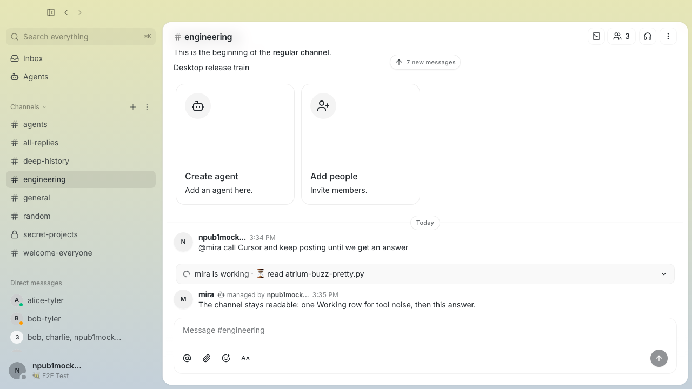
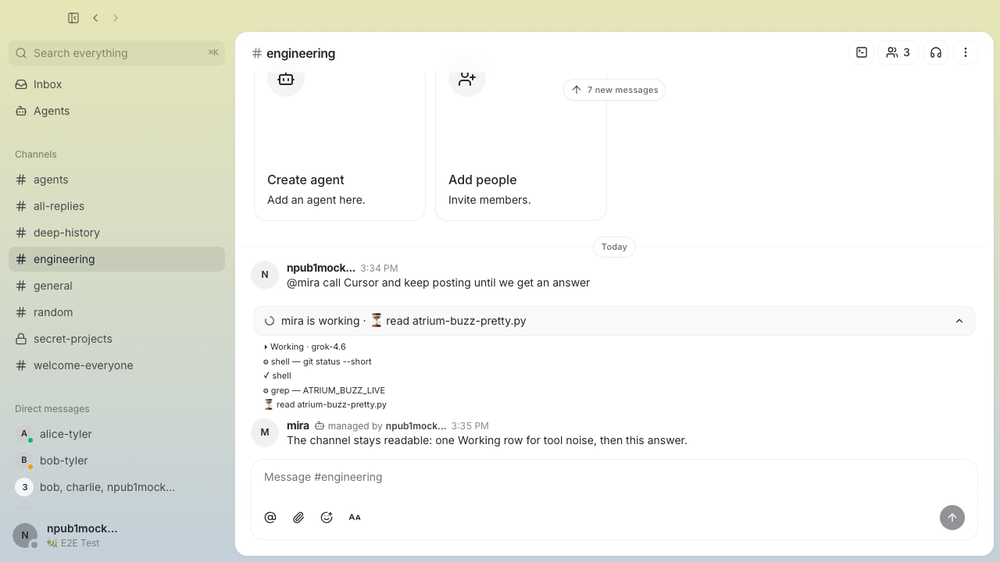

# INT-1287 — Agent progress without the junk feed

Calling an agent that talks to Cursor used to dump every tool start/complete
and every assistant fragment into the channel (`⚙ shell`, `✓`, `✗`, leftover
prose). That is not status.

## What you see now

1. **Bridge (live, next @mention)** — `ATRIUM_BUZZ_LIVE_MODE=status` (default):
   one `▸ Working`, occasional `⏳ {step}` (~15s), errors, then the **answer**.
   Set `ATRIUM_BUZZ_LIVE_MODE=verbose` to restore the old per-tool feed.
2. **Desktop** — leftover/historical progress lines collapse into one
   expandable row: `Working · N updates · latest: …`.

## Screenshots

Collapsed — one Working row, then the answer:

Expanded — tool lines stay under the row:

