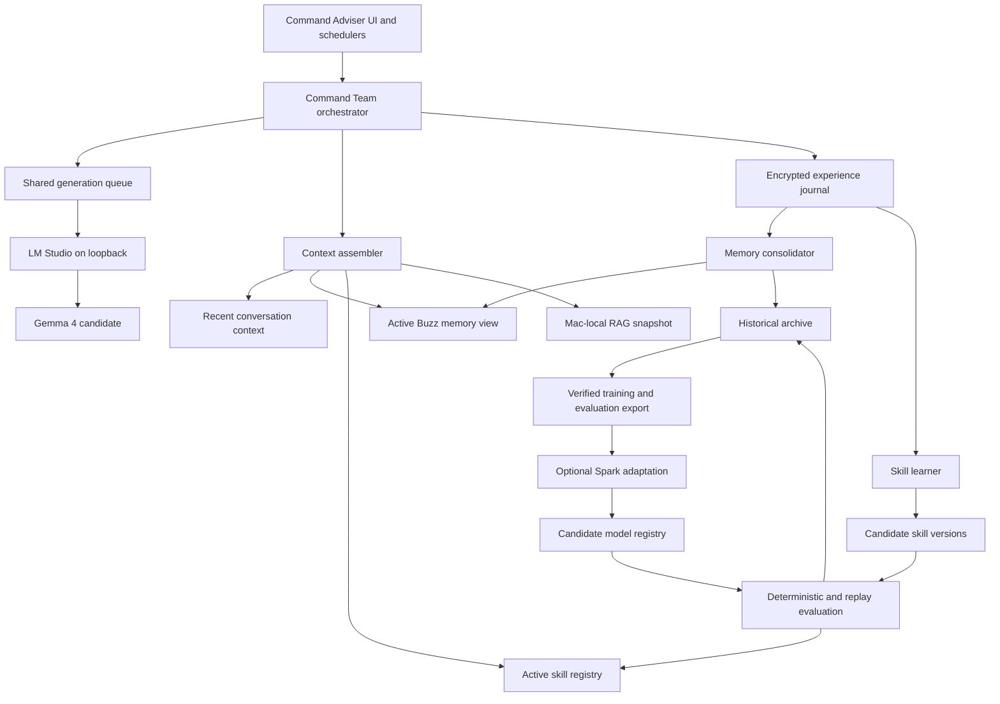

# Offline Adaptive Command Adviser Design

## Status

Conceptually approved on 9 August 2026. This document materialises that
concept for review before implementation planning. It does not authorise code
changes or displace the active Command Adviser upstream-synchronisation phase.

## Outcome

Command Adviser can operate for extended periods with no network access from a
single 14-inch MacBook Pro with an Apple M5 Pro and 64 GB unified memory. The
Mac carries the model runtime, Buzz, the command workspace, the agent team, the
authoritative local memory, and a local copy of the RAG corpus.

The product improves through two coordinated workstreams:

1. **Offline local intelligence:** one multimodal local model serves the Command
   Team through a bounded shared queue.
2. **Adaptive memory and skills:** Buzz continuously preserves experience and
   autonomously creates, evaluates, versions, promotes, and rolls back reusable
   skills.

A later optional refinement programme uses successful traces, memory outcomes,
and skill history to adapt or distil a Command Adviser-specific model. Model
weights learn behaviour and procedure; Buzz memory continues to hold evolving
experience, and RAG remains the authoritative cited source for doctrine and
reference material.

## Design Principles

- **Disconnected means complete:** normal adviser turns, scheduled briefs,
  memory writes, skill evolution, retrieval, restart, and recovery must not
  require DNS, licensing calls, model downloads, or cloud APIs.
- **One machine first:** the 64 GB MacBook is the deployment target. A second
  DGX Spark is not required for inference unless measured acceptance failures
  prove otherwise. The existing Spark may be used later for training.
- **One resident generation model:** correctness and context capacity take
  priority over simultaneous token generation. One to three collaborating
  agents may wait their turn.
- **Retrieve facts; train behaviour:** current operational facts and doctrine do
  not belong solely in model weights.
- **Preserve history without obeying stale history:** raw experience and every
  skill version remain available for learning and diagnosis, while an active
  derived view controls what influences current work.
- **Autonomy with deterministic checks:** routine memory and skill changes do
  not require owner approval, but promotion depends on automated validation and
  remains reversible.
- **No hidden success:** degraded model, memory, RAG, or skill state is visible
  in the product and audit history.

## Scope

This design covers:

- qualification and operation of the local multimodal model through LM Studio;
- bounded scheduling of multiple advisers against one model instance;
- practical context management for 32K, 64K, and 128K working windows;
- a complete Mac-local RAG snapshot and local embedding path;
- continuous encrypted experience capture in Buzz;
- active, historical, specialist-private, and Command-Team-shared memory views;
- autonomous skill creation and evolution with lineage and regression tests;
- offline backup, rebuild, and recovery;
- an evaluation corpus and optional future LoRA, QLoRA, or distillation path;
  and
- real user-journey acceptance for interactive work and the Daily Command
  Brief.

## Non-goals

The first implementation does not:

- train a foundation model from scratch;
- require the DGX Spark at sea;
- run several full model instances for concurrent agents;
- make a model's advertised 256K context window an operational requirement;
- replace RAG with fine-tuning or copy the full knowledge base into weights;
- delete superseded memories or skill versions;
- autonomously change provider security policy, external systems, credentials,
  model files, or Command Adviser release configuration;
- expose the local model, RAG, or memory service outside the owner-authorised
  local interface; or
- treat autonomous skill promotion as authority to take external operational
  action.

## Existing Buzz Substrate

The design extends existing components rather than introducing a second agent
platform:

- Command Adviser already has an LM Studio-native provider, readiness probing,
  bounded request handling, reasoning-off policy, structured outputs, fallback
  routing, provider audit, and Daily Command Brief orchestration.
- The synchronized Buzz model catalogue already recommends
  `unsloth/gemma-4-26B-A4B-it-GGUF:UD-Q4_K_M` for 64 GB machines.
- NIP-AE stores encrypted, owner-scoped `kind:30174` engrams. The ACP harness
  currently injects only the `core` engram when a session is created.
- `buzz-agent` currently discovers `.agents/skills`, `.goose/skills`, and
  `.claude/skills` when a session starts and exposes a read-only `load_skill`
  tool with bounded supporting-file loading.
- Command Adviser already preserves RAG passage identity, document, collection,
  page, section, point ID, retrieval time, and quoted evidence in briefs.

The missing capabilities are intelligent memory recall beyond `core`, an
append-only experience history suitable for learning, locally authoritative RAG
replication, writable and versioned skills, automated skill evaluation, and an
offline model acceptance gate.

## System Architecture

The model, memory, skills, and RAG are independent replaceable components. A
model upgrade does not migrate memory. A skill update does not rewrite RAG. A
RAG refresh does not silently change model or skill versions used by an active
run.

## Workstream 1: Offline Local Intelligence

### Initial model decision

The first qualification target is the LM Studio build being downloaded by the
owner:

`Gemma 4 26B-A4B-IT Q4_K_M`

It is a provisional champion, not an accepted production model. The earlier
working `gemma4:cloud` route proves provider compatibility, while the separate
dense local `google/gemma-4-31b` attempt failed LM Studio's memory estimate.
The sparse 26B-A4B GGUF therefore requires a fresh Mac-local canary.

If Gemma fails the acceptance gate, the first challenger is Ministral 3 14B
Instruct GGUF because it is smaller, multimodal, supports a long context, and
advertises native function calling. GPT-OSS-20B remains a text-and-tool control,
not a single multimodal foundation. Qwen 3.5/3.6 is excluded from the primary
shortlist because prior long agentic runs were slow, repetitive, context-hungry,
and unreliable despite succeeding on bounded tool calls.

The initial phase uses LM Studio rather than introducing another runtime. The
runtime remains replaceable behind Buzz's existing provider interface.

### Runtime boundary

- LM Studio binds to the approved loopback endpoint and uses its existing
  Keychain-backed authentication path when authentication is enabled.
- The exact model identifier, quantisation, context setting, LM Studio version,
  and model-file hash are captured for every acceptance run.
- The model is preloaded and verified before an offline period. The product
  never assumes that a catalogue entry means the model is installed or usable.
- A disconnected-mode check blocks unnoticed cloud fallback and verifies that
  all required artefacts are already local.
- Model responses remain subject to the existing structured-output, tool-call,
  evidence, timeout, cancellation, and size limits.
- Model replacement occurs only between runs. Every run captures an immutable
  runtime identity at start.

The sea-going bundle includes the accepted model file, its vision projector or
other required companion files, the accepted LM Studio installer, Command
Adviser application bundle, embedding model, RAG snapshot, database recovery
material, configuration manifest, and checksums. Readiness is tested from that
bundle with external networking disabled. A missing companion file is a failed
readiness check, not a reason to download during an offline period.

### Shared generation queue

Only one generation request executes at a time by default. Advisers may prepare
retrieval and deterministic work concurrently, then submit bounded generation
jobs to the queue.

Each job records:

- run, adviser, owner, and community identity;
- model and runtime identity;
- priority and deadline;
- enqueue, start, completion, cancellation, and retry state;
- input-budget class and requested output limit; and
- resumable workflow checkpoint.

Interactive turns receive bounded priority over background work, but cannot
starve a scheduled brief indefinitely. The Daily Command Brief is decomposed
into individually durable specialist jobs followed by one Chief consolidation
job. Completed specialist results survive process restart and are not regenerated
unless their input identity changed or validation failed.

There is no automatic second model instance. A second instance is considered
only after measured evidence shows that a single queued model cannot meet the
accepted interactive and overnight deadlines within the Mac's memory limits.

### Context policy

Advertised context is a model capability, not a deployment guarantee. Buzz uses
a measured context ladder:

1. 32K baseline;
2. 64K normal long-work target; and
3. 128K extended synthesis target.

Each tier must pass under the complete local stack, not an isolated model
prompt. The acceptance record includes time to first token, completion time,
prompt and output tokens, model residency, system memory pressure, swap
behaviour, failures, and output validity.

The context assembler builds prompts from:

- the recent working conversation;
- a compact run state and unresolved tasks;
- selectively recalled active memories;
- skill instructions loaded on demand; and
- only the RAG passages required for the current question.

Historical memory and entire documents are never injected merely because they
exist. If a request exceeds the admitted tier, the workflow checkpoints,
summarises completed work with source links, and continues in a fresh turn. It
does not allow unbounded hidden reasoning to consume the working window.

### Multimodal input

The production candidate must accept text and image inputs. Images are used for
charts, diagrams, screenshots, scanned forms, and layouts where spatial meaning
matters. Documents first pass through deterministic text, table, and OCR
extraction; selected rendered pages or crops accompany the extracted evidence
only when visual interpretation is necessary. This preserves citations and
reduces image-token pressure.

### Mac-local RAG

Before disconnected operation, the Mac receives a versioned, read-only RAG
snapshot containing the approved corpus, vector data, embedding model, retrieval
configuration, and a signed manifest of document and chunk identities.

The local snapshot must preserve the passage metadata already required by
Command Adviser: document identity, collection, page, section, point ID, content
hash, and quoted text. A collection list or health endpoint is not acceptance;
a fixed semantic canary must return substantive cited passages.

Snapshot refresh is an explicit dockside operation. An interrupted refresh
leaves the prior accepted snapshot active. Disconnected operation never blends
partial new data with the accepted snapshot.

## Workstream 2: Adaptive Memory and Skills

### Experience capture

Buzz continuously records meaningful task experience without per-write owner
approval. Capture includes:

- user requests and corrections;
- retrieved source identities and admitted evidence;
- tool calls, bounded results, and stable error codes;
- plans, decisions, assumptions, dissent, and limitations;
- model, prompt-template, memory-view, RAG-snapshot, and skill-version identity;
- final outputs and whether they were accepted, corrected, superseded, or
  abandoned; and
- deterministic evaluation outcomes.

"Capture all data" means all useful task evidence and outcomes. Credentials,
authentication material, transient secrets, hidden model reasoning, and
unbounded duplicate payloads are excluded. Source material already held in RAG
is referenced by stable identity rather than copied repeatedly.

An experience write is append-only, signed, encrypted, owner-scoped, and
idempotent. Failure to persist does not fabricate success: the task may continue
when safe, but the UI and audit mark learning as degraded until the write is
reconciled.

### Historical archive and active view

NIP-AE addressable heads alone cannot guarantee a complete historical archive,
because normal relay semantics expose only the latest event for one address.
The implementation therefore separates:

- an immutable episodic journal, where each event has a unique address and is
  never overwritten;
- compact canonical memories, represented by replaceable active heads; and
- an index that derives active, superseded, contradictory, and related state
  from the journal.

Superseding a memory writes a relationship to the newer record; it does not
delete the older event. Retrieval defaults to the active view and ranks by
scope, relevance, recency, confidence, source quality, and supersession state.
Historical and superseded records remain queryable for training, regression
analysis, explanation, and rollback.

If an index is lost, it is rebuilt deterministically from the signed journal.
The archive is the durable evidence; the active index is disposable derived
state.

### Private and shared learning

Each specialist has a private memory and skill scope for role-specific methods.
A Command-Team scope contains lessons that generalise across advisers.

A private lesson is promoted to shared scope only when:

- it is not owner- or role-secret;
- its source and originating specialist remain traceable;
- it is useful to at least one other role or a cross-role workflow;
- it does not conflict with authoritative doctrine or higher-priority policy;
  and
- it passes the shared evaluation suite.

Promotion copies a versioned generalisation into shared scope. It does not erase
the specialist's original experience.

### Skill representation

The active skill interface remains compatible with Buzz's current
`SKILL.md`-based discovery and on-demand loading. The managed skill registry adds
immutable versions and metadata around that format:

- stable skill identity and semantic purpose;
- version and parent-version identity;
- private or shared scope;
- source memory and task references;
- required inputs, outputs, tools, and permissions;
- inherited behavioural tests and new regression tests;
- evaluation results and observed production outcomes;
- active, candidate, rejected, superseded, or rolled-back state; and
- content hash and signature.

An active pointer selects one immutable version. New sessions and new turns load
the active pointer; a skill cannot change underneath the turn currently using
it. The initial implementation may use a controlled agent rescan or restart
between turns rather than invasive hot reloading.

The authoritative registry is stored as owner-scoped, signed, encrypted Buzz
events under a dedicated agent-skill event contract. Immutable version events
hold the manifest and content-addressed bundle references; an addressable active
pointer selects the current version for each scope. Large supporting files live
in a private Mac-local object store using Buzz's existing media and object
contracts and are bound to the manifest by content hash. The numeric event kind
is allocated centrally with the other Buzz kinds when that implementation phase
begins.

The runtime materializer verifies the signature, owner, scope, manifest, and
content hashes before projecting the selected version into a managed
`.agents/skills` directory compatible with the existing loader. The directory
is a disposable cache, not the source of truth. Deleting it and restarting the
materializer must reconstruct the same active skills from Buzz events and local
objects.

### Autonomous skill-learning loop

The learner runs asynchronously after completed work and during idle or
overnight periods:

1. identify a repeated workflow, correction, failure pattern, or successful
   procedure;
2. retrieve relevant historical outcomes and the current skill lineage;
3. create a new candidate version rather than editing the active version;
4. inherit every prior behavioural test and add tests for the new evidence;
5. run schema, policy, tool-permission, deterministic, replay, and regression
   checks;
6. compare the candidate with the active version on a bounded evaluation set;
7. promote automatically when all required checks pass and no protected metric
   regresses;
8. monitor production outcomes; and
9. roll back automatically when a later regression threshold is crossed.

Candidate generation may use the local model, but the model cannot mark its own
candidate as passing. Deterministic validators and recorded task replays own the
promotion decision. Failed candidates and their results remain in the archive
as learning evidence.

### Memory consolidation

The memory consolidator runs incrementally after tasks and more deeply during
idle periods. It may extract entities, decisions, relationships, corrections,
open loops, and candidate generalisations. It may mark an older memory
superseded, but it cannot alter or remove the source journal.

Consolidation is itself versioned and replayable. A future consolidator can
rebuild a better active view from the same archive without losing earlier
experience.

## Optional Future Model Refinement

The refinement pipeline begins only after the offline runtime and adaptive
learning loop have produced enough verified evidence.

The training exporter selects examples that have:

- complete source and runtime provenance;
- a clear task and accepted or deterministically verified outcome;
- no credentials or excluded sensitive payloads;
- stable skill and memory identities;
- deduplication and contamination controls; and
- an explicit split between training, validation, and untouched evaluation
  cases.

Raw archive volume is not a quality signal and is not automatically training
data. Failed and superseded examples remain valuable for preference pairs,
regression tests, and error analysis.

The first adaptation method is LoRA or QLoRA on the existing DGX Spark. A
distilled smaller model is a later research option. Every candidate model must
return to the MacBook and pass the same offline, tool, vision, RAG, context,
queue, and overnight gates before it can replace the base model. The prior model
and adapter remain available for immediate rollback.

No adapted model becomes the sole store of a fact, policy, memory, or skill.

## Autonomy and Safety Boundary

Routine internal learning requires no approval. Agents may append experience,
derive memories, create candidate skills, run evaluations, promote passing
skills, and roll back regressions.

This autonomy does not permit agents to:

- weaken source admission, classification, encryption, or audit policy;
- add a network endpoint or cloud provider;
- access credentials or store them in memory;
- grant a skill new external permissions merely by editing its text;
- replace or delete the historical archive;
- update model binaries, adapters, application code, or release configuration;
  or
- take external operational action beyond the separately authorised tool
  boundary.

Tool permissions are enforced outside the model and skill content. Retrieved
documents, memory, and skill text are untrusted instructions unless admitted by
the relevant policy layer.

## Failure and Recovery Behaviour

- **Model cannot load:** the local route stays unavailable with a stable reason;
  no disconnected run silently falls through to cloud.
- **Context tier fails:** the run checkpoints and retries at the last accepted
  lower tier or decomposes into smaller jobs. It does not load a second model.
- **Queue worker exits:** durable jobs return to pending unless their completed
  result was already committed. Idempotency prevents duplicate publication.
- **RAG snapshot is unavailable or corrupt:** the affected work is explicitly
  source-degraded. Doctrine-dependent conclusions cannot be represented as
  sourced.
- **Experience write fails:** current work may continue when safe, but learning
  status is degraded and the write is retried from a bounded local outbox.
- **Consolidation fails:** the journal remains authoritative; the last accepted
  active view continues to serve.
- **Skill evaluation fails:** the candidate remains inactive and the current
  version continues unchanged.
- **Promoted skill regresses:** the active pointer returns to the last passing
  version; the failure and rollback are archived.
- **Disk pressure:** new large imports and training exports pause before the
  reserved recovery threshold. The system never silently deletes memory,
  skills, RAG snapshots, or rollback models.
- **Index corruption:** derived memory and skill indexes rebuild from signed
  events and immutable version manifests.

## Observability

The local status surface reports, without exposing prompts or secrets:

- model identity, loaded state, context tier, queue depth, active job, and last
  successful generation;
- RAG snapshot identity, embedding identity, semantic-canary result, and last
  refresh;
- memory journal health, outbox depth, active-view revision, and last successful
  consolidation;
- skill active versions, candidate count, last evaluation, promotion, and
  rollback; and
- disconnected readiness as one explicit pass or fail state with component
  reasons.

Every Daily Command Brief records the exact model, RAG snapshot, memory-view
revision, and skill versions used so the result can be reproduced or diagnosed.

## Verification and Acceptance

### Model qualification

The Gemma candidate must pass on the target MacBook with cloud routes disabled:

- cold load and restart from locally stored files;
- ordinary text response and valid structured JSON;
- native multi-turn tool calls, including tool error recovery;
- image, chart, screenshot, and scanned-page interpretation;
- 32K and 64K full-stack context tiers, with 128K admitted only if it remains
  operationally stable;
- cancellation, timeout, malformed output, and context-overflow recovery;
- three advisers completing through the shared queue without a second model
  instance; and
- complete operation after network interfaces are disabled.

### Knowledge and memory

- A fixed local RAG canary returns substantive doctrine with document, section,
  page or chunk, and point-ID metadata.
- A meaningful task writes an encrypted journal event, appears in later active
  recall, and survives app and machine restart.
- A correction supersedes current recall while both versions remain visible in
  historical queries.
- Specialist-private memory is inaccessible to unrelated advisers until a
  generalised lesson passes shared promotion.
- A lost derived index rebuilds to the same active heads from the archive.

### Skills

- A repeated successful workflow produces a candidate skill version without an
  owner approval prompt.
- The candidate cannot activate until inherited and new tests pass.
- Removing an old function causes a regression failure and preserves the active
  version.
- A passing candidate activates between turns and is used by a later real task.
- A simulated production regression rolls back to the prior version while
  preserving the rejected version and evidence.

### Integrated user journeys

- One interactive Command Adviser request involving one to three advisers
  completes fully offline with cited local evidence and durable learning.
- One Daily Command Brief runs through the queued specialists and Chief
  overnight, survives an application restart, and is ready by its deadline.
- An eight-hour soak has no runaway hidden reasoning, unbounded queue growth,
  silent memory loss, or model re-download.
- A cold disconnected restart restores the model route, accepted RAG snapshot,
  active memory view, skill registry, and pending jobs.

The implementation is not accepted on unit tests, catalogue visibility, health
endpoints, or isolated model prompts alone. The installed application must pass
the real user journeys.

## Delivery Decomposition

This umbrella design is delivered as separately reviewable phases:

1. **Gemma Mac canary and offline runtime gate** — after the download completes,
   qualify the model, context tiers, multimodality, tool calls, and single-model
   queue assumptions.
2. **Mac-local RAG snapshot** — package, refresh, verify, and recover the
   complete cited retrieval stack.
3. **Experience journal and active memory view** — add continuous capture,
   historical preservation, supersession, private/shared scopes, and rebuild.
4. **Versioned autonomous skills** — add candidate creation, inherited tests,
   automatic evaluation, promotion, monitoring, and rollback.
5. **Integrated disconnected operation** — make briefs resumable, expose
   readiness, perform cold-restart and overnight acceptance, and document the
   sea-going operating procedure.
6. **Optional model refinement** — export verified data, adapt on Spark, and
   evaluate the candidate back on the Mac.

Each implementation phase receives its own bounded plan and acceptance gate.
Canary preparation may proceed while the model download completes, but
repository implementation remains sequenced behind the currently active Command
Adviser phase unless the owner explicitly reprioritises the roadmap.

## References

- Gemma 4 26B-A4B-IT: <https://huggingface.co/google/gemma-4-26B-A4B-it>
- Ministral 3 14B Instruct: <https://huggingface.co/mistralai/Ministral-3-14B-Instruct-2512>
- Ministral 3 official GGUF: <https://huggingface.co/mistralai/Ministral-3-14B-Instruct-2512-GGUF>
- GPT-OSS-20B: <https://huggingface.co/openai/gpt-oss-20b>
- Hermes Agent skill-management reference:
  <https://github.com/NousResearch/hermes-agent/blob/main/website/docs/user-guide/features/skills.md>
- Buzz NIP-AE: `docs/nips/NIP-AE.md`
