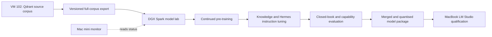

# Closed-Book Command Adviser Model Design

## Status

Conceptually approved on 26 August 2026. This document defines Phase 6 for
review before implementation planning. It authorises neither a training run nor
a production model change.

This decision supersedes one boundary in the earlier
`2026-08-09-offline-adaptive-command-adviser-design.md`: the new programme does
intend to place the full RAG knowledge corpus into model weights. The existing
RAG service remains the source corpus and home-side reference system, but it is
not a runtime dependency for the sea-going Hermes agent.

## Outcome

Create `command-adviser-qwen3.8-27b-v1`, a derivative of the exact Qwen 3.8 27B
revision already proven with Hermes Agent and LM Studio. The derivative should
recall useful knowledge from every current RAG collection without calling the
RAG MCP server, while retaining the base model's multimodal, coding, reasoning,
structured-output, and tool-use capabilities.

All data preparation, training, evaluation, merging, and quantisation run on the
DGX Spark. The Mac mini may observe progress. The sea-going MacBook receives
only a finished candidate and performs the final LM Studio, Hermes, Buzz, and
physical-disconnection qualification.

## Goals

- Include the contents of every RAG collection rather than selecting only
  doctrine or a curated subset.
- Improve closed-book recall for doctrine, technical references,
  troubleshooting, coding, project history, and the owner's other ingested
  material.
- Preserve Hermes-compatible structured tool calls and reliable agentic work.
- Preserve native image understanding from the multimodal base model.
- Produce a local LM Studio package that fits the 64 GB MacBook target.
- Make training reproducible, resumable, measurable, and refreshable when the
  RAG corpus changes.
- Keep the current working Qwen model available as the immediate fallback.

## Non-goals

This phase does not:

- train a foundation model from random initialisation;
- promise database-exact recall of every fact or replace evidence checking when
  exact source wording matters;
- require the RAG MCP server during normal inference or acceptance testing;
- require the MacBook to export data, train, merge, or quantise the model;
- require cloud training or a second DGX Spark before measurements justify it;
- add a classification, per-document approval, or elaborate security workflow
  around the owner's personal data; or
- update knowledge continuously in real time. Corpus refreshes create a new,
  evaluated model version.

## Current and Target Topology

The current home-side RAG system is deliberately split:

- **VWHomeServer VM 102 (`192.168.1.107`):** authoritative Qdrant corpus,
  retrieval API, and RAG MCP service. The live collection inventory contained
  123,593 points when this design was approved.
- **DGX Spark (`192.168.1.11`):** upload, queue, staging, parsing, ingest, local
  model support, sparse retrieval, reranking, and the existing Streamlit
  operational interface.
- **Mac mini:** optional lightweight monitoring of Spark training state.
- **MacBook Pro:** final candidate download and disconnected deployment target.

The target training flow is:

## Source Corpus and Dataset Construction

### Full export

The exporter reads every point from every Qdrant collection and writes a
versioned corpus bundle on the Spark. Each record retains the source collection,
document identity, title, page or section, chunk order, point ID, and available
ingest metadata. The manifest records collection names, point counts, file
hashes, export time, and the source Qdrant identity.

The initial reconciliation gate is exact: exported collection and point counts
must match the source inventory. Missing payload text, duplicate point IDs, or
unexplained count differences fail the export.

### Reconstruction and normalisation

RAG chunks are retrieval units, not ideal training documents. Dataset
preparation therefore:

1. groups chunks by collection and document identity;
2. orders them by page, section, and chunk index where available;
3. removes repeated overlap introduced by chunking;
4. removes exact and measured near-duplicates while recording the decision;
5. preserves meaningful headings, tables, code, lists, and provenance labels;
6. creates bounded training sequences without silently dropping long
   documents; and
7. produces collection and document statistics for balancing and evaluation.

All source documents remain eligible for continued pre-training. Evaluation
questions and task formulations are held out; the underlying source knowledge
is not withheld because the objective is to teach the complete corpus.

### Derived instruction data

The same corpus produces several instruction families:

- direct and paraphrased recall;
- synthesis across passages or documents;
- troubleshooting and diagnostic sequences;
- coding and configuration tasks grounded in technical material;
- conflict and revision awareness when sources disagree or change over time;
- uncertainty and no-answer behaviour; and
- Hermes-style structured tool selection, parameter construction, recovery,
  and completion reporting.

Generated items retain source links internally so they can be checked during
dataset QA, even though the deployed model is expected to answer without a RAG
call.

## Training Strategy

The selected approach is continued pre-training followed by instruction tuning.
It is more likely than instruction tuning alone to internalise a large,
heterogeneous corpus, while remaining practical compared with training a new
foundation model.

### Stage 0: Spark qualification

Before the trial, the Spark must prove that it can:

- load the pinned official Qwen 3.8 27B base revision;
- run a short QLoRA or LoRA optimisation job without memory instability;
- save and resume a checkpoint;
- merge the adapter into a test checkpoint; and
- run deterministic inference and the packaging toolchain.

The exact model revision, tokenizer, libraries, container image, training
arguments, and hardware telemetry are captured in a run manifest. The vision
encoder remains frozen initially so the text-heavy corpus does not unnecessarily
damage native image capability.

### Stage 1: Continued pre-training

The first learning stage uses causal language-model training over reconstructed
documents from all collections. Sampling prevents a few large collections or
repetitive document families from overwhelming the rest of the corpus. A
replay portion of suitable general-domain data may be used if trial measurements
show unacceptable base-capability loss.

This stage produces a checkpointed CPT adapter. The accepted CPT result is
merged into an intermediate model so the instruction stage has an unambiguous,
reproducible starting point.

### Stage 2: Knowledge instruction tuning

The intermediate model is tuned on the derived recall, synthesis,
troubleshooting, coding, conflict, and uncertainty tasks. The training set uses
multiple formulations per knowledge unit rather than teaching a single fixed
question-answer phrase.

### Stage 3: Hermes agent tuning

The final tuning stage uses successful Hermes-compatible interactions and
synthetic tasks with observable structured outputs. It teaches tool schemas,
multi-step recovery, concise completion reporting, and collaboration patterns.
It does not depend on storing hidden chain-of-thought traces.

Each stage retains its adapter, merged checkpoint, configuration, logs, and
evaluation report. A later failure can therefore be traced to the knowledge or
agent-tuning stage instead of forcing an unexplained full restart.

## Trial Before Full Training

The first experiment is a stratified trial, not a token sample drawn only from
the largest collections. It includes material and hidden evaluation cases from
every collection family and exercises the complete export, reconstruction,
training, merge, evaluation, and packaging path.

The trial proceeds to the full run only if it shows:

- a material closed-book recall improvement over the unmodified base model;
- no major collection family with unexplained regression;
- stable loss, checkpoints, resume, and merge on the Spark;
- retained structured tool use, coding, and native-image capability; and
- a credible fit and load path for the 64 GB MacBook.

If it fails, the trial is adjusted and repeated. The full run does not start
merely because the training pipeline completed.

## Model Lab and Run Management

Training code, configuration, dataset schemas, prompts, evaluators, and run
books live in a dedicated private `Command Adviser Model Lab` repository. Large
corpus exports, checkpoints, and weights live on the Spark rather than in Git.
The proposed Spark root is `/opt/command-adviser-model-lab` with separate,
versioned directories for source exports, prepared datasets, runs, checkpoints,
evaluations, and release packages.

Every run receives a unique ID and writes:

- a machine-readable manifest;
- `queued`, `running`, `completed`, or `failed` status;
- current stage, step, loss, elapsed time, and estimated completion;
- latest durable checkpoint;
- hardware memory, temperature, and utilisation telemetry;
- source corpus and dataset identities; and
- final evaluation and package identities.

Jobs never overwrite a previous run. Interrupted work resumes from the latest
validated checkpoint.

## Monitoring

The Spark owns training and remains able to run without the Mac mini. The Mac
mini may read the Spark's status file and recent logs over the existing local
network, then report progress and stale or failed jobs. A new dashboard is not
required for the first trial; a small read-only status view or command is
sufficient.

Losing the monitor does not stop training. Losing the Spark process changes the
run to failed or interrupted and preserves the last checkpoint for recovery.

## Evaluation

### Closed-book knowledge gate

Both the base model and candidate answer the same hidden suite with RAG, Memory
MCP, internet search, and source-document access disabled. The suite is balanced
by collection and task family rather than reporting only one aggregate score.
It includes direct recall, paraphrase, cross-document synthesis,
troubleshooting, coding, conflicting or superseded material, and questions the
corpus cannot answer.

Scoring combines deterministic checks, source-backed reference answers, and
reviewed model grading where free-form answers require judgement. Reports show
per-collection coverage and regressions as well as the overall result.

### Capability regression gate

The candidate must also pass the existing local-model behaviours required by
Hermes and Command Adviser:

- exact-text and strict-JSON output;
- reasoning-off operation;
- stateful continuation;
- structured tool calls and argument correctness;
- native image understanding;
- cancellation and recovery;
- a three-request shared queue;
- coding and troubleshooting tasks not present in the private corpus; and
- a representative multi-agent Hermes/Buzz workflow.

The trial defines numerical thresholds from the base-model baseline before the
candidate is scored. Promotion requires a material knowledge gain and no
critical agent, tool, multimodal, or stability regression. Thresholds cannot be
relaxed after seeing the candidate merely to declare success.

## Packaging and MacBook Deployment

The accepted Spark checkpoint is merged and converted into the LM Studio format
selected by measured Mac performance, initially a suitable GGUF quantisation.
The release bundle includes the model, any required vision projector, tokenizer
and chat template, hashes, licence and base revision, training manifest,
evaluation report, and recommended LM Studio settings.

The model is named `command-adviser-qwen3.8-27b-v1` and is installed alongside,
not over, the current Qwen model. Hermes remains pointed at the known-good base
until the candidate passes Mac acceptance.

Mac acceptance uses the real LM Studio, Hermes Agent, Buzz connector, memory,
skills, queue, and Daily Command Brief path. The RAG MCP service is absent from
the candidate's normal configuration. The final acceptance is repeated with
external connectivity physically unavailable. Context sizes are qualified by
measured memory and stability, not by the model's advertised maximum.

If the candidate fails any critical gate, switching Hermes back to the current
base model is the rollback. No retraining is needed to recover service.

## Corpus Refresh and Model Evolution

The RAG corpus remains the home-side knowledge intake and reference system.
When it materially changes, a new signed export and dataset identity are
created. Refresh training produces `v2`, `v3`, and later candidates; it does not
silently modify the installed model.

A refresh replays a balanced portion of the prior corpus as well as new and
changed documents so recent additions do not erase older capability. Historical
run manifests, adapters, evaluations, and released models are retained for
comparison and rollback.

Buzz memory and evolving skills remain separate live systems. They carry recent
experience and behaviour changes between model releases; selected successful
history can become instruction data for a later candidate.

## Delivery Sequence

1. Create the private Model Lab repository and pinned Spark environment.
2. Add and reconcile the full Qdrant export from VM 102 to the Spark.
3. Build reconstruction, deduplication, dataset manifests, and QA reports.
4. Establish the hidden base-model knowledge and capability baseline.
5. Pass the Spark qualification smoke test.
6. Run the stratified CPT plus instruction-tuning trial.
7. Review the trial gates before authorising the full corpus run.
8. Run the full training stages with checkpointed evaluation.
9. Merge, quantise, and package the accepted candidate on the Spark.
10. Download only the release bundle to the MacBook.
11. Pass connected, restart, and physically disconnected Hermes/Buzz
    acceptance before changing the default model.

Implementation uses a separate PR for each model-lab or source-system phase.
The existing home RAG services continue operating throughout.

## Acceptance Definition

Phase 6 is complete only when:

- the export manifest reconciles every live RAG collection and point;
- the full run can be reproduced from pinned code, configuration, corpus, and
  base-model identities;
- the candidate beats the base model on the predeclared closed-book knowledge
  gate, including per-collection review;
- Hermes tool use, coding, multimodal, queue, cancellation, and recovery gates
  pass;
- the release loads within the MacBook's measured memory envelope;
- a real multi-agent Hermes/Buzz journey and Daily Command Brief complete with
  RAG MCP unavailable;
- the same acceptance survives restart and physical disconnection; and
- the known-good base model remains a tested one-step rollback.

## Indicative Duration

- **Stratified trial:** approximately 7-10 calendar days from working Spark
  access and a reconciled export.
- **First full candidate:** approximately 4-6 weeks if the trial succeeds;
  allow 6-8 weeks for a conservative schedule with one or more tuning repeats.

These are engineering estimates, not GPU-hour guarantees. The initial Spark
qualification and corpus token count will replace them with measured timings.

## Data Handling

The corpus is the owner's personal data and is intentionally included in full.
The implementation uses ordinary local file hygiene: private repositories,
checksums, versioned manifests, backups, and access already appropriate to the
Spark and home network. It does not add per-document approval or unnecessary
governance around training.
