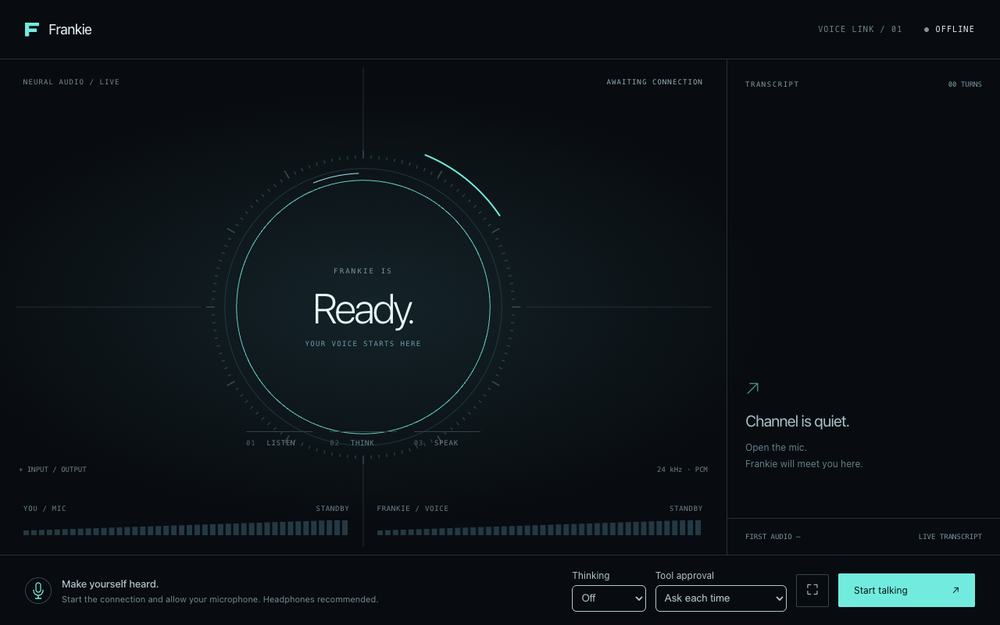

# Frankie through Buzz

Run a local voice conversation through the native llama.cpp Frankie server, Buzz
agent, and this webpage. The browser captures and plays mono PCM16 at 24 kHz.
Buzz owns MCP tools and their permission decisions; llama.cpp loads the single
GGUF and runs the brain, Parakeet, Qwen3-TTS, vision, and turn models through ggml.
No Python inference service or hosted model API is needed.

The page includes live transcripts, interruption, thinking controls, tool
approval, and latency measured from the end of speech to actual playback.



## Get the model

Obtain a compatible Frankie GGUF separately and save it as
`models/frankie-studio-c10-q8-audio.gguf` outside the source repositories.
Model weights are not distributed through this repository.

The tested September 10, 2026 package has:

- Size: **20,326,799,488 bytes** (20.33 GB / 18.93 GiB).
- SHA-256: `1822228c2caa051fb4fa8535c9a3105c2bb67440968dc5a9f6ee44ffbc439c50`.
- Custom Q4_1 brain; supported Parakeet and Qwen3-TTS matrices in Q8_0.
  Convolutions and sensitive tensors retain their original types; vision is F16.
- The packaged c10 reference voice. A custom reference can replace it at launch.

Verify the download with `shasum -a 256 models/frankie-studio-c10-q8-audio.gguf`
(macOS) or `sha256sum` (Linux). A different hash identifies a different package;
the compatibility results here apply to the hash above. Model and reference-voice
licensing are separate from the code license; consult the package's source and
voice metadata before redistribution.

## Build llama.cpp

Prerequisites: Git, CMake, a C/C++ toolchain, ICU development headers/libraries,
and OpenSSL development headers/libraries. For CUDA, install the CUDA toolkit;
for Metal, use macOS with Xcode command-line tools. See the fork's
[Frankie build guide](https://github.com/tlongwell-block/llama.cpp/blob/d0aa7352535cbdc2bddfd5512b5f95d731761f72/tools/frankie/README.md)
for native dependencies and tuning.

Use the Frankie fork, including [PR #1](https://github.com/tlongwell-block/llama.cpp/pull/1).
The pinned revision below is the one used to validate this GGUF; stock llama.cpp
cannot run this package.

```sh
git clone https://github.com/tlongwell-block/llama.cpp.git llama-frankie
cd llama-frankie
git checkout d0aa7352535cbdc2bddfd5512b5f95d731761f72

# Metal (macOS)
cmake -S . -B build-frankie -DCMAKE_BUILD_TYPE=Release \
  -DLLAMA_BUILD_FRANKIE=ON -DGGML_METAL=ON
cmake --build build-frankie --target llama-frankie-realtime -j4
cd ..
```

For CPU, replace `-DGGML_METAL=ON` with
`-DGGML_METAL=OFF -DGGML_CUDA=OFF`. For CUDA, use
`-DGGML_METAL=OFF -DGGML_CUDA=ON`. If CMake cannot find ICU, add
`-DICU_ROOT=/path/to/icu/prefix` using the prefix of your installation.

## Build Buzz and launch

The example uses Node 24 and the repository's Rust toolchain through Hermit.
Follow the root [contributing guide](../../CONTRIBUTING.md) for any platform
build prerequisites. The page has no npm runtime dependencies and needs no
frontend build.

```sh
git clone https://github.com/block/buzz.git buzz-frankie
cd buzz-frankie
git fetch origin pull/7519/head:frankie-demo
git checkout frankie-demo
. ./bin/activate-hermit
cargo build --release -p buzz-agent -p buzz-dev-mcp

node examples/realtime-audio/launch.mjs \
  --native ../llama-frankie/build-frankie/bin/llama-frankie-realtime \
  --model ../models/frankie-studio-c10-q8-audio.gguf \
  --device gpu
```

Use `--device cpu` with a CPU build. Open the complete `http://127.0.0.1:18796/#…`
URL printed by the launcher in Chrome, click **Start talking**, and allow the
microphone. Model loading and warm-up happen before this URL appears. Stop with
Ctrl-C. The launcher supports macOS and Linux.

Try “What is two plus two?” and then “Run uptime.” A tool request displays its
arguments: choose **Allow once** or **Deny**. The demo advertises one short shell
tool through a thin adapter to the existing `buzz-dev-mcp`; approval and execution
stay in Buzz. Nothing is executed by recognizing speech alone.

By default tools run in an empty temporary directory. Add `--cwd /path/to/project`
to choose their working directory. The launcher uses neutral instructions and
disables local hints/skills; it does not load a personal persona. Each connection
gets a new agent session. A disconnect does not replay previous tool actions.

## Voice, thinking, and memory

Add a non-silent WAV up to 20 seconds to replace the bundled voice:

```sh
node examples/realtime-audio/launch.mjs \
  --native ../llama-frankie/build-frankie/bin/llama-frankie-realtime \
  --model ../models/frankie-studio-c10-q8-audio.gguf \
  --voice /path/to/my-voice.wav
```

WAV-only conditioning uses the native speaker encoder; rebuilding the GGUF is
unnecessary. Optional `--voice-text-file` and `--voice-codes` must be supplied
together with the matching WAV. Codec IDs must already exist; the native runtime
does not generate these optional ICL codes from arbitrary WAVs.

Choose **Off**, **Minimal**, **Low**, **Medium**, **High**, **Very high**, or
**Maximum** thinking before connecting. Off is the default. Buzz forwards the
setting and requires the provider to acknowledge it. Reasoning is not spoken;
higher levels can substantially delay the first answer. End and reconnect to
change the level.

The launcher defaults to `--context 131072 --cache-type q4_0 --threads 4`.
`--context`, `--cache-type q4_0|q8_0|f16`, and `--threads` are configurable. File
size is not peak GPU memory: KV/recurrent state and compute buffers also count.
CPU and Metal have native integration coverage. CUDA and a complete 128K workload
on a 24 GiB consumer GPU still require hardware validation; the default context
allocation does not establish that memory or throughput target.

## Operation and troubleshooting

- Only one browser connection can use this demo at a time. Close an existing
  conversation before opening another. The page requires a fresh connection
  after transport errors; tool effects are never automatically replayed.
- Use `--port` and `--native-port` if 18796 or 18793 is already occupied.
- The browser adapter and native server bind to loopback. Keep the printed URL
  private: its random fragment authorizes that local demo. Provider credentials
  stay server-side. There are no external page assets or browser storage writes.
- Temporary logs are printed at startup and retained for troubleshooting.
  The adapter does not record conversations or audio to disk. Normal tool commands
  may read or write files when approved. Do not add runtime logs or models to Git.
- With Bluetooth headphones, selecting their microphone can switch the device
  into lower-quality call audio. Try speakers or a separate microphone if playback
  sounds uniformly muffled. Check Chrome's microphone selection.
- Brief capture stalls are buffered for up to five seconds. Longer stalls close
  the session visibly instead of silently dropping accepted samples. Slow inference
  can still underrun playback; reduce thinking or use a faster backend.
- The launcher expires after 24 hours (`--hours`, up to 168). Each conversation
  also has a one-hour limit. Use `--help` for binary and port overrides.

For a separately managed native server, `server.mjs` can run directly. Configure
`BUZZ_AGENT_PROVIDER=openai`, `OPENAI_COMPAT_API=realtime`,
`OPENAI_COMPAT_MODEL=frankie`, `OPENAI_COMPAT_BASE_URL=ws://127.0.0.1:18793/v1/realtime`,
and `OPENAI_COMPAT_API_KEY` matching the native `FRANKIE_REALTIME_TOKEN`. Set
`BUZZ_AGENT_BIN`, `BUZZ_MCP_BIN` to this directory's executable `mcp-shell.mjs`,
`FRANKIE_DEV_MCP_BIN` to `buzz-dev-mcp`, and `BUZZ_AGENT_NO_HINTS=1`. Run
`node /path/to/server.mjs` from the desired tool working directory. The launcher
is the recommended path because it supplies neutral configuration and owns cleanup.

## Tests

```sh
node --test examples/realtime-audio/*.test.mjs
cargo test -p buzz-agent
```

The Node tests exercise the production capture queue, AudioWorklet, loopback
authentication, permission forwarding, disconnect cleanup, and launcher rejection
paths. Rust tests exercise the actual ACP subprocess and controlled WebSocket/MCP
peers, including stale playback, cancellation, thinking acknowledgment, output
limits, and reconnect isolation. Native model inference is a separate end-to-end
check requiring the GGUF and the fork binary; unit fixtures are not inference
benchmarks. The example tests also run in `just ci` and GitHub CI.
